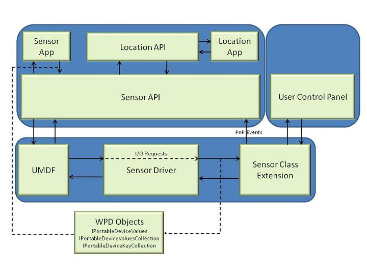

# Introduction to the Sensor and Location Platform in Windows

The Windows 7 operating system provides built-in support for sensor devices. This includes support for location sensors, such as GPS devices. As part of this support, the Windows Sensor and Location platform provides a standard way for device manufacturers to expose sensor devices to software developers and consumers. At the same time, the platform gives developers a standardized API and device driver interface (DDI) to work with sensors and sensor data.

## About Sensor Devices

Sensors come in many configurations and, from a certain perspective, almost anything that provides data about physical phenomena can be called a sensor. Although we typically think of sensors as hardware devices, logical sensors can also provide information through emulation of sensor functionality in software or firmware. Also, a single hardware device can contain multiple sensors.

The Windows Sensor and Location platform organizes sensors into *categories*, which represent broad classes of sensor devices, and *types*, which represent specific kinds of sensors. For example, a sensor in a video game controller that detects the position and movement of a player's hand (perhaps for a video bowling game) would be categorized as an Orientation sensor, but its type would be 3-D Accelerometer. In code, Windows represents categories and types by using globally unique identifiers (GUIDs), many of which are predefined. Device manufacturers can create new categories and types by defining and publishing new GUIDs, when it is required.

Location devices make up one especially interesting category. By now, most people are familiar with global positioning systems (GPS). In Windows, a GPS sensor is part of the Location category. The Location category could include other sensor types. Some of these sensor types are software based, such as an IP resolver that provides location information based on an Internet address, a mobile phone tower triangulator that determines location based on nearby towers, or a Wi-Fi network location provider that reads location information from the connected wireless network hub.

## About the Platform

The Windows Sensor and Location platform consists of the following developer and user components:

-   The DDI enables Windows to provide a standard way for sensor devices to connect to the computer and to provide data to other subsystems.
-   The Windows Sensor API provides a set of methods, properties, and events to work with connected sensors and sensor data.
-   The Windows Location API, which is built on the Windows Sensor API, provides a set of programming objects, including scripting objects, for working with location information.
-   The Location and Other Sensors Control Panel enables computer administrators to set sensors, including location sensors, for each user.

The following sections describe each of these components.

## Architecture Diagram

The following diagram shows the relationship between the components.

## Device Driver Interface

Sensor manufacturers can create device drivers to connect sensors with Windows 7. Sensor device drivers are implemented by using the Windows Portable Devices (WPD) driver model, which is based on the Windows User Mode Driver Framework (UMDF).Many device drivers have been written by using these frameworks. Because these technologies are established, experienced device driver programmers will find writing a sensor driver to be a familiar task. The sensor DDI uses specific UMDF and WPD data types and interfaces, and also defines sensor-specific WPD commands and parameters, where it is required. For more information about creating sensor device drivers, see the Windows Driver Kit.

## Sensor API

The Sensor API enables C++ developers to create sensor-based programs by using a set of COM interfaces. The API defines interfaces to perform common sensor programming tasks that include managing sensors by category, type, or ID, managing sensor events, working with individual sensors and sensor collections, and working with sensor data. The Windows SDK includes header files, documentation, samples, and tools to help guide software developers on how to use sensors in Windows programs. This documentation describes the Sensor API.

## Location API

Built on the Sensor API, the Location API provides an easy way to retrieve data about geographic location while protecting user privacy. The Location API provides its functionality through a set of COM interfaces that represent objects. These objects can be used by programmers who understand how to use COM through the C++ programming language, or in scripting languages, such as JScript. Scripting support gives easy access to location data for projects that run in the Local Computer zone, such as gadgets. The Windows SDK includes header files, documentation (including scripting reference documentation), samples, and tools to help guide Web and software developers on how to use location information in their programs.

## Location and Other Sensors Control Panel

Windows 7 includes a control panel that lets computer administrators enable or disable sensors system-wide or for each user. Because some sensors can expose sensitive data, this user interface gives administrators control over whether all programs have access to each sensor for each user. Users can also view sensor properties and change the sensor description that is displayed in the user interface.

The Control Panel also provides a Default Location page to enable users to provide their location. When no sensor is available, the platform will use the user-provided location. Users can provide civic address fields, which include the street address, city, state or province, and country or region.

## Related topics

<dl> <dt>

[About the Sensor API](about-the-sensor-api.md)
</dt> </dl>

 

 

