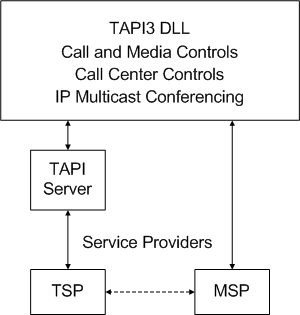

# TAPI 3.1 Overview

TAPI version 3.1 is a COM-based API that merges classic and IP telephony. Possible applications range from simple voice calls over the Public Switched Telephone Network (PSTN) to multicast multimedia IP conferencing with quality of service (QOS).

For additional information on TAPI 3.1 IP Telephony capabilities, please consult the "IP Telephony with TAPI 3" white paper, which can be found on the Microsoft web site.

There are four major components to TAPI 3.1:

-   COM API
-   TAPI Server
-   Telephony Service Providers (TSPs)
-   Media Stream Providers (MSPs)

The following diagram illustrates the TAPI 3.1 architecture:

The API is implemented as a suite of Component Object Model (COM) objects. Moving TAPI to the object-oriented COM model allows developers to write TAPI-enabled applications in many languages, such as Java, Visual Basic, or C/C++. Use of COM enables component upgrades of TAPI features.

The TAPI Server process (TAPISRV) abstracts the TAPI Service Provider Interface (TSPI) from TAPI 3.x and TAPI 2.x, allowing TAPI 2.x Telephony Service Providers to be used with TAPI 3.x, maintaining the internal state of TAPI. TAPISRV is implemented as a service process within SVCHOST.

[Service Providers](https://msdn.microsoft.com/en-us/library/ms725513(v=VS.85).aspx) abstract provider-specific media transport mechanisms. They typically exist in pairs – a Telephony Service Provider (TSP) for call control and a Media Service Provider (MSP) for media control.

[Telephony Service Providers](https://msdn.microsoft.com/en-us/library/ms725516(v=VS.85).aspx) (TSPs) are responsible for resolving the protocol-independent call model of TAPI into protocol-specific call control mechanisms. TAPI 3.1 provides backward compatibility with TAPI 2.1 TSPs. Two IP Telephony service providers (and their associated MSPs) ship by default with TAPI 3.1: the H.323 TSP and the IP Multicast Conferencing TSP.

[Media Service Providers](media-service-providers-start-page.md) (MSPs) provide a uniform way to access the media streams in a call, supporting the DirectShowTM API as the primary media stream handler. TAPI MSPs implement DirectShow interfaces for a particular TSP and are required for any telephony service that makes use of DirectShow streaming. Generic streams are handled by the application.

 

 

