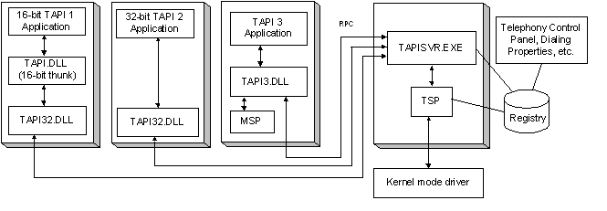

# TAPI DLL

The TAPI DLLs, along with the TAPI Server (Tapisvr.exe), are crucial abstractions separating end-user or server applications from service providers. A TAPI DLL in conjunction with the TAPI Server provides a consistent interface between these two layers.

A TAPI application loads the appropriate DLL into its process space. During initialization, TAPI establishes an RPC link with Tapisvr.exe. The TAPI Server runs in the context of SVCHOST.

There are three DLLs associated with TAPI: Tapi.dll, Tapi32.dll, and Tapi3.dll. These DLLs are located in %SystemRoot%\\system32. The following figure illustrates the roles of their respective roles in Microsoft Telephony:

Existing 16-bit applications link to Tapi.dll. Tapi.dll is simply a thunk layer that maps 16-bit addresses to 32-bit addresses and pass requests to Tapi32.dll.

Existing 32-bit TAPI 2.x applications link to Tapi32.dll. Tapi32.dll is a thin marshalling layer that transfers function requests to the TAPI Server (TAPISRV) and, when needed, loads and invokes media service provider DLLs in the application's process.

TAPI 3.x applications link to Tapi3.dll.

 

 

