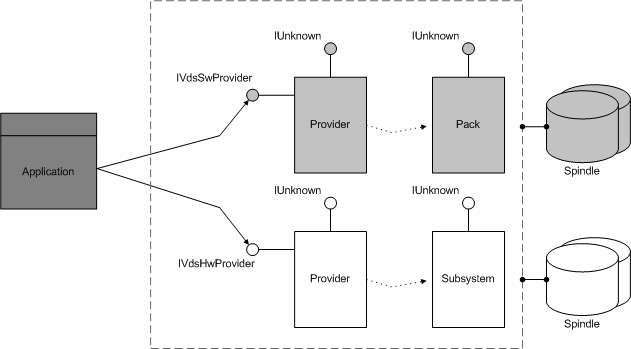

# Provider Object

\[Beginning with Windows 8 and Windows Server 2012, the [Virtual Disk Service](virtual-disk-service-portal.md) COM interface is superseded by the [Windows Storage Management API](https://msdn.microsoft.com/library/windows/desktop/hh830613).\]

The provider object models the program that is responsible for storage management. This object provides access to both software provider and hardware provider functionality. Provider programs execute operations on software devices (volumes and disks) and hardware devices (storage subsystems and arrays of drives behind RAID controllers).

VDS registers a provider object as a COM object in the Windows Registry and uses contained interfaces (not aggregation) to implement the remaining objects, wrapping all the interfaces and methods and conditionally adding functionality. The objects and interfaces that are wrapped by the provider object differ depending on the provider type.

You cannot instantiate a provider object directly from your application. Instead, you must start up VDS, obtain a pointer to a service object, and use the service object to query for the providers known to the host. For instructions on loading VDS, see [Startup and Service Objects](startup-and-service-objects.md).

Use the [**IVdsService::QueryProviders**](/windows/desktop/api/Vds/nf-vds-ivdsservice-queryproviders) method to enumerate the registered provider programs on a host. The first parameter of the method enables you to specify software providers only, hardware providers only, or both. With a provider object, you can perform operations on the objects managed by that provider. As the following illustration shows, you can use the methods that are exposed by the [**IVdsSwProvider**](/windows/desktop/api/Vds/nn-vds-ivdsswprovider) interface to create and query pack objects that are associated with software providers. Likewise, you can use the methods on the [**IVdsHwProvider**](/windows/desktop/api/Vds/nn-vds-ivdshwprovider) interface to interact with the subsystem objects that are associated with hardware providers.

Object properties include a persistent GUID object identifier that represents a specific provider and a second GUID that represents the provider version. Note that other object identifiers in the VDS object model are non-persistent. The remaining properties for this object include a provider name, additional version information, the provider type software or hardware), various flags, and a rebuild-priority setting that applies only to software providers.

The following table lists related interfaces, enumerations, and structures 

| Type                                                                                         | Element                                                                                                                                                                                                                                                                                        |
|----------------------------------------------------------------------------------------------|------------------------------------------------------------------------------------------------------------------------------------------------------------------------------------------------------------------------------------------------------------------------------------------------|
| Interfaces that are always exposed by this object                                            | [**IVdsProvider**](/windows/desktop/api/Vds/nn-vds-ivdsprovider)                                                                                                                                                                                                                                                           |
| Interfaces that are always exposed by software providers only                                | [**IVdsSwProvider**](/windows/desktop/api/Vds/nn-vds-ivdsswprovider)                                                                                                                                                                                                                                                       |
| Interfaces that are always exposed by hardware providers only                                | [**IVdsHwProvider**](/windows/desktop/api/Vds/nn-vds-ivdshwprovider)                                                                                                                                                                                                                                                       |
| Interfaces that may be exposed by this object                                                | [**IVdsProviderSupport**](/windows/desktop/api/Vds/nn-vds-ivdsprovidersupport)                                                                                                                                                                                                                                             |
| Interfaces that may be exposed by hardware providers only                                    | [**IVdsHwProviderType**](/windows/desktop/api/Vds/nn-vds-ivdshwprovidertype), [**IVdsHwProviderStoragePools**](/windows/desktop/api/Vds/nn-vds-ivdshwproviderstoragepools)**Windows Server 2008, Windows Vista, and Windows Server 2003:** The [**IVdsHwProviderStoragePools**](/windows/desktop/api/Vds/nn-vds-ivdshwproviderstoragepools) interface is not supported.  |
| Interfaces that are always implemented but not exposed to applications                       | [**IVdsProviderPrivate**](/windows/desktop/api/VdsHwPrv/nn-vdshwprv-ivdsproviderprivate)                                                                                                                                                                                                                                             |
| Interfaces that are always implemented by hardware providers but not exposed to applications | [**IVdsHwProviderPrivate**](/windows/desktop/api/VdsHwPrv/nn-vdshwprv-ivdshwproviderprivate)                                                                                                                                                                                                                                         |
| Interfaces that may be implemented by hardware providers but not exposed to applications     | [**IVdsHwProviderPrivateMpio**](/windows/desktop/api/VdsHwPrv/nn-vdshwprv-ivdshwproviderprivatempio)                                                                                                                                                                                                                                 |
| Associated enumerations                                                                      | [**VDS\_PROVIDER\_FLAG**](/windows/desktop/api/Vds/ne-vds-_vds_provider_flag), [**VDS\_QUERY\_PROVIDER\_FLAG**](/windows/desktop/api/Vds/ne-vds-_vds_query_provider_flag), and [**VDS\_PROVIDER\_TYPE**](/windows/desktop/api/Vds/ne-vds-_vds_provider_type).                                                                                                                         |
| Associated structures                                                                        | None.                                                                                                                                                                                                                                                                                          |

 

## Related topics

<dl> <dt>

[VDS Object Model](vds-object-model.md)
</dt> <dt>

[Startup and Service Objects](startup-and-service-objects.md)
</dt> <dt>

[**IVdsService::QueryProviders**](/windows/desktop/api/Vds/nf-vds-ivdsservice-queryproviders)
</dt> <dt>

[**IVdsSwProvider**](/windows/desktop/api/Vds/nn-vds-ivdsswprovider)
</dt> <dt>

[**IVdsHwProvider**](/windows/desktop/api/Vds/nn-vds-ivdshwprovider)
</dt> </dl>

 

 

