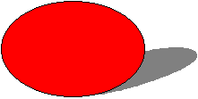

# Using the Shadow Element

This topic describes VML, a feature that is deprecated as of Windows Internet Explorer 9. Webpages and applications that rely on VML should be [migrated to SVG](http://go.microsoft.com/fwlink/p/?LinkID=236964) or other widely supported standards.

> [!Note]  
> As of December 2011, this topic has been archived. As a result, it is no longer actively maintained. For more information, see [Archived Content](https://msdn.microsoft.com/library/hh772377). For information, recommendations, and guidance regarding the current version of Windows Internet Explorer, see [Internet Explorer Developer Center](http://go.microsoft.com/fwlink/p/?linkid=204313).

 

In this topic, we will illustrate how to use the <shadow> sub-element to draw a shape that has various shadow effects.

You can place the <shadow> sub-element inside the <shape>, <shapetype>, or any predefined shape element to draw a shape with a shadow. You can then use the property attributes of the <shadow> sub-element to customize the shadow.

For example, to create a shape with a shadow, as shown in the following picture, you can type the following lines in the <BODY> region of your Web page:




```HTML
<v:oval style='width:120pt;height:80pt;' fillcolor="red">
<v:shadow on="t" type="perspective"
origin=".5,.5" offset="0,0"
matrix=",-92680f,,,,-95367431641e-17"/>
</v:oval>
```


[Show Me](http://samples.msdn.microsoft.com/workshop/samples/vml/examples/Shadow/Shape1.md)

-   `on="t"` and `type="perspective"` indicate to turn on the shadow using the perspective type.
-   The **origin** and **offset** indicate where to draw the shadow.
-   `matrix="..."` specifies the perspective transform matrix.

For more information about this element, see the [VML specification](http://www.w3.org/TR/NOTE-VML#-toc416858396) .

 

 


