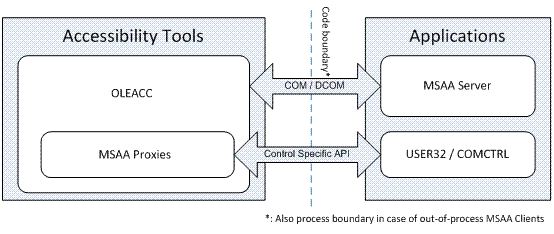
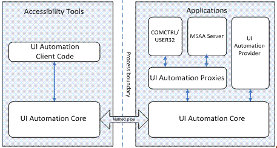
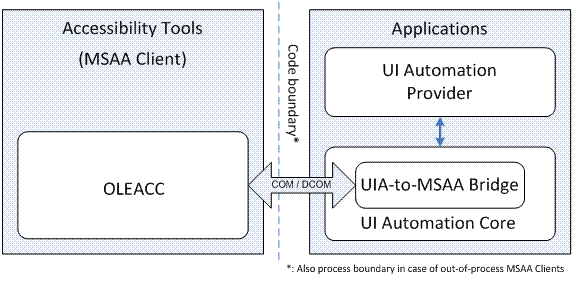

# Architecture and Interoperability

This topic briefly describes the architecture of Microsoft Active Accessibility and Microsoft UI Automation, and the components that allow interoperability between applications based on the two different technologies.

For more information about Microsoft Active Accessibility and UI Automation interoperability, see [Common Infrastructure](common-infrastructure.md).

This topic contains the following sections.

-   [Microsoft Active Accessibility Architecture](#microsoft-active-accessibility-architecture)
-   [UI Automation Architecture](#ui-automation-architecture)
-   [Microsoft Active Accessibility and UI Automation Interoperability](#microsoft-active-accessibility-and-ui-automation-interoperability)
-   [The IAccessibleEx Interface](#the-iaccessibleex-interface)
-   [Related topics](#related-topics)

## Microsoft Active Accessibility Architecture

Microsoft Active Accessibility exposes basic information about controls such as control name, location on screen, and type of control, as well as state information such as visibility and enabled/disabled status. The UI is represented as a hierarchy of accessible objects; changes and actions are represented as WinEvents.

Microsoft Active Accessibility consists of the following components:

-   Accessible object—A logical UI element (such as a button) that is represented by an [**IAccessible**](iaccessible.md) Component Object Model (COM) interface and an integer child identifier (ChildID).
-   WinEvents—An event system that enables servers to notify clients when an accessible object changes. For more information, see [WinEvents](winevents-collision169.md).
-   OLEACC.dll—The run-time, dynamic-link library that provides the Microsoft Active Accessibility API and the accessibility system framework. OLEACC implements proxy objects that provide default accessibility information for standard UI elements, including USER controls, USER menus, and common controls.

For Microsoft Active Accessibility, the system component of the accessibility framework (OLEACC) helps the communication between assistive technologies (accessibility tools) and applications, as the following illustration shows.

The applications (Microsoft Active Accessibility servers) provide UI accessibility information to tools (Microsoft Active Accessibility clients), which interact with the UI on behalf of users. The code boundary is both a programmatic and a process boundary.

## UI Automation Architecture

With UI Automation, the UI Automation core component (UIAutomationCore.dll) is loaded into both the accessibility tools' and applications' processes. The core component manages cross-process communication, provides higher level services such as searching for elements by property values, and enables bulk fetching or caching of properties, which provides better performance than the Microsoft Active Accessibility implementation.

UI Automation includes proxy objects that provide UI information about standard UI elements such as USER controls, USER menus, and common controls. It also includes proxies that enable UI Automation clients to get UI information from Microsoft Active Accessibility servers.

The following illustration shows the relationships among the various UI Automation compontents used in accessibility tools (clients) and in applications (providers).

## Microsoft Active Accessibility and UI Automation Interoperability

The UI Automation to Microsoft Active Accessibility Bridge enables Microsoft Active Accessibility clients to access UI Automation providers by converting the UI Automation object model to a Microsoft Active Accessibility object model. The following illustration shows the role of the UI Automation-to-Microsoft Active Accessibility Bridge.

Similarly, the Microsoft Active Accessibility-to-UI Automation Proxy translates Microsoft Active Accessibility-based server object models for UI Automation clients. The following illustration shows the role of the Microsoft Active Accessibility-to-UI Automation Proxy.

## The IAccessibleEx Interface

The [**IAccessibleEx**](uiauto-iaccessibleex.md) interface enables existing applications or UI libraries to extend their Microsoft Active Accessibility object model to support UI Automation without rewriting the implementation from scratch. With **IAccessibleEx**, you can implement only the additional UI Automation properties and control patterns needed to fully describe the UI and its functionality.

Because the Microsoft Active Accessibility-to-UI Automation Proxy translates the object models of [**IAccessibleEx**](uiauto-iaccessibleex.md)-enabled Microsoft Active Accessibility servers as UI Automation object models, UI Automation clients do not need to do any extra work. The **IAccessibleEx** interface can also enable in-process Microsoft Active Accessibility clients to interact directly with UI Automation providers.

For more information, see [The IAccessibleEx Interface](iaccessibleex.md).

## Related topics

<dl> <dt>

[Windows Automation API Overview](windows-automation-api-overview.md)
</dt> <dt>

[The IAccessibleEx Interface](iaccessibleex.md)
</dt> <dt>

[Security Considerations for Assistive Technologies](uiauto-securityoverview.md)
</dt> </dl>

 

 

