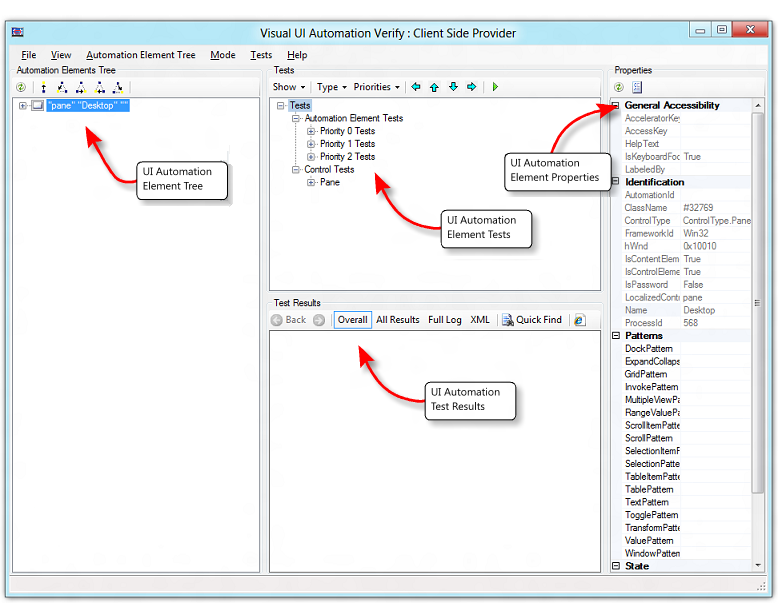
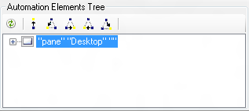
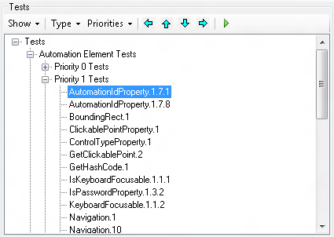
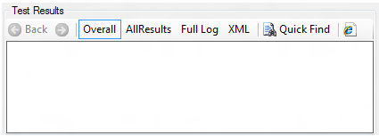
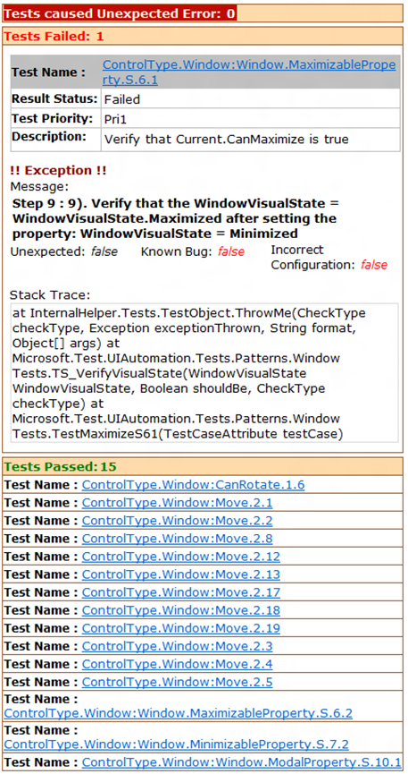
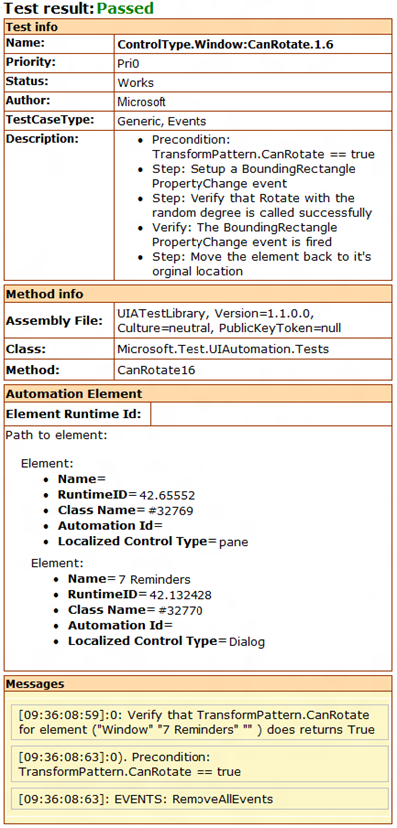
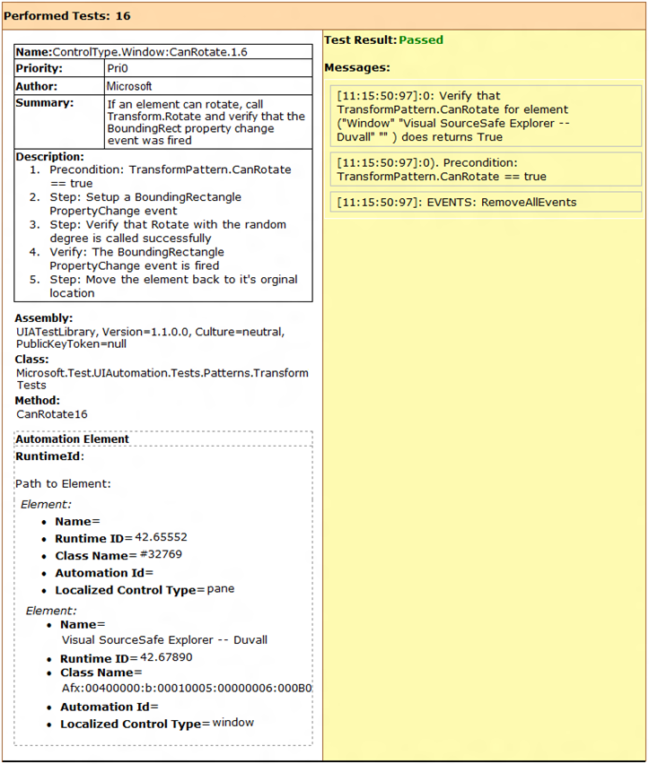
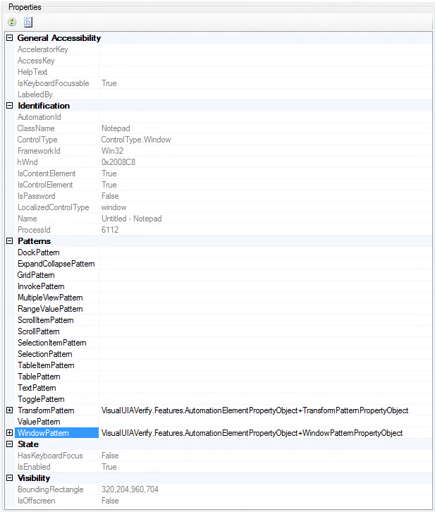

# Visual UI Automation Verify

Visual UI Automation Verify (Visual UIA Verify) is a Windows GUI driver for the UIA Test Library that is designed for manual testing of UI automation. It provides an interface to UIA Test Library functionality that eliminates the coding overhead of a command-line tool.

-   [Menu Commands](#menu-commands)
-   [Functional Panes](#functional-panes)
    -   [Automation Elements Tree Pane](#automation-elements-tree-pane)
    -   [Tests Pane](#tests-pane)
    -   [Test Results Pane](#test-results-pane)
    -   [Properties Pane](#properties-pane)

Visual UIA Verify supports only the UIA Verify XML logger (WUIALoggerXml.dll) natively. User-selectable XML transformations are incorporated into Visual UIA Verify to present various views of the XML logger report in the **Test Results** pane.

By default, Visual UIA Verify loads the UI Automation client-side provider that shipped with the original release of UI Automation. You can choose not to load this provider by adding **/NOCLIENTSIDEPROVIDER** in the command-line option of VisualUIVerifyNative.exe.

The following screen shot shows the main functional areas of the Visual UIA Verify user interface.

## Menu Commands

The following table describes the commands in the Visual UIA Verify menu.

<table>
<colgroup>
<col style="width: 33%" />
<col style="width: 33%" />
<col style="width: 33%" />
</colgroup>
<thead>
<tr class="header">
<th>Menu</th>
<th>Command</th>
<th>Description</th>
</tr>
</thead>
<tbody>
<tr class="odd">
<td><strong>File</strong></td>
<td><strong>Exit</strong></td>
<td>Exit Visual UIA Verify.</td>
</tr>
<tr class="even">
<td><strong>View</strong></td>
<td><strong>Highlighting</strong></td>
<td>Highlight the bounding rectangle of the selected element in the <strong>Automation Elements Tree</strong> pane. The following options are available.
<ul>
<li><strong>Rectangle</strong>—A solid red line.</li>
<li><strong>Fading Rectangle</strong>—A solid red line that disappears after a few seconds.</li>
<li><strong>Rays and Rectangle</strong>—A solid red line with additional blue highlight lines that radiate from each corner of the bounding rectangle.</li>
<li><strong>None</strong>—No visible highlight.</li>
</ul></td>
</tr>
<tr class="odd">
<td rowspan="2"><strong>Automation Elements Tree</strong>${REMOVE}$ 
</td>
<td><strong>Refresh Selected Element</strong></td>
<td>Refresh the children of the selected element in the <strong>Automation Elements Tree</strong> pane. The list of elements is static and does not refresh dynamically (automatically) if the element tree changes.</td>
</tr>
<tr class="even">
<td><strong>Navigation</strong></td>
<td>Navigate through the element tree hierarchy to one of the following elements.
<ul>
<li><strong>Parent</strong>—Go to parent element.</li>
<li><strong>First Child</strong>—Go to first child element.</li>
<li><strong>Next Sibling</strong>—Go to first sibling element.</li>
<li><strong>Previous Sibling</strong>—Go to previous sibling element.</li>
<li><strong>Last Child</strong>—Go to last child element.</li>
</ul></td>

</tr>
<tr class="odd">
<td rowspan="3"><strong>Mode</strong>${REMOVE}$ 
</td>
<td><strong>Always On Top</strong></td>
<td>The Visual UIA Verify window remains at the top of the desktop z-order.</td>
</tr>
<tr class="even">
<td><strong>Hover Mode (Use Ctrl)</strong></td>
<td>When the Ctrl key is pressed, the element under the mouse cursor is identified as the element of interest. The <strong>Automation Elements Tree</strong> pane is refreshed and the corresponding item in the element list is highlighted.</td>

</tr>
<tr class="odd">
<td><strong>Focus Tracking</strong></td>
<td>As the focus changes, the element with the focus is identified as the element of interest. The <strong>Automation Elements Tree</strong> pane is refreshed and the corresponding item in the element list is highlighted.</td>

</tr>
<tr class="even">
<td rowspan="6"><strong>Tests</strong>${REMOVE}$ 
</td>
<td><strong>Go Left</strong></td>
<td>Move one node left in the <strong>Tests</strong> tree.</td>
</tr>
<tr class="odd">
<td><strong>Go Up</strong></td>
<td>Move one node up in the <strong>Tests</strong> tree.</td>

</tr>
<tr class="even">
<td><strong>Go Down</strong></td>
<td>Move one node down in the <strong>Tests</strong> tree.</td>

</tr>
<tr class="odd">
<td><strong>Go Right</strong></td>
<td>Move one node right in the <strong>Tests</strong> tree.</td>

</tr>
<tr class="even">
<td><strong>Run Selected Test(s) On Selected Element</strong></td>
<td>Run the selected tests from the <strong>Tests</strong> tree on the selected element.</td>

</tr>
<tr class="odd">
<td><strong>Filter Known Problems</strong></td>
<td>Filter known UI Automation bugs from the test results.</td>

</tr>
<tr class="even">
<td><strong>Help</strong></td>
<td><strong>About Visual UI Automation Verify</strong></td>
<td>Display the software version and copyright information for Visual UIA Verify.</td>
</tr>
</tbody>
</table>

 

## Functional Panes

This section describes the functional panes in the Visual UIA Verify user interface.

-   [Automation Elements Tree Pane](#automation-elements-tree-pane)
-   [Tests Pane](#tests-pane)
-   [Test Results Pane](#test-results-pane)
-   [Properties Pane](#properties-pane)

### Automation Elements Tree Pane

The **Automation Elements Tree** pane contains a hierarchical snapshot of automation element objects that are available for testing. The top element in the tree represents the desktop.

This view is a static collection that is compiled when Visual UIA Verify starts. To refresh the view at the selected node, use the **Refresh Selected Element** menu command or toolbar button.

The following screen shot shows the **Automation Elements Tree** pane.

A dimmed (unavailable) node in the **Automation Elements Tree** indicates that the element is a member of the UI Automation raw view, but does not meet the conditions necessary to be considered a member of the content view or control view. However, the element can still be tested from Visual UI Automation Verify. For more information, see the [UI Automation Tree Overview](uiauto-treeoverview.md).

Commands available from the **Automation Elements Tree** toolbar include:

-   **Refresh**—Refresh the selected node and its children. This command does not refresh the entire element tree unless the root node is selected.
-   **Parent (Ctrl+Shift+F6)**—Go to parent of the current node.
-   **First Child (Ctrl+Shift+F7)**—Go to first child of the current node..
-   **Next Sibling (Ctrl+Shift+F8)**—Go to next sibling child of the current node.
-   **Previous Sibling (Ctrl+Shift+F9)**—Go to previous sibling of the current node.
-   **Last Child (Ctrl+Shift+F10)**—Go to last child of the current node.
-   **Focus Tracking**—Toggle node selection on or off based on focus tracking.

### Tests Pane

The **Tests** pane contains a list of UI Automation tests organized by test type (**Automation Element**, **Control**, and **Pattern**) and priority (**Build Verification**, **Priority 0**, **Priority 1**, **Priority 2**, and **Priority 3**). This list is generated based on the control type of the selected element in the **Automation Elements Tree** pane. For more information, see [UI Automation Control Types Overview](uiauto-controltypesoverview.md).

The following screen shot shows the **Tests** pane.

Commands available from the **Tests** toolbar include:

-   **Show**—Specifies the UI Automation tests to display; that is, display all tests or only tests suited to the control type of the selected element in the **Automation Elements Tree** (default).
-   **Type**—Specifies the test types to display: **Automation Element**, **Pattern**, or **Control**.
-   **Priorities**—Specifies the test priorities to display: **Build Verification**, **Priority 0**, **Priority 1**, **Priority 2**, or **Priority 3**.
-   **Go Left**—Go to the parent of the current node.
-   **Go Up**—Go to the previous sibling of the current node.
-   **Go Down**—Go to the next sibling of the current node.
-   **Go Right**—Go to the first child of the current node.
-   **Run Selected Test(s)**—Runs the tests on the element selected in the **Automation Elements Tree**.

### Test Results Pane

The **Test Results** pane contains the Visual UIA Verify logging functionality. The following screen shot shows the **Test Results** pane.

Commands available from the **Tests Results** toolbar include:

-   **Back**—Page backward in report viewing history.
-   **Forward**—Page forward in report viewing history.
-   **Overall**—Displays a summary of the test results (**Passed**, **Failed**, and **Unexpected Error**). The test result is linked to the **All Results** view. The **Overall** command displays a table like the following one.

    

-   **All Results**— Displays a detailed log for each test result, as shown in the following tables.

    

    The test name in the **All Results** table is linked to a test case description for the element, as in the following table.

    

-   **Full Log**—Displays an alternate view of the detailed log for each test result, as shown in the following screen shot.

    

-   **XML**—Displays the raw XML generated by the XML logger.
-   **Quick Find**—Simple text search of the current view in the **Test Results** pane.
-   **Open in New Window**—Opens the current view in a new instance of Internet Explorer.

### Properties Pane

The **Properties** pane contains a list of UI Automation properties and property values organized by property type: **General Accessibility**, **Identification**, **Patterns** (control patterns), **State**, and **Visibility**. The property values are dynamically populated based on the control type of the object selected in the **Automation Elements Tree** pane. The following screen shot shows the **Properties** pane.

If the selected control supports a specific control pattern, Visual UIA Verify provides the ability to call methods that are supported by that control pattern. For example, the [Window control type](uiauto-supportwindowcontroltype.md) supports the [Window control pattern](uiauto-implementingwindow.md), which has a [**Close**](/windows/desktop/api/UIAutomationClient/nf-uiautomationclient-iuiautomationwindowpattern-close) method that can be invoked from the **Properties** pane, as shown in the following screen shot. For more information, see [UI Automation Control Types Overview](uiauto-controltypesoverview.md).

Commands available from the **Properties** toolbar include:

-   **Refresh**—Refresh the **Properties** tree.
-   **Expand All**—Expands all nodes in the **Properties** tree.

 

 

