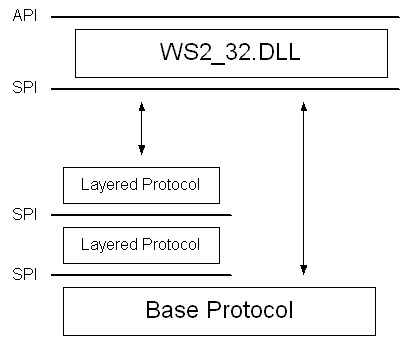

# Layered Protocols and Protocol Chains

Windows Sockets 2 incorporates the concept of a layered protocol: one that implements only higher-level communications functions while relying on an underlying transport stack for the actual exchange of data with a remote endpoint. An example of this type of layered protocol is a security layer that adds a protocol to the socket connection process in order to perform authentication and establish an encryption scheme. Such a security protocol generally requires the services of an underlying and reliable transport protocol such as TCP or SPX.

The term *base protocol* refers to a protocol, such as TCP or SPX, that is fully capable of performing data communications with a remote endpoint. A *layered protocol* is a protocol that cannot stand alone, while a *protocol chain* is one or more layered protocols strung together and anchored by a base protocol.

You can create a protocol chain if you design the layered protocols to support the Windows Sockets 2 SPI at both their upper and lower edges. A special [**WSAPROTOCOL\_INFO**](/windows/desktop/api/Winsock2/) structure refers to the protocol chain as a whole and describes the explicit order in which the layered protocols are joined. This is illustrated in the figure below. Since only base protocols and protocol chains are directly usable by applications, they are the only ones listed when the installed protocols are enumerated with the [**WSAEnumProtocols**](/windows/desktop/api/Winsock2/nf-winsock2-wsaenumprotocolsa) function.

 

 

