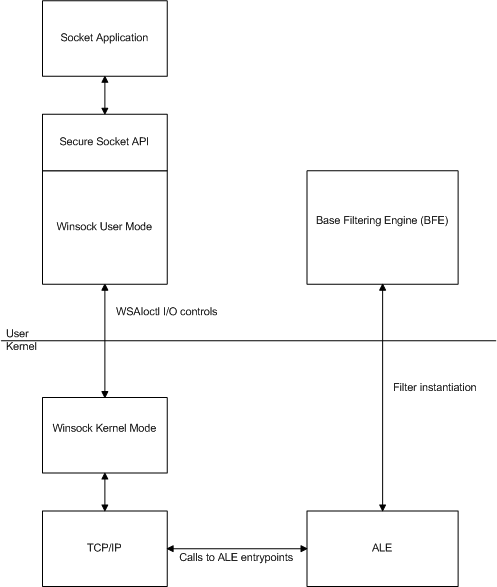

# Winsock Secure Socket Extensions

The secure socket extensions to Winsock allow a socket application to control the security of their traffic over a network. These extensions allow an application to provide security policy and requirements for their network traffic, and query the security settings applied. For example, an application can use these extensions to query the peer security token that can be used to perform application level access checks.

The secure socket extensions are intended to integrate the services provided by IPsec and other security protocols with the Winsock framework. Prior to Windows Vista, on Windows Server 2003 and Windows XP, IPsec has been configured by an administrator via local and domain policies. On Windows Vista, the secure socket extensions instead allow applications to entirely or partially configure and control the security of their network traffic at the socket level.

Applications can already secure network traffic by using public APIs, such as IPsec management, Windows Filtering Platform and Security Support Provider Interface (SSPI). However, using these APIs may make the application more difficult to develop, and may make it more difficult to configure and deploy. The Winsock secure socket extensions have been designed to simplify the development of network applications that require secure network traffic by letting Winsock handle most of the complexity.

These secure socket extensions are available on Windows Vista and later.

## Secure Socket Functions

The secure socket extension functions are as follows:

-   [**WSADeleteSocketPeerTargetName**](/windows/desktop/api/Ws2tcpip/nf-ws2tcpip-wsadeletesocketpeertargetname)
-   [**WSAImpersonateSocketPeer**](/windows/desktop/api/Ws2tcpip/nf-ws2tcpip-wsaimpersonatesocketpeer)
-   [**WSAQuerySocketSecurity**](/windows/desktop/api/Ws2tcpip/nf-ws2tcpip-wsaquerysocketsecurity)
-   [**WSARevertImpersonation**](/windows/desktop/api/Ws2tcpip/nf-ws2tcpip-wsarevertimpersonation)
-   [**WSASetSocketPeerTargetName**](/windows/desktop/api/Ws2tcpip/nf-ws2tcpip-wsasetsocketpeertargetname)
-   [**WSASetSocketSecurity**](/windows/desktop/api/Ws2tcpip/nf-ws2tcpip-wsasetsocketsecurity)

> [!Note]  
> The secure socket functions currently support only the IPsec protocol and are available on Windows Vista and later.

 

The structures and enumerations used by the secure socket functions are as follows:

-   [**SOCKET\_PEER\_TARGET\_NAME**](/windows/desktop/api/Mstcpip/ns-mstcpip-_socket_peer_target_name)
-   [**SOCKET\_SECURITY\_PROTOCOL**](/windows/desktop/api/Mstcpip/ne-mstcpip-_socket_security_protocol)
-   [**SOCKET\_SECURITY\_QUERY\_INFO**](/windows/desktop/api/Mstcpip/ns-mstcpip-_socket_security_query_info)
-   [**SOCKET\_SECURITY\_QUERY\_TEMPLATE**](/windows/desktop/api/Mstcpip/ns-mstcpip-_socket_security_query_template)
-   [**SOCKET\_SECURITY\_SETTINGS**](/windows/desktop/api/Mstcpip/ns-mstcpip-_socket_security_settings)
-   [**SOCKET\_SECURITY\_SETTINGS\_IPSEC**](/windows/desktop/api/Mstcpip/ns-mstcpip-_socket_security_settings_ipsec)

The secure socket functions are simple to use for normal applications and are flexible enough for applications that need a high degree of control over their security. These functions make it possible to keep the underlying security mechanism hidden from the application. An application can specify generic security requirements and let the administrator control the security protocol that is used to support the requirements. While it is possible to extend these functions to add other security protocols, currently only IPsec integrates with the secure socket functions.

The [**WSASetSocketSecurity**](/windows/desktop/api/Ws2tcpip/nf-ws2tcpip-wsasetsocketsecurity) function allows an application to enable security and apply security settings before a connection is established.

The [**WSASetSocketPeerTargetName**](/windows/desktop/api/Ws2tcpip/nf-ws2tcpip-wsasetsocketpeertargetname) function allows an application to specify the target name corresponding to a peer entity. The selected security protocol will use this information when authenticating the peer. This feature addresses concerns about trusted man-in-the-middle attacks.

The [**WSADeleteSocketPeerTargetName**](/windows/desktop/api/Ws2tcpip/nf-ws2tcpip-wsadeletesocketpeertargetname) function is used to delete a previously specified peer name for a socket.

After a connection is established, the [**WSAQuerySocketSecurity**](/windows/desktop/api/Ws2tcpip/nf-ws2tcpip-wsaquerysocketsecurity) function allows an application to query the security properties of the connection, which can include the peer access or computer access token.

After a connection is established, the [**WSAImpersonateSocketPeer**](/windows/desktop/api/Ws2tcpip/nf-ws2tcpip-wsaimpersonatesocketpeer) function allows an application to impersonate the security principal corresponding to a socket peer in order to perform application-level authorization.

The [**WSARevertImpersonation**](/windows/desktop/api/Ws2tcpip/nf-ws2tcpip-wsarevertimpersonation) allows an application to terminate the impersonation of a socket peer.

## Secure Socket Architecture

-   An application calls the secure socket functions to set or query security settings for a socket.
-   The secure socket functions are a set of type-safe extension functions that wrap calls to the [**WSAIoctl**](/windows/desktop/api/Winsock2/nf-winsock2-wsaioctl) function using newly-defined values for the *dwIoControlCode* parameter available on Windows Vista and later. These IOCTLs are handled by the network stack.
-   The network stack will direct the call to [Application Layer Enforcement (ALE)](https://msdn.microsoft.com/ffebd312-9220-476c-a4ba-28e2e8ac8879) along with the endpoint handle. For the [**WSADeleteSocketPeerTargetName**](/windows/desktop/api/Ws2tcpip/nf-ws2tcpip-wsadeletesocketpeertargetname), [**WSASetSocketPeerTargetName**](/windows/desktop/api/Ws2tcpip/nf-ws2tcpip-wsasetsocketpeertargetname), and [**WSASetSocketSecurity**](/windows/desktop/api/Ws2tcpip/nf-ws2tcpip-wsasetsocketsecurity) functions, ALE will configure the application's settings on the local endpoint. For the [**WSAQuerySocketSecurity**](/windows/desktop/api/Ws2tcpip/nf-ws2tcpip-wsaquerysocketsecurity) function, ALE will read the requested information from applicable local and remote endpoints.
-   Based on socket events, Application Layer Enforcement (ALE) enforces policies for the secure socket architecture using the Windows Filtering Platform. For more information, see [About Windows Filtering Platform](https://msdn.microsoft.com/6faad008-b2f6-4f45-89c7-ae98c2f58ce1) and [Application Layer Enforcement (ALE)](https://msdn.microsoft.com/ffebd312-9220-476c-a4ba-28e2e8ac8879).

## Related topics

<dl> <dt>

[About Windows Filtering Platform](https://msdn.microsoft.com/6faad008-b2f6-4f45-89c7-ae98c2f58ce1)
</dt> <dt>

[Advanced Winsock Samples Using Secure Socket Extensions](advanced-winsock-samples-using-secure-socket-extensions.md)
</dt> <dt>

[Application Layer Enforcement (ALE)](https://msdn.microsoft.com/ffebd312-9220-476c-a4ba-28e2e8ac8879)
</dt> <dt>

[IPsec Configuration](https://msdn.microsoft.com/d54b5caa-daea-4231-9909-7a8d388df661)
</dt> <dt>

[IPsec Functions](https://msdn.microsoft.com/db656c58-7776-44c4-a7ce-c38e59b37c74)
</dt> <dt>

[Secure Winsock Programming](secure-winsock-programming.md)
</dt> <dt>

[Security Support Provider Interface (SSPI)](https://msdn.microsoft.com/79ed7c51-4191-40b2-8d5f-06157f5b99be)
</dt> <dt>

[Using Secure Socket Extensions](using-secure-socket-extensions.md)
</dt> <dt>

[Windows Filtering Platform](https://www.bing.com/search?q=Windows+Filtering+Platform)
</dt> <dt>

[Windows Filtering Platform API Functions](https://msdn.microsoft.com/26a69710-9981-40a4-8b1e-dca709624ead)
</dt> </dl>

 

 

