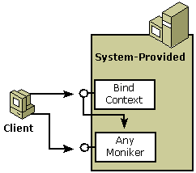

# Asynchronous and Synchronous Monikers

A client of a standard, synchronous OLE moniker typically creates and holds a reference to the moniker, as well as the bind-context to be used during binding. The components involved in using traditional monikers are shown in the following diagram.

Clients typically create standard monikers by calling functions such as [**CreateFileMoniker**](createfilemoniker.md), [**CreateItemMoniker**](createitemmoniker.md), or [**CreatePointerMoniker**](createpointermoniker.md) or, because they are can be saved to persistent storage, through [**OleSaveToStream**](olesavetostream.md) and [**OleLoadFromStream**](oleloadfromstream.md). Monikers may also be obtained from a container object by calling the [**IBindHost::CreateMoniker**](_inet_IBindHost_CreateMoniker_Method) method. Clients create bind contexts by calling the [**CreateBindCtx**](createbindctx.md) function and then pass the bind context to the moniker with calls to [**IMoniker::BindToStorage**](imoniker-bindtostorage.md) or [**IMoniker::BindToObject**](imoniker-bindtoobject.md).

As shown in the following diagram, a client of an asynchronous moniker also creates and holds a reference to the moniker and bind context to be used during binding.

To get asynchronous behavior, the client implements the [**IBindStatusCallback**](_inet_IBindStatusCallback_Interface_cpp) interface on a bind-status-callback object and calls either the [**RegisterBindStatusCallback**](_inet_RegisterBindStatusCallback_Function_cpp) function or the [**CreateAsyncBindCtx**](createasyncbindctx.md) function to register this interface with the bind context. The moniker passes a pointer to its [**IBinding**](_inet_IBinding_Interface_cpp) interface in a call to the [**IBindStatusCallback::OnStartBinding**](_inet_IBindStatusCallback_OnStartBinding_Method) method. The client tells the asynchronous moniker how it wants to bind on return from the moniker's call to [**IBindStatusCallback::GetBindInfo**](_inet_IBindStatusCallback_GetBindInfo_Method) method.

## Related topics

<dl> <dt>

[Asynchronous Monikers](asynchronous-monikers.md)
</dt> </dl>

 

 

