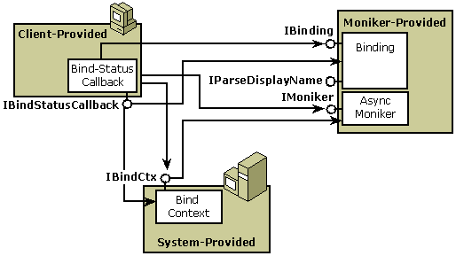

# Asynchronous and Synchronous Monikers

A client of a standard, synchronous OLE moniker typically creates and holds a reference to the moniker, as well as the bind-context to be used during binding. The components involved in using traditional monikers are shown in the following diagram.

Clients typically create standard monikers by calling functions such as [**CreateFileMoniker**](/windows/desktop/api/Objbase/nf-objbase-createfilemoniker), [**CreateItemMoniker**](/windows/desktop/api/Objbase/nf-objbase-createitemmoniker), or [**CreatePointerMoniker**](/windows/desktop/api/Objbase/nf-objbase-createpointermoniker) or, because they are can be saved to persistent storage, through [**OleSaveToStream**](/windows/desktop/api/ole/nf-ole-olesavetostream) and [**OleLoadFromStream**](/windows/desktop/api/ole/nf-ole-oleloadfromstream). Monikers may also be obtained from a container object by calling the [**IBindHost::CreateMoniker**](45e7247f-c611-4a6a-a630-3c20c3581a7d) method. Clients create bind contexts by calling the [**CreateBindCtx**](/windows/desktop/api/Objbase/nf-objbase-createbindctx) function and then pass the bind context to the moniker with calls to [**IMoniker::BindToStorage**](/windows/desktop/api/ObjIdl/nf-objidl-imoniker-bindtostorage) or [**IMoniker::BindToObject**](/windows/desktop/api/ObjIdl/nf-objidl-imoniker-bindtoobject).

As shown in the following diagram, a client of an asynchronous moniker also creates and holds a reference to the moniker and bind context to be used during binding.

To get asynchronous behavior, the client implements the [**IBindStatusCallback**](https://www.bing.com/search?q=**IBindStatusCallback**) interface on a bind-status-callback object and calls either the [**RegisterBindStatusCallback**](https://www.bing.com/search?q=**RegisterBindStatusCallback**) function or the [**CreateAsyncBindCtx**](/windows/desktop/api/Urlmon/nf-urlmon-createasyncbindctx) function to register this interface with the bind context. The moniker passes a pointer to its [**IBinding**](https://www.bing.com/search?q=**IBinding**) interface in a call to the [**IBindStatusCallback::OnStartBinding**](75a6432d-d3c6-4010-85fe-355278d86cbb) method. The client tells the asynchronous moniker how it wants to bind on return from the moniker's call to [**IBindStatusCallback::GetBindInfo**](a402c6a2-bae3-4874-8fc9-67d04b67687e) method.

## Related topics

<dl> <dt>

[Asynchronous Monikers](asynchronous-monikers.md)
</dt> </dl>

 

 

