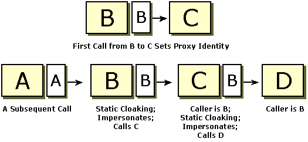
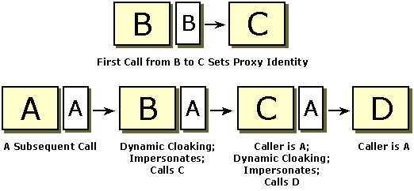

# Cloaking

Cloaking is a COM security capability that determines what identity the client projects toward the server during impersonation. When cloaking is set, the intermediate server masks its own identity and presents the client's identity to the server that it calls on the client's behalf. Basically; the client identity that is seen by the server is the identity associated with the proxy. The proxy's identity is determined by several factors, one of which is the type of cloaking that is set (if any). Cloaking is not supported by the Schannel security provider.

The following topics provide more information about cloaking:

-   [Types of Cloaking](#types-of-cloaking)
-   [How Cloaking Affects Client Identity](#how-cloaking-affects-client-identity)
-   [Setting Cloaking](#setting-cloaking)
-   [Cloaking and Impersonation Levels](#cloaking-and-impersonation-levels)
-   [Cloaking Scenarios](#cloaking-scenarios)
-   [Related topics](#related-topics)

## Types of Cloaking

There are two types of cloaking: *static* cloaking and *dynamic* cloaking:

-   With static cloaking (EOAC\_STATIC\_CLOAKING), the server sees the thread token from the first call from a client to the server. For the first call, if the proxy identity was previously set during a call to [**CoSetProxyBlanket**](/windows/win32/combaseapi/nf-combaseapi-cosetproxyblanket?branch=master), that proxy identity is used. However, if the proxy identity was not previously set, the thread token is used. If no thread token is present, the process token is used. For all future calls, the identity set on the first call is used.
-   With dynamic cloaking (EOAC\_DYNAMIC\_CLOAKING), on each call the current thread token (if there is a thread token) is used to determine the client's identity. If there is no thread token, the process token is used. This means that servers called on the client's behalf during impersonation see the identity of the COM client that originated the call, which is generally the desired behavior. (Of course, for impersonation to succeed, the client must have given the server authority to impersonate by setting an appropriate impersonation level. For more information, see [Impersonation Levels](impersonation-levels.md).) This type of cloaking is expensive.

## How Cloaking Affects Client Identity

When an encrypted call is made and the server asks the client for its identity, it usually gets the identity tied to the proxy. (Sometimes the authentication service performs a translation from the real identity, but generally the proxy identity is the identity the server sees.) The proxy presents an identity to the server that depends on the type of cloaking that is set and other factors.

To summarize, the identity of the client is a function of the cloaking flag set, the process token, the presence or absence of a thread token, and whether the proxy identity has been previously set. The following table shows the resulting proxy identity (client identity) when these factors vary.

| Cloaking Flags                     | Thread Token Presence  | Proxy Identity Previously Set | Proxy Identity (Client Identity)                    |
|------------------------------------|------------------------|-------------------------------|-----------------------------------------------------|
| Cloaking not set         | Don't care   | Don't care          | Process token or authentication identity  |
| EOAC\_STATIC\_CLOAKING   | Present      | No                  | Thread token                              |
| EOAC\_STATIC\_CLOAKING   | Present      | Yes                 | Current proxy identity                    |
| EOAC\_STATIC\_CLOAKING   | Not present  | No                  | Process token                             |
| EOAC\_STATIC\_CLOAKING   | Not present  | Yes                 | Current proxy identity                    |
| EOAC\_DYNAMIC\_CLOAKING  | Present      | Don't care          | Thread token                              |
| EOAC\_DYNAMIC\_CLOAKING  | Not present  | Don't care          | Process token                             |

 

The following flowchart illustrates how the proxy identity is determined in different situations.

## Setting Cloaking

Cloaking is set as a capability flag in a call to [**CoInitializeSecurity**](/windows/win32/combaseapi/nf-combaseapi-coinitializesecurity?branch=master), which sets cloaking for the entire process. The cloaking capability is then set until the client changes it through a call to IClientSecurity::[**SetBlanket**](/windows/win32/objidlbase/nf-objidl-iclientsecurity-setblanket?branch=master) (or to [**CoSetProxyBlanket**](/windows/win32/combaseapi/nf-combaseapi-cosetproxyblanket?branch=master)), which sets cloaking for the proxy.

By default, cloaking is not set. To set it, pass EOAC\_STATIC\_CLOAKING or EOAC\_DYNAMIC\_CLOAKING to the *pCapabilities* parameter in [**CoInitializeSecurity**](/windows/win32/combaseapi/nf-combaseapi-coinitializesecurity?branch=master) or [**SetBlanket**](/windows/win32/objidlbase/nf-objidl-iclientsecurity-setblanket?branch=master).

When static cloaking is enabled using [**CoInitializeSecurity**](/windows/win32/combaseapi/nf-combaseapi-coinitializesecurity?branch=master), each proxy picks up a token (thread or process) the first time you make a call on the proxy. When static cloaking is enabled using [**SetBlanket**](/windows/win32/objidlbase/nf-objidl-iclientsecurity-setblanket?branch=master), the proxy picks up the token on the thread at that time. If no thread token is available when **SetBlanket** is called, the process token is used for the proxy's identity. Basically, **SetBlanket** fixes the identity of the proxy.

With dynamic cloaking, the proxy's identity is determined the same way regardless of whether dynamic cloaking is set using [**CoInitializeSecurity**](/windows/win32/combaseapi/nf-combaseapi-coinitializesecurity?branch=master) or with [**SetBlanket**](/windows/win32/objidlbase/nf-objidl-iclientsecurity-setblanket?branch=master). The current thread token is used if there is one; otherwise, the process token is used.

If cloaking is set for the entire process through a call to [**CoInitializeSecurity**](/windows/win32/combaseapi/nf-combaseapi-coinitializesecurity?branch=master) and you want to make calls with the process token, do not impersonate while making calls.

## Cloaking and Impersonation Levels

As mentioned previously, the cloaking capability determines what identity is presented to a server during impersonation. Cloaking provides a way for a server to project an identity other than its own to another server it is calling on behalf of the client. The impersonation level indicates how much authority the client has given the server.

Impersonation without cloaking works, but it may not be the best choice because, in some cases, the final server needs to know the identity of the initial caller. This cannot be achieved without using cloaking because it is difficult to ensure that only authorized clients can access a remote computer. When impersonation is used without cloaking, the identity presented to a downstream server is that of the immediate calling process.

However, cloaking is not useful without impersonation. Cloaking makes sense only when the client has set an impersonation level of impersonate or delegate. (With lower impersonation levels, the server cannot make cloaked calls.) Whether cloaking is successful depends on the number of computer boundaries crossed and on the impersonation level, which indicates how much authority the server has to act on behalf of the client.

In some situations, it makes sense for the server to set cloaking when the client sets the impersonation level to RPC\_C\_IMP\_LEVEL\_IMPERSONATE. However, certain limitations are in effect. If the original client sets the impersonation level to RPC\_C\_IMP\_LEVEL\_IMPERSONATE, the intermediate server (acting as a client on the same computer) can cloak across only one computer boundary. This is because an impersonate-level impersonation token can be passed across only one computer boundary. After the computer boundary has been crossed, only local resources can be accessed. The identity presented to the server depends on the type of cloaking that is set. If no cloaking is set, the identity presented to a server will be that of the process making the immediate call.

To cloak over multiple computer boundaries, you must specify both an appropriate cloaking capability flag and delegate-level impersonation. With this type of impersonation, both the local and network credentials of the client are given to the server, so the impersonation token can cross any number of computer boundaries. Again, the identity presented to the server depends on the type of cloaking that is set. If no cloaking is set with delegate-level impersonation, the identity presented to a server is that of the process making the call.

For example, suppose Process A calls B, and B calls C. B has set cloaking and A has set the impersonation level to impersonate. If A, B, and C are on the same computer, passing the impersonation token from A to B and then to C will work. But if A and C are on the same computer, and B is not, passing the token will work between A and B, but not from B to C. The call from B to C will fail because B cannot call C while cloaking. However, if A sets the impersonation level to delegate, the token can be passed from B to C and the call may succeed.

## Cloaking Scenarios

In the following illustration, Process A calls B, calls C, calls D when cloaking is not set. As a result, each intermediate process sees the identity of the process that called it.

With static cloaking, the server sees the proxy identity that was set during the first call from the client to the server. The following figure shows an example of the proxy identity being set during a call from B to C. On a subsequent call, Process D sees B's identity when static cloaking is set by B and C.

With dynamic cloaking, the identity of the caller during impersonation is based on the current thread token, if there is one. The following illustration shows the situation where B and C set dynamic cloaking and D sees the identity of A, despite an earlier call from B to C.

## Related topics

<dl> <dt>

[Delegation and Impersonation](delegation-and-impersonation.md)
</dt> </dl>

 

 

