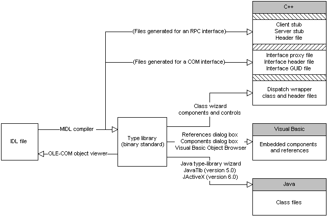

# How Developer Tools Use Type Libraries

The following diagram illustrates how the various development tools interact with a COM object's type library. Each type library exposes standard programmatic interfaces that tools can call to get information about the elements described in that type library. In this diagram, GUID stands for globally unique identifier and RPC for remote procedure call.

In the preceding diagram, the C++ conversion tools, such as the MIDL compiler and the wizards provided by the Microsoft Visual C++ development system, generate header and stub files. You can add these files to your project in order to use the COM object described by the type library.

Similarly, in Java the developer tools generate Java class and source files, which you can then import into your application.

In Visual Basic, the scenario is somewhat simpler. You do not need to generate additional files. The Visual Basic environment provides dialog boxes listing the COM objects currently installed on your computer. You select the component you want to call from your application, and it is added to your project, either as a component or a reference.

The OLE-COM viewer reads a type library, generates a temporary IDL file based on the type library, and displays it to users. The OLE-COM viewer also displays the C++ syntax for the COM elements listed in the type library.

For more information about type libraries, see [Type Libraries and the Object Description Language](http://go.microsoft.com/fwlink/p/?linkid=138951).

 

 

