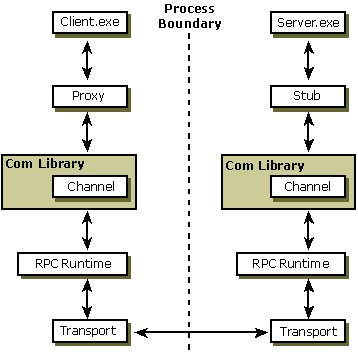

# Marshaling Details

If you use standard marshaling, COM handles all of the details described here for you. However, there are those few programmers who need these details and for those interested in the underlying information. Marshaling is the process of packaging and unpackaging parameters so a remote procedure call can take place.

Different parameter types are marshaled in different ways. For example, marshaling an integer parameter involves simply copying the value into the message buffer. (Although even in this simple case, there are issues such as byte ordering to deal with in cross-computer calls.) Marshaling an array, however, is a more complex process. Array members are copied in a specific order so that the other side can reconstruct the array exactly. When a pointer is marshaled, the data that the pointer is pointing to is copied following rules and conventions for dealing with nested pointers in structures. Unique functions exist to handle the marshaling of each parameter type.

With standard marshaling, the proxies and stubs are systemwide resources for the interface and they interact with the channel through a standard protocol. Standard marshaling can be used both by standard COM-defined interfaces and by custom interfaces, as follows:

-   In the case of most COM interfaces, the proxies and stubs for standard marshaling are in-process component objects which are loaded from a systemwide DLL provided by COM in Ole32.dll.
-   In the case of custom interfaces, the proxies and stubs for standard marshaling are generated by the interface designer, typically with MIDL. These proxies and stubs are statically configured in the registry, so any potential client can use the custom interface across process boundaries. These proxies and stubs are loaded from a DLL that is located via the system registry, using the interface ID (IID) for the custom interface they marshal.
-   An alternative to using MIDL to generate proxies and stubs for custom interfaces, a type library can be generated instead and the system provided, type-library–driven marshaling engine will marshal the interface.

As an alternative to standard marshaling, an interface (standard or custom) can use custom marshaling. With custom marshaling, an object dynamically implements the proxies at run time for each interface that it supports. For any given interface, the object can select COM-provided standard marshaling or custom marshaling. This choice is made by the object on an interface-by-interface basis. Once the choice is made for a given interface, it remains in effect during the object's lifetime. However, one interface on an object can use custom marshaling while another uses standard marshaling.

Custom marshaling is inherently unique to the object that implements it. It uses proxies implemented by the object and provided to the system on request at run time. Objects that implement custom marshaling must implement the [**IMarshal**](https://msdn.microsoft.com/en-us/library/Dd542707(v=VS.85).aspx) interface, whereas objects that support standard marshaling do not.

If you decide to write a custom interface, you must provide marshaling support for it. Typically, you will provide a standard marshaling DLL for the interface you design. You can create the proxy/stub code and the proxy/stub DLL, or you can create a type library that COM will use to do data-driven marshaling (using the data in the type library).

For a client to make a call to an interface method in an object in another process involves the cooperation of several components. The standard proxy is a piece of interface-specific code that resides in the client's process space and prepares the interface parameters for transmittal. It packages, or marshals, them in such a way that they can be re-created and understood in the receiving process. The standard stub, also a piece of interface-specific code, resides in the server's process space and reverses the work of the proxy. The stub unpackages, or unmarshals, the sent parameters and forwards them to the object application. It also packages reply information to send back to the client.

> [!Note]  
> Readers more familiar with RPC than COM may be used to seeing the terms client stub and server stub. These terms are analogous to proxy and stub.

 

## Components of Interprocess Communications

The following diagram shows the flow of communication between the components involved. On the client side of the process boundary, the client's method call goes through the proxy and then onto the channel, which is part of the COM library. The channel sends the buffer containing the marshaled parameters to the RPC run-time library, which transmits it across the process boundary. The RPC run time and the COM libraries exist on both sides of the process. The distinction between the channel and the RPC run time is a characteristic of this implementation and is not part of the programming model or the conceptual model for COM client/server objects. COM servers see only the proxy or stub and, indirectly, the channel. Future implementations may use different layers below the channel or no layers.

## Related topics

<dl> <dt>

[Channel](channel.md)
</dt> <dt>

[Inter-Object Communication](inter-object-communication.md)
</dt> <dt>

[Microsoft RPC](microsoft-rpc.md)
</dt> <dt>

[Proxy](proxy.md)
</dt> <dt>

[Stub](stub.md)
</dt> </dl>

 

 

