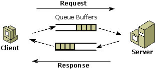

# Benefits of Queued Processing

When designing new applications, developers must consider the implications of coding components for real-time (synchronous) processing versus queued (asynchronous) processing. The choice depends on the requirements of the specific application as determined by the underlying business logic. As a guideline, queued processing offers the following advantages over real-time processing:

-   Reduced dependency on component availability
-   Shorter component lifetimes
-   Uninterrupted productivity when using disconnected applications
-   Message reliability
-   Efficient server scheduling

## Component Availability

In a real-time processing application, if just one component of the transaction is not available—perhaps because of server overload or networking problems—the entire process is blocked and cannot complete. In contrast, an application using the COM+ queued components service separates the transaction into activities that must be completed now and those that can be completed at a later time. For example, messages can be queued for later processing so that the requesting component is free for other tasks.

## Component Lifetimes

An application using the queued components service allows the server component to operate independently of the client. As a result, server components can complete more quickly. In a real-time system, the server component exists from the time it is created until the object is finally released. The server waits for the client to make method calls and for results to be returned, which negates the rapid cycling of server objects and limits server scalability.

## Disconnected Applications

The increasing use of laptops, notebooks, and palm computers has created a need for applications that service occasionally disconnected clients or mobile users. In a queued system, these users can continue to work in a disconnected scenario or when not connected to the server, and they can later connect to the databases or servers to process their requests. For example, a salesperson can take orders from customers and later connect to the shipping department to process those orders.

If you have a component that can be run either connected or disconnected, messages are traveling in one direction and there is rarely a need to switch back and forth. For example, in the order-taking scenario, the shipping component receives the message and processes it. It may generate another component for billing or auditing. The client commits before the server ever starts. The message isn't sent until the application commits.

The following illustration shows the flow of information in a disconnected scenario.

## Message Reliability

Message Queuing is a powerful tool that uses database techniques to help protect data in a robust way. In the event of a server failure, Message Queuing ensures that transactions are rolled back so that messages are not lost and data is not corrupted.

## Server Scheduling

An application using queued components is well suited to time-shifted component execution, which defers uncritical work to an off-peak period. This is the same useful concept that was applied to traditional batch mode processing. Similar requests can be deferred for contiguous execution by the server rather than requiring the server to react immediately to a wide variety of requests.

 

 

