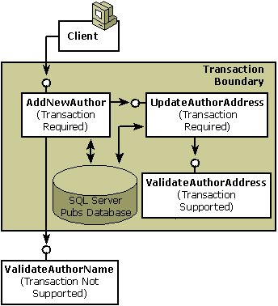
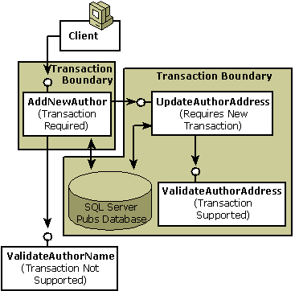

# Step 3: Reusing Components

## Objectives

In this step, you will learn about the following:

-   Reusable components.
-   How to plan for reusability.

## Description

Two previous parts of this COM+ services primer, [Step 1: Creating a Transactional Component](step-1--creating-a-transactional-component.md) and [Step 2: Extending a Transaction Across Multiple Components](step-2--extending-a-transaction-across-multiple-components.md) show how to write one component that calls a second component to assist in completing some work, updating author information in the Microsoft SQL Server Pubs database; all work is protected by a single transaction. The sample components focused on the work of updating an author's data and verifying the author's address, and COM+ provided transaction processing, [JIT activation](com--just-in-time-activation.md), and [concurrency protection](com--synchronization.md).

This step demonstrates how to reuse the components created in steps 1 and 2 and looks at what this means to the design of those components. As shown in the following illustration, this means creating a new component, `AddNewAuthor`, that adds new authors to the database by calling `UpdateAuthorAddress`.



In addition to reusing existing component functionality, `AddNewAuthor` calls another new component called `ValidateAuthorName`. As the preceding illustration shows, `ValidateAuthorName` is non-transactional. The transaction attribute value for this component is left at its default setting (**Not Supported**) to exclude its work from the transaction. As shown in the step 3 sample code, `ValidateAuthorName` performs read-only queries on the database, and the failure of this minor task should not have the potential to abort the transaction. However, the transaction attribute value of the `AddNewAuthor` component is set to **Required**.

The `AddNewAuthor`, `UpdateAuthorAddress`, and `ValidateAuthorAddress` components all vote in the transaction. In this transaction, `AddNewAuthor` is the root object. COM+ always makes the first object created in the transaction the root object.

In this example, reusing the `UpdateAuthorAddress` component is easy—COM+ automatically delivers the expected services. However, the results would be different if the transaction attribute value of the `UpdateAuthorAddress` component were initially set to **Requires New** instead of **Required**. On the surface, both settings appear similar; both guarantee a transaction. **Requires New**, however, always starts a new transaction, while **Required** starts a new transaction only when the object's caller is non-transactional. You can see from this how important it was to configure `UpdateAuthorAddress` carefully and thoughtfully. Otherwise, COM+ might have interpreted the service request differently, generating two unrelated transactions, as shown in the following illustration, instead of one.



> [!Note]  
> When you reuse components, make sure the services are configured to support your desired outcome.

 

## Sample Code

The AddNewAuthor component performs batch additions of new authors by allowing the object to remain active until the client releases its reference to the object.


```VB
Option Explicit
'
'   Purpose:   This class is used for adding a new author.
'
'   Notes:    IMPT:  This component implicitly assumes that it will
'             always run in a transaction. Undefined results may 
'             otherwise occur.
'
'  AddNewAuthor
'
Public Sub AddNewAuthor( _
                        ByVal strAuthorFirstName As String, _
                        ByVal strAuthorLastName As String, _
                        ByVal strPhone As String, _
                        ByVal strAddress As String, _
                        ByVal strCity As String, _
                        ByVal strState As String, _
                        ByVal strZip As String, _
                        ByVal boolContracted As Boolean)
  ' Handle any errors.
  On Error GoTo UnexpectedError

  ' Verify component is in a transaction.
  ' The VerifyInTxn subroutine is described in Step 1.
  VerifyInTxn

  ' Get our object context.
  Dim objcontext As COMSVCSLib.ObjectContext
  Set objcontext = GetObjectContext

  ' Get the IContextState object.
  Dim contextstate As COMSVCSLib.IContextState
  Set contextstate = objcontext

  ' Validate that the author is OK.
  ' The ValidateAuthorName function is described after this function.
  Dim oValidateAuthName As Object
  Dim bValidAuthor As Boolean
  Set oValidateAuthName = CreateObject("ComplusPrimer.ValidateAuthorName")
  bValidAuthor = oValidateAuthName.ValidateAuthorName( _
    strAuthorFirstName, strAuthorLastName)
  If Not bValidAuthor Then
    Err.Raise 999999, "The AddNewAuthor component", _
      "You tried to add an author on the banned list!"
  End If
  
  ' Open the connection to the database.
  Dim conn As ADODB.Connection
  Set conn = CreateObject("ADODB.Connection")

  ' Specify the OLE DB provider.
  conn.Provider = "SQLOLEDB"

  ' Connect using Windows Authentication.
  Dim strProv As String
  strProv = "Server=MyDBServer;Database=pubs;Trusted_Connection=yes"

  ' Open the database.
  conn.Open strProv

  ' Tell the database to actually add the author; use empty strings 
  ' for this part and rely on the UpdateAuthorAddress 
  ' component to validate the address/phone/etc data.
  ' Default Contract flag is off.
  Dim strUpdateString As String
  strUpdateString = "insert into authors values(_
                     '789-65-1234'," & _
                     strAuthorLastName & ", " & _
                     strAuthorFirstName & ", " & _
                     "'(555) 555-5555', ', ', ', '98765', "

  If boolContracted Then
    strUpdateString = strUpdateString + "1)"
  Else
    strUpdateString = strUpdateString + "0)"
  End If

  conn.Execute strUpdateString
  
  ' Close the connection; this potentially allows 
  ' another component in the same transaction to
  ' reuse the connection from the connection pool.
  conn.Close
  Set conn = Nothing
  
  ' Create the UpdateAuthorAddress component.
  Dim oUpdateAuthAddr As Object
  Set oUpdateAuthAddr = CreateObject("ComplusPrimer.UpdateAuthorAddress")
  
  ' The component throws an error if anything goes wrong.
  oUpdateAuthAddr.UpdateAuthorAddress "", strPhone, _
    strAddress, strCity, strState, strZip
    
  Set oUpdateAuthAddr = Nothing
  
  ' Everything works--commit the transaction.
  contextstate.SetMyTransactionVote TxCommit
  
  '  Design issue:  Allow batch additions of new
  '  authors in one transaction, or should each new author be added
  '  in a single new transaction?
  contextstate.SetDeactivateOnReturn False
  Exit Sub
  
UnexpectedError:
  ' There's an error.
  contextstate.SetMyTransactionVote TxAbort
  contextstate.SetDeactivateOnReturn True
  
End Sub
```


The `ValidateAuthorName` component validates author names before `AddNewAuthor` adds the name to the database. This component throws an error back to its caller if something unexpected happens.


```VB
Option Explicit
'
'   Purpose:   This class is used for validating authors before
'              adding them to the database.
'
'   Notes:   This component doesn't need to be in a transaction because
'            it is performing read-only queries on the database,
'            especially since these queries are not overlapping with
'            any updates of end-user data. If an unexpected error
'            happens, let the error go back to the caller who
'            needs to handle it.
'

Public Function ValidateAuthorName( _
                        ByVal strAuthorFirstName As String, _
                        ByVal strAuthorLastName As String _
                        ) As Boolean
  ValidateAuthorName = False

  ' Open the connection to the database.
  Dim conn As ADODB.Connection
  Set conn = CreateObject("ADODB.Connection")

  ' Specify the OLE DB provider.
  conn.Provider = "SQLOLEDB"

  ' Connect using Windows Authentication.
  Dim strProv As String
  strProv = "Server=MyDBServer;Database=pubs;Trusted_Connection=yes"

  ' Open the database.
  conn.Open strProv

  ' Suppose another hypothetical table has been added to the Pubs 
  ' database, one that contains a list of banned authors.
  Dim rs As ADODB.Recordset
  Set rs = conn.Execute("select * from banned_authors")
  
  ' Loop through the banned-author list looking for the specified
  ' author.
  While Not rs.EOF
    If rs.Fields("FirstName") = strAuthorFirstName And _
      rs.Fields("LastName") = strAuthorLastName Then
        ' This is a banned author.
        conn.Close
        Set conn = Nothing
        Set rs = Nothing
        Exit Function
    End If
    rs.MoveNext
  Wend
  
  ' None of the added authors found in the banned list.
  ValidateAuthorName = True
  conn.Close
  Set conn = Nothing
  Set rs = Nothing
End Function
```


## Summary

-   There are times when you don't want a component to vote in the transaction.
-   COM+ does not enforce JIT activation or concurrency protection on non-transactional components. You may configure these services separately.
-   A calling component's configuration affects how COM+ interprets the service requests of the called component.

## Related topics

<dl> <dt>

[Step 1: Creating a Transactional Component](step-1--creating-a-transactional-component.md)
</dt> <dt>

[Step 2: Extending a Transaction Across Multiple Components](step-2--extending-a-transaction-across-multiple-components.md)
</dt> <dt>

[Configuring Transactions](configuring-transactions.md)
</dt> <dt>

[Designing for Scalability](designing-for-scalability.md)
</dt> </dl>

 

 


