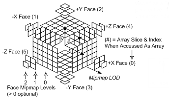
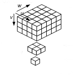

# Introduction To Textures in Direct3D 11

A texture resource is a structured collection of data designed to store texels. A texel represents the smallest unit of a texture that can be read or written to by the pipeline. Unlike buffers, textures can be filtered by texture samplers as they are read by shader units. The type of texture impacts how the texture is filtered. Each texel contains 1 to 4 components, arranged in one of the DXGI formats defined by the DXGI\_FORMAT enumeration.

Textures are created as a structured resource with a known size. However, each texture may be typed or typeless when the resource is created as long as the type is fully specified using a view when the texture is bound to the pipeline.

## Texture Types

There are several types of textures: 1D, 2D, 3D, each of which can be created with or without mipmaps. Direct3D 11 also supports texture arrays and multisampled textures.

-   [1D Textures](#1d-textures)
-   [1D Texture Arrays](#1d-texture-arrays)
-   [2D Textures and 2D Texture Arrays](#2d-textures-and-2d-texture-arrays)
-   [3D Textures](#3d-textures)

### 1D Textures

A 1D texture in its simplest form contains texture data that can be addressed with a single texture coordinate; it can be visualized as an array of texels, as shown in the following illustration. 1D textures are represented by the [**ID3D11Texture1D**](/windows/desktop/api/D3D11/nn-d3d11-id3d11texture1d) interface.

Each texel contains a number of color components depending on the format of the data stored. Adding more complexity, you can create a 1D texture with mipmap levels, as shown in the following illustration.

A mipmap level is a texture that is a power-of-two smaller than the level above it. The topmost level contains the most detail, each subsequent level is smaller. For a 1D mipmap, the smallest level contains one texel. Furthermore, MIP levels always reduce down to 1:1. When mipmaps are generated for an odd sized texture, the next lower level is always even size (except when the lowest level reaches 1). For example, the diagram illustrates a 5x1 texture whose next lowest level is a 2x1 texture, whose next (and last) mip level is a 1x1 sized texture. The levels are identified by an index called a LOD (level-of-detail) which is used to access the smaller texture when rendering geometry that is not as close to the camera.

### 1D Texture Arrays

Direct3D 11 also supports arrays of textures. A 1D texture array is also represented by the [**ID3D11Texture1D**](/windows/desktop/api/D3D11/nn-d3d11-id3d11texture1d) interface. An array of 1D textures looks conceptually like the following illustration.

This texture array contains three textures. Each of the three textures has a texture width of 5 (which is the number of elements in the first layer). Each texture also contains a 3 layer mipmap.

All texture arrays in Direct3D are a homogeneous array of textures; this means that every texture in a texture array must have the same data format and size (including texture width and number of mipmap levels). You may create texture arrays of different sizes, as long as all the textures in each array match in size.

### 2D Textures and 2D Texture Arrays

A Texture2D resource contains a 2D grid of texels. Each texel is addressable by a u, v vector. Since it is a texture resource, it may contain mipmap levels, and subresources. 2D textures are represented by the [**ID3D11Texture2D**](/windows/desktop/api/D3D11/nn-d3d11-id3d11texture2d) interface. A fully populated 2D texture resource looks like the following illustration.

This texture resource contains a single 3x5 texture with three mipmap levels.

A 2D texture array resource is a homogeneous array of 2D textures; that is, each texture has the same data format and dimensions (including mipmap levels). A 2D texture array is also represented by the [**ID3D11Texture2D**](/windows/desktop/api/D3D11/nn-d3d11-id3d11texture2d) interface. It has a similar layout as the 1D texture array except that the textures now contain 2D data, as shown in the following illustration.

This texture array contains three textures; each texture is 3x5 with two mipmap levels.

### Using a 2D Texture Array as a Texture Cube

A texture cube is a 2D texture array that contains 6 textures, one for each face of the cube. A fully populated texture cube looks like the following illustration.

A 2D texture array that contains 6 textures may be read from within shaders with the cube map intrinsic functions, after they are bound to the pipeline with a cube-texture view. Texture cubes are addressed from the shader with a 3D vector pointing out from the center of the texture cube.

> [!Note]  
> Devices that you create with [**10\_1 feature level**](https://www.bing.com/search?q=**10\_1 feature level**) and above can support arrays of texture cubes in which the number of textures is equal to the number of texture cubes in an array times six. Devices that you create with [**10\_0 feature level**](https://www.bing.com/search?q=**10\_0 feature level**) support only a single texture cube of six faces. Also, Direct3D 11 does not support partial cubemaps.

 

### 3D Textures

A 3D texture resource (also known as a volume texture) contains a 3D volume of texels. Because it is a texture resource, it may contain mipmap levels. 3D textures are represented by the [**ID3D11Texture3D**](/windows/desktop/api/D3D11/nn-d3d11-id3d11texture3d) interface. A fully populated 3D texture looks like the following illustration.

When a 3D texture mipmap slice is bound as a render target output (with a render-target view), the 3D texture behaves identically to a 2D texture array with n slices. The particular render slice is chosen from the geometry-shader stage, by declaring a scalar component of output data as the SV\_RenderTargetArrayIndex system-value.

There is no concept of a 3D texture array; therefore a 3D texture subresource is a single mipmap level.

## Related topics

<dl> <dt>

[Textures](overviews-direct3d-11-resources-textures.md)
</dt> </dl>

 

 

