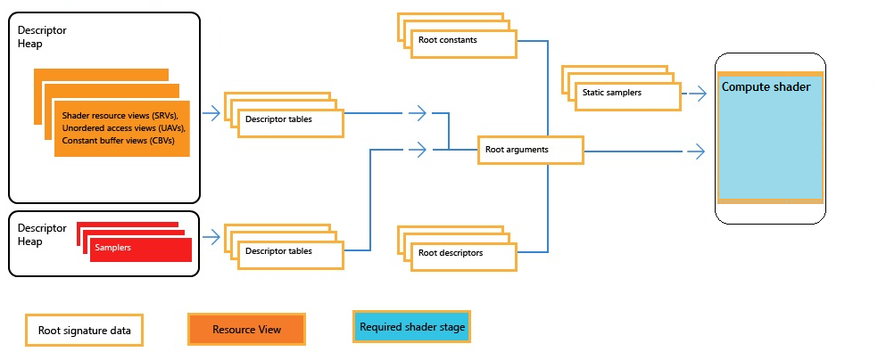

# Pipelines and Shaders with Direct3D 12

The Direct3D 12 programmable pipeline significantly increases rendering performance compared to previous generation graphics programming interfaces.

-   [Direct3D 12 graphics pipeline](#direct3d-12-graphics-pipeline)
-   [Pipeline state objects](#pipeline-state-objects)
-   [Direct3D 12 compute pipeline](#direct3d-12-compute-pipeline)
-   [Related topics](#related-topics)

## Direct3D 12 graphics pipeline

The following diagram illustrates the Direct3D 12 graphics pipeline and state.

A graphics pipeline is the sequential flow of data inputs and outputs as the GPU renders frames. Given the pipeline state and inputs, the GPU performs a series of operations to create the resulting images. A graphics pipeline contains shaders, which perform programmable rendering effects and calculations, and fixed function operations.

Note the following when referring to the pipeline state diagram:

-   The descriptor tables and heaps can be arbitrarily arranged: SRVs, CBVs and UAVs can be referenced and allocated in any order.
-   Some operations of the pipeline are configurable. For example, the output merger typically operates on a read-modify-write basis with the render target and depth stencil views. However the pipeline can be configured so that either of these views are read-only or write-only.
-   Static samplers are not part of the root arguments since they are static.

## Pipeline state objects

Direct3D 12 introduces the pipeline state object (PSO). Rather than storing and representing pipeline state across a large number of high-level objects, the states of pipeline components like the input assembler, rasterizer, pixel shader, and output merger are stored in a PSO. A PSO is a unified pipeline state object that is immutable after creation. The currently selected PSO can be changed quickly and dynamically, and the hardware and drivers can directly convert a PSO into native hardware instructions and state, readying the GPU for graphics processing. To apply a PSO, the hardware copies a minimal amount of pre-computed state directly to the hardware registers. This removes the overhead caused by the graphics driver continually recomputing hardware state based on all currently applicable rendering and pipeline settings. The result is significantly reduced draw call overhead, increased performance, and more draw calls per frame.

The currently applied PSO defines and connects all of the shaders being used in the rendering pipeline. [Microsoft High Level Shader Language (HLSL)](https://msdn.microsoft.com/library/windows/desktop/bb509561) is pre-compiled into shader objects, which are then used at run time as input for pipeline state objects. For more information about how the PSO functions within the graphics pipeline, see [Managing graphics pipeline state in Direct3D 12](managing-graphics-pipeline-state-in-direct3d-12.md).

## Direct3D 12 compute pipeline

The following diagram illustrates the Direct3D 12 compute pipeline and state.

There are no fixed function units in this pipeline, however descriptor heaps, sampler heaps and static samplers are still available in compute.

## Related topics

<dl> <dt>

[Work Submission in Direct3D 12](command-queues-and-command-lists.md)
</dt> </dl>

 

 

