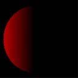
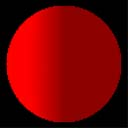

# Diffuse Lighting (Direct3D 9)

After adjusting the light intensity for any attenuation effects, the lighting engine computes how much of the remaining light reflects from a vertex, given the angle of the vertex normal and the direction of the incident light. The lighting engine skips to this step for directional lights because they do not attenuate over distance. The system considers two reflection types, diffuse and specular, and uses a different formula to determine how much light is reflected for each. After calculating the amounts of light reflected, Direct3D applies these new values to the diffuse and specular reflectance properties of the current material. The resulting color values are the diffuse and specular components that the rasterizer uses to produce Gouraud shading and specular highlighting.

Diffuse lighting is described by the following equation.

Diffuse Lighting = sum\[C<sub>d</sub>\*L<sub>d</sub>\*(N<sup>.</sup>L<sub>dir</sub>)\*Atten\*Spot\]


| Parameter       | Default value | Type          | Description                                                                                                   |
|-----------------|---------------|---------------|---------------------------------------------------------------------------------------------------------------|
| sum             | N/A           | N/A           | Summation of each light's diffuse component.                                                                  |
| C<sub>d</sub>   | (0,0,0,0)     | D3DCOLORVALUE | Diffuse color.                                                                                                |
| L<sub>d</sub>   | (0,0,0,0)     | D3DCOLORVALUE | Light diffuse color.                                                                                          |
| N               | N/A           | D3DVECTOR     | Vertex normal                                                                                                 |
| L<sub>dir</sub> | N/A           | D3DVECTOR     | Direction vector from object vertex to the light.                                                             |
| Atten           | N/A           | FLOAT         | Light attenuation. See [Attenuation and Spotlight Factor (Direct3D 9)](attenuation-and-spotlight-factor.md). |
| Spot            | N/A           | FLOAT         | Spotlight factor. See [Attenuation and Spotlight Factor (Direct3D 9)](attenuation-and-spotlight-factor.md).  |


 

The value for C<sub>d</sub> is either:

-   vertex color1, if DIFFUSEMATERIALSOURCE = D3DMCS\_COLOR1, and the first vertex color is supplied in the vertex declaration.
-   vertex color2, if DIFFUSEMATERIALSOURCE = D3DMCS\_COLOR2, and the second vertex color is supplied in the vertex declaration.
-   material diffuse color

> [!Note]  
> If either DIFFUSEMATERIALSOURCE option is used, and the vertex color is not provided, the material diffuse color is used.

 

To calculate the attenuation (Atten) or the spotlight characteristics (Spot), see [Attenuation and Spotlight Factor (Direct3D 9)](attenuation-and-spotlight-factor.md).

Diffuse components are clamped to be from 0 to 255, after all lights are processed and interpolated separately. The resulting diffuse lighting value is a combination of the ambient, diffuse and emissive light values.

## Example

In this example, the object is colored using the light diffuse color and a material diffuse color. The code is shown below.


```
D3DMATERIAL9 mtrl;
ZeroMemory( &amp;mtrl, sizeof(mtrl) );

D3DLIGHT9 light;
ZeroMemory( &amp;light, sizeof(light) );
light.Type = D3DLIGHT_DIRECTIONAL;

D3DXVECTOR3 vecDir;
vecDir = D3DXVECTOR3(0.5f, 0.0f, -0.5f);
D3DXVec3Normalize( (D3DXVECTOR3*)&amp;light.Direction, &amp;vecDir );

// set directional light diffuse color
light.Diffuse.r = 1.0f;
light.Diffuse.g = 1.0f;
light.Diffuse.b = 1.0f;
light.Diffuse.a = 1.0f;
m_pd3dDevice->SetLight( 0, &amp;light );
m_pd3dDevice->LightEnable( 0, TRUE );

// if a material is used, SetRenderState must be used
// vertex color = light diffuse color * material diffuse color
mtrl.Diffuse.r = 0.75f;
mtrl.Diffuse.g = 0.0f;
mtrl.Diffuse.b = 0.0f;
mtrl.Diffuse.a = 0.0f;
m_pd3dDevice->SetMaterial( &amp;mtrl );
m_pd3dDevice->SetRenderState(D3DRS_DIFFUSEMATERIALSOURCE, D3DMCS_MATERIAL);
```


According to the equation, the resulting color for the object vertices is a combination of the material color and the light color.

The following two illustrations show the material color, which is gray, and the light color, which is bright red.


The resulting scene is shown in the following illustration. The only object in the scene is a sphere. The diffuse lighting calculation takes the material and light diffuse color and modifies it by the angle between the light direction and the vertex normal using the dot product. As a result, the backside of the sphere gets darker as the surface of the sphere curves away from the light.



Combining the diffuse lighting with the ambient lighting from the previous example shades the entire surface of the object. The ambient light shades the entire surface and the diffuse light helps reveal the object's 3D shape, as shown in the following illustration.



Diffuse lighting is more intensive to calculate than ambient lighting. Because it depends on the vertex normals and light direction, you can see the objects geometry in 3D space, which produces a more realistic lighting than ambient lighting. You can use specular highlights to achieve a more realistic look.

## Related topics

<dl> <dt>

[Mathematics of Lighting](mathematics-of-lighting.md)
</dt> </dl>

 

 


