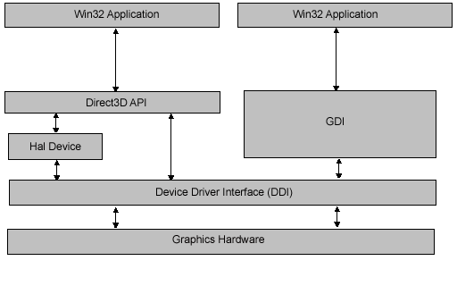

# Direct3D Architecture (Direct3D 9)

This topic provides two high-level views of the architecture of Direct3D:

-   [Direct3D Graphics Pipeline](#direct3d-graphics-pipeline) - A view of the internal processing architecture of the Direct3D rendering system.
-   [Direct3D System Integration](#direct3d-system-integration) - A view of how Direct3D mediates between an application and the graphics hardware.

## Direct3D Graphics Pipeline

The graphics pipeline provides the horsepower to efficiently process and render Direct3D scenes to a display, taking advantage of available hardware. The following diagram shows the building blocks of the pipeline:

| Pipeline Component  | Description                                                                                                                                                                                      | Related Topics                                                                                                                                                                                             |
|---------------------|--------------------------------------------------------------------------------------------------------------------------------------------------------------------------------------------------|------------------------------------------------------------------------------------------------------------------------------------------------------------------------------------------------------------|
| Vertex Data         | Untransformed model vertices are stored in vertex memory buffers.                                                                                                                                | [Vertex Buffers (Direct3D 9)](vertex-buffers.md), [**IDirect3DVertexBuffer9**](idirect3dvertexbuffer9.md)                                                                                                |
| Primitive Data      | Geometric primitives, including points, lines, triangles, and polygons, are referenced in the vertex data with index buffers.                                                                    | [Index Buffers (Direct3D 9)](index-buffers.md), [**IDirect3DIndexBuffer9**](idirect3dindexbuffer9.md), [Primitives](primitives.md), [Higher-Order Primitives (Direct3D 9)](higher-order-primitives.md) |
| Tessellation        | The tesselator unit converts higher-order primitives, displacement maps, and mesh patches to vertex locations and stores those locations in vertex buffers.                                      | [Tessellation (Direct3D 9)](tessellation.md)                                                                                                                                                              |
| Vertex Processing   | Direct3D transformations are applied to vertices stored in the vertex buffer.                                                                                                                    | [Vertex Pipeline (Direct3D 9)](vertex-pipeline.md)                                                                                                                                                        |
| Geometry Processing | Clipping, back face culling, attribute evaluation, and rasterization are applied to the transformed vertices.                                                                                    | [Pixel Pipeline (Direct3D 9)](pixel-pipeline.md)                                                                                                                                                          |
| Textured Surface    | Texture coordinates for Direct3D surfaces are supplied to Direct3D through the [**IDirect3DTexture9**](idirect3dtexture9.md) interface.                                                         | [Direct3D Textures (Direct3D 9)](direct3d-textures.md), [**IDirect3DTexture9**](idirect3dtexture9.md)                                                                                                    |
| Texture Sampler     | Texture level-of-detail filtering is applied to input texture values.                                                                                                                            | [Direct3D Textures (Direct3D 9)](direct3d-textures.md)                                                                                                                                                    |
| Pixel Processing    | Pixel shader operations use geometry data to modify input vertex and texture data, yielding output pixel color values.                                                                           | [Pixel Pipeline (Direct3D 9)](pixel-pipeline.md)                                                                                                                                                          |
| Pixel Rendering     | Final rendering processes modify pixel color values with alpha, depth, or stencil testing, or by applying alpha blending or fog. All resulting pixel values are presented to the output display. | [Pixel Pipeline (Direct3D 9)](pixel-pipeline.md)                                                                                                                                                          |

 

## Direct3D System Integration

The following diagram shows the relationships between a Window application, Direct3D,GDI, and the hardware:

Direct3D exposes a device-independent interface to an application. Direct3D applications can exist alongsideGDI applications, and both have access to the computer's graphics hardware through the device driver for the graphics card. UnlikeGDI, Direct3D can take advantage of hardware features by creating a hal device.

A hal device provides hardware acceleration to graphics pipeline functions, based upon the feature set supported by the graphics card. Direct3D methods are provided to retrieve device display capabilities at run time. (See [**GetDeviceCaps**](idirect3d9--getdevicecaps.md) and [**GetDeviceCaps**](idirect3ddevice9--getdevicecaps.md).) If a capability is not provided by the hardware, the hal does not report it as a hardware capability.

For more information about hal and reference devices supported by Direct3D, see [Device Types (Direct3D 9)](device-types.md).

## Related topics

<dl> <dt>

[Getting Started](getting-started.md)
</dt> </dl>

 

 

