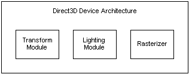

# Direct3D Devices (Direct3D 9)

A Direct3D device is the rendering component of Direct3D. It encapsulates and stores the rendering state. In addition, a Direct3D device performs transformations and lighting operations and rasterizes an image to a surface.

-   [XPDM vs. WDDM](xpdm-vs-wddm.md)
-   [Device Types (Direct3D 9)](device-types.md)
-   [Creating a Device (Direct3D 9)](creating-a-device.md)
-   [Windowed vs Full-Screen Mode (Direct3D 9)](windowed-vs-full-screen-mode.md)
-   [Selecting a Device (Direct3D 9)](selecting-a-device.md)
-   [Lost Devices (Direct3D 9)](lost-devices.md)
-   [Determining Hardware Support (Direct3D 9)](determining-hardware-support.md)
-   [Processing Vertex Data (Direct3D 9)](processing-vertex-data.md)
-   [Primitives](primitives.md)

Architecturally, Direct3D devices contain a transformation module, a lighting module, and a rasterizing module, as the following diagram shows.

Direct3D currently supports two main types of Direct3D devices:

-   A hal device with hardware-accelerated rasterization and shading with both hardware and software vertex processing
-   A reference device

You can think of these devices as two separate drivers. Software and reference devices are represented by software drivers, and the hal device is represented by a hardware driver. The most common way to take advantage of these devices is to use the hal device for shipping applications, and the reference device for feature testing. These are provided by third parties to emulate particular devices - for example, developmental hardware that has not yet been released.

The Direct3D device that an application creates must correspond to the capabilities of the hardware on which the application is running. Direct3D provides rendering capabilities, either by accessing 3D hardware that is installed in the computer or by emulating the capabilities of 3D hardware in software. Therefore, Direct3D provides devices for both hardware access and software emulation.

Hardware-accelerated devices give much better performance than software devices. The hal device type is available on all Direct3D supported graphic adapters. In most cases, applications target computers that have hardware acceleration and rely on software emulation to accommodate lower-end computers.

With the exception of the reference device, software devices do not always support the same features as a hardware device. Applications should always query for device capabilities to determine which features are supported.

Because the behavior of the software and reference devices provided with Direct3D 9 is identical to that of the hal device, application code authored to work with the hal device will work with the software or reference devices without modifications. Note that while the provided software or reference device behavior is identical to that of the hal device, the device capabilities do vary, and a particular software device may implement a much smaller set of capabilities.

## Behaviors

Direct3D enables you to specify the behavior of a device, as well the device's type. The [**IDirect3D9::CreateDevice**](idirect3d9--createdevice.md) method enables a combination of one or more of the behavior flags to control the global behaviors of the Direct3D device. These behaviors specify what is and is not maintained in the run-time portion of Direct3D, and the device types specify which driver to use. Although some combinations of device behaviors are not valid, it is possible to use all device behaviors with all device types. For example, it is valid to specify D3DDEVTYPE\_SW on a device created with D3DCREATE\_PUREDEVICE.

## Related topics

<dl> <dt>

[Getting Started](getting-started.md)
</dt> </dl>

 

 

