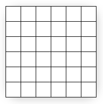
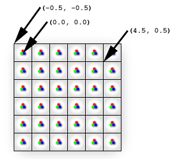
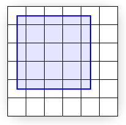
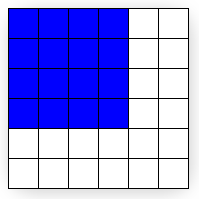
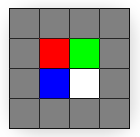
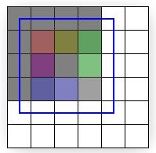
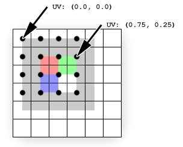
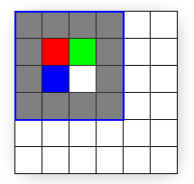

# Directly Mapping Texels to Pixels (Direct3D 9)

When rendering 2D output using pre-transformed vertices, care must be taken to ensure that each texel area correctly corresponds to a single pixel area, otherwise texture distortion can occur. By understanding the basics of the process that Direct3D follows when rasterizing and texturing triangles, you can ensure your Direct3D application correctly renders 2D output.



The preceding diagram shows pixels that are modeled as squares. In reality, however, pixels are dots, not squares. Each square in the preceding diagram indicates the area lit by the pixel, but a pixel is always just a dot at the center of a square. This distinction, though seemingly small, is important. A better illustration of the same display is shown in the following diagram.



The preceding diagram correctly shows each physical pixel as a point in the center of each cell. The screen space coordinate (0, 0) is located directly at the top-left pixel, and therefore at the center of the top-left cell. The top-left corner of the display is therefore at (-0.5, -0.5) because it is 0.5 cells to the left and 0.5 cells up from the top-left pixel. Direct3D will render a quad with corners at (0, 0) and (4, 4), as shown in the following illustration.



The preceding illustration shows where the mathematical quad is in relation to the display, but does not show what the quad will look like once Direct3D rasterizes it and sends it to the display. In fact, it is impossible for a raster display to fill the quad exactly as shown because the edges of the quad do not coincide with the boundaries between pixel cells. In other words, because each pixel can only display a single color, each pixel cell is filled with only a single color; if the display were to render the quad exactly as shown, the pixel cells along the quad's edge would need to show two distinct colors: blue where covered by the quad and white where only the background is visible.

Instead, the graphics hardware is tasked with determining which pixels should be filled to approximate the quad. This process is called rasterization, and is detailed in [Rasterization Rules (Direct3D 9)](rasterization-rules.md). For this particular case, the rasterized quad is shown in the following illustration.



Note that the quad passed to Direct3D has corners at (0, 0) and (4, 4), but the rasterized output (the preceding illustration) has corners at (-0.5,-0.5) and (3.5,3.5). Compare the preceding two illustrations for rendering differences. You can see that what the display actually renders is the correct size, but has been shifted by -0.5 cells in the x and y directions. However, except for multi-sampling techniques, this is the best possible approximation to the quad. (See the [Antialias Sample](https://msdn.microsoft.com/en-us/library/Ee415231(v=VS.85).aspx) for thorough coverage of multi-sampling.) Be aware that if the rasterizer filled every cell the quad crossed, the resulting area would be of dimension 5 x 5 instead of the desired 4 x 4.

If you assume that screen coordinates originate at the top-left corner of the display grid instead of the top-left pixel, the quad appears exactly as expected. However, the difference becomes clear when the quad is given a texture. The following illustration shows the 4 x 4 texture you'll map directly onto the quad.



Because the texture is 4 x 4 texels and the quad is 4 x 4 pixels, you might expect the textured quad to appear exactly like the texture regardless of the location on the screen where the quad is drawn. However, this is not the case; even slight changes in position influence how the texture is displayed. The following illustration shows how a quad between (0, 0) and (4, 4) is displayed after being rasterized and textured.



The quad drawn in the preceding illustration shows the textured output (with a linear filtering mode and a clamp addressing mode) with the superimposed rasterized outline. The rest of this article explains exactly why the output looks the way it does instead of looking like the texture, but for those who want the solution, here it is: The edges of the input quad need to lie upon the boundary lines between pixel cells. By simply shifting the x and y quad coordinates by -0.5 units, texel cells will perfectly cover pixel cells and the quad can be perfectly recreated on the screen. (The last illustration in this topic shows the quad at the corrected coordinates.)

The details of why the rasterized output only bears slight resemblance to the input texture are directly related to the way Direct3D addresses and samples textures. What follows assumes you have a good understanding of [texture coordinate space](texture-coordinates.md) And [bilinear texture filtering](bilinear-texture-filtering.md).

Getting back to our investigation of the strange pixel output, it makes sense to trace the output color back to the pixel shader: The pixel shader is called for each pixel selected to be part of the rasterized shape. The solid blue quad depicted in an earlier illustration could have a particularly simple shader:


```
float4 SolidBluePS() : COLOR
{ 
    return float4( 0, 0, 1, 1 );
} 
```


For the textured quad, the pixel shader has to be changed slightly:


```
texture MyTexture;

sampler MySampler = 
sampler_state 
{ 
    Texture = <MyTexture>;
    MinFilter = Linear;
    MagFilter = Linear;
    AddressU = Clamp;
    AddressV = Clamp;
};

float4 TextureLookupPS( float2 vTexCoord : TEXCOORD0 ) : COLOR
{
    return tex2D( MySampler, vTexCoord );
} 
```


That code assumes the 4 x 4 texture is stored in MyTexture. As shown, the MySampler texture sampler is set to perform bilinear filtering on MyTexture. The pixel shader gets called once for each rasterized pixel, and each time the returned color is the sampled texture color at vTexCoord. Each time the pixel shader is called, the vTexCoord argument is set to the texture coordinates at that pixel. That means the shader is asking the texture sampler for the filtered texture color at the exact location of the pixel, as detailed in the following illustration.



The texture (shown superimposed) is sampled directly at pixel locations (shown as black dots). Texture coordinates are not affected by rasterization (they remain in the projected screen-space of the original quad). The black dots show where the rasterization pixels are. The texture coordinates at each pixel are easily determined by interpolating the coordinates stored at each vertex: The pixel at (0,0) coincides with the vertex at (0, 0); therefore, the texture coordinates at that pixel are simply the texture coordinates stored at that vertex, UV (0.0, 0.0). For the pixel at (3, 1), the interpolated coordinates are UV (0.75, 0.25) because that pixel is located at three-fourths of the texture's width and one-fourth of its height. These interpolated coordinates are what get passed to the pixel shader.

The texels do not line up with the pixels in this example; each pixel (and therefore each sampling point) is positioned at the corner of four texels. Because the filtering mode is set to Linear, the sampler will average the colors of the four texels sharing that corner. This explains why the pixel expected to be red is actually three-fourths gray plus one-fourth red, the pixel expected to be green is one-half gray plus one-fourth red plus one-fourth green, and so on.

To fix this problem, all you need to do is correctly map the quad to the pixels to which it will be rasterized, and thereby correctly map the texels to pixels. The following illustration shows the results of drawing the same quad between (-0.5, -0.5) and (3.5, 3.5), which is the quad intended from the outset.



The preceding illustration demonstrates that the quad (shown outlined from (-0.5, -0.5) to (3.5, 3.5)) exactly matches the rasterized area.

## Summary

In summary, pixels and texels are actually points, not solid blocks. Screen space originates at the top-left pixel, but texture coordinates originate at the top-left corner of the texture's grid. Most importantly, remember to subtract 0.5 units from the x and y components of your vertex positions when working in transformed screen space in order to correctly align texels with pixels.

The following code is an example of offsetting the vertices of a 256 by 256 square to properly display a 256 by 256 texture in transformed screen space.


```C++
//define FVF with vertex values in transformed screen space
#define D3DFVF_CUSTOMVERTEX (D3DFVF_XYZRHW|D3DFVF_TEX1)

struct CUSTOMVERTEX
{
    FLOAT x, y, z, rhw; // position
    FLOAT tu, tv;       // texture coordinates
};

//unadjusted vertex values
float left = 0.0f;
float right = 255.0f;
float top = 0.0f;
float bottom = 255.0f;


//256 by 256 rectangle matching 256 by 256 texture
CUSTOMVERTEX vertices[] =
{
    { left,  top,    0.5f, 1.0f, 0.0f, 0.0f}, // x, y, z, rhw, u, v
    { right, top,    0.5f, 1.0f, 1.0f, 0.0f},
    { right, bottom, 0.5f, 1.0f, 1.0f, 1.0f},
    { left,  top,    0.5f, 1.0f, 0.0f, 0.0f},
    { right, bottom, 0.5f, 1.0f, 1.0f, 1.0f},
    { left,  bottom, 0.5f, 1.0f, 0.0f, 1.0f},
    
};
```


```C++
//adjust all the vertices to correctly line up texels with pixels 
for (int i=0; i<6; i++)
{
    vertices[i].x -= 0.5f;
    vertices[i].y -= 0.5f;
}
```


## Related topics

<dl> <dt>

[Texture Coordinates](texture-coordinates.md)
</dt> </dl>

 

 


