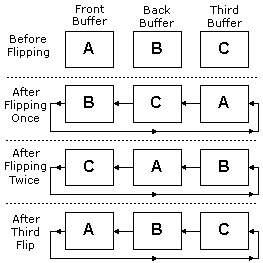

# Flipping Surfaces (Direct3D 9)

A Direct3D application typically displays an animated sequence by generating the frames of the animation in back buffers and presenting them in sequence. Back buffers are organized into swap chains. A swap chain is a series of buffers that "flip" to the screen one after another. This can be used to render one scene in memory and then flip the scene to the screen when rendering is complete. This avoids the phenomenon known as tearing and allows for smoother animation.

Each device created in Direct3D has at least one swap chain. When you initialize the first Direct3D device, you set the BackBufferCount member of [**D3DPRESENT\_PARAMETERS**](d3dpresent-parameters.md), which tells Direct3D the number of back buffers that will be in the swap chain. The call to [**IDirect3D9::CreateDevice**](idirect3d9--createdevice.md) then creates the Direct3D device and corresponding swap chain.

When you use [**IDirect3DDevice9::Present**](idirect3ddevice9--present.md) to request a surface flip operation, the pointers to surface memory for the front buffer and back buffers are swapped. Flipping is performed by switching pointers that the display device uses for referencing memory, not by copying surface memory. When a flipping chain contains a front buffer and more than one back buffer, the pointers are switched in a circular pattern, as shown in the following diagram.

You can create addition swap chains for a device by calling [**IDirect3DDevice9::CreateAdditionalSwapChain**](idirect3ddevice9--createadditionalswapchain.md). An application can create one swap chain per view and associate each swap chain with a particular window. The application renders images in the back buffers of each swap chain, and then presents them individually. The two parameters that **IDirect3DDevice9::CreateAdditionalSwapChain** takes are a pointer to a [**D3DPRESENT\_PARAMETERS**](d3dpresent-parameters.md) structure and the address of a pointer to an [**IDirect3DSwapChain9**](idirect3dswapchain9.md) interface. You can then use [**IDirect3DSwapChain9::Present**](idirect3dswapchain9--present.md) to display the contents of the next back buffer to the front buffer. Note that a device can only have one full-screen swap chain.

You can gain access to a specific back buffer by calling the [**IDirect3DDevice9::GetBackBuffer**](idirect3ddevice9--getbackbuffer.md) or [**IDirect3DSwapChain9::GetBackBuffer**](idirect3dswapchain9--getbackbuffer.md) methods, which return a pointer to an [**IDirect3DSurface9**](idirect3dsurface9.md) interface that represents the returned back buffer surface. Note that calling this method increases the internal reference count on the [**IDirect3DDevice9**](idirect3ddevice9.md) interface so be sure to call [**IUnknown**](com.iunknown) when you are done using this surface or you will have a memory leak.

Remember, Direct3D flips surfaces by swapping surface memory pointers within the swap chain, not by swapping the surfaces themselves. This means that you will always render to the back buffer that will be displayed next.

It is important to note the distinction between a "flipping operation," as performed by a display adapter driver, and a "Present" operation applied to a swap chain created with D3DSWAPEFFECT\_FLIP.

The term "flip" conventionally denotes an operation that alters the range of video memory addresses that a display adapter uses to generate its output signal, thus causing the contents of a previously hidden back buffer to be displayed. In Direct3D 9, the term is often used more generally to describe the presentation of a back buffer in any swap chain created with the D3DSWAPEFFECT\_FLIP swap effect.

While such "Present" operations are almost invariably implemented by flip operations when the swap chain is a full-screen one, they are necessarily implemented by copy operations when the swap chain is windowed. Furthermore, a display adapter driver may use flipping to implement Present operations against full-screen swap chains based on the D3DSWAPEFFECT\_DISCARD and D3DSWAPEFFECT\_COPY.

The discussion above applies to the commonly used case of a full-screen swap chain created with D3DSWAPEFFECT\_FLIP.

For a more general discussion of the different swap effects for both windowed and full-screen swap chains, see [**D3DSWAPEFFECT**](direct3d9.d3dswapeffect).

## Related topics

<dl> <dt>

[Direct3D Surfaces](direct3d-surfaces.md)
</dt> </dl>

 

 

