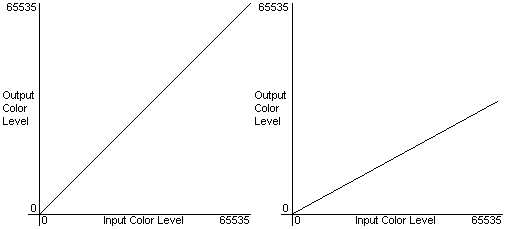

# Gamma Controls (Direct3D 9)

Gamma controls allow you to change how the system displays the contents of the surface, without affecting the contents of the surface itself. Think of these controls as very simple filters that Direct3D applies to data as it leaves a surface and before it is rendered on the screen.

Gamma controls are a property of a swap chain. Gamma controls make it possible to dynamically change how a surface's red, green, and blue levels map to the actual levels that the system displays. By setting gamma levels, you can cause the user's screen to flash colors - red when the user's character is shot, green when the character picks up a new item, and so on - without copying new images to the frame buffer to achieve the effect. Or, you might adjust color levels to apply a color bias to the images in the back buffer.

There is always at least one swap chain (the implicit swap chain) for each device because Direct3D 9 has one swap chain as a property of the device. Because the gamma ramp is a property of the swap chain, the gamma ramp can be applied when the swap chain is windowed. The gamma ramp takes effect immediately. There is no waiting for a vertical sync operation.

The [**SetGammaRamp**](https://msdn.microsoft.com/library/Bb174434(v=VS.85).aspx) and [**GetGammaRamp**](https://msdn.microsoft.com/library/Bb174390(v=VS.85).aspx) methods allow you to manipulate ramp levels that affect the red, green, and blue color components of pixels from the surface before they are sent to the digital-to-analog converter (DAC) for display.

## Gamma Ramp Levels

In Direct3D, the term gamma ramp describes a set of values that map the level of a particular color component - red, green, blue - for all pixels in the frame buffer to new levels that are received by the DAC for display. The remapping is performed by way of three look-up tables, one for each color component.

Here's how it works: Direct3D takes a pixel from the frame buffer and evaluates its individual red, green, and blue color components. Each component is represented by a value from 0 to 65535. Direct3D takes the original value and uses it to index a 256-element array (the ramp), where each element contains a value that replaces the original one. Direct3D performs this look-up and replace process for each color component of each pixel in the frame buffer, thereby changing the final colors for all the on-screen pixels.

It's handy to visualize the ramp values by graphing them, as shown in the following two graphs. The left graph shows a ramp that doesn't modify colors at all. The right graph shows a ramp that imposes a negative bias to the color component to which it is applied.

The array elements for the graph on the left contain values identical to their index - 0 in the element at index 0, and 65535 at index 255. This type of ramp is the default, as it doesn't change the input values before they're displayed. The right graph provides more variation; its ramp contains values that range from 0 in the first element to 32768 in the last element, with values ranging uniformly in between. The effect is that the color component that uses this ramp appears muted on the display. You are not limited to using linear graphs; if your application can assign arbitrary mapping if needed. You can even set the entries to all zeroes to remove a color component completely from the display.

## Setting and Retrieving Gamma Ramp Levels

Gamma ramp levels are effectively look-up tables that Direct3D uses to map the frame buffer color components to new levels that will be displayed. You can set and retrieve ramp levels for the primary surface by calling the [**SetGammaRamp**](https://msdn.microsoft.com/library/Bb174434(v=VS.85).aspx) and [**GetGammaRamp**](https://msdn.microsoft.com/library/Bb174390(v=VS.85).aspx) methods. **SetGammaRamp** accepts two parameters and **GetGammaRamp** accepts one parameter. For **SetGammaRamp**, the first parameter is either D3DSGR\_CALIBRATE or D3DSGR\_NO\_CALIBRATION. The second parameter, pRamp, is a pointer to a [**D3DGAMMARAMP**](d3dgammaramp.md) structure. The **D3DGAMMARAMP** structure contains three 256-element arrays of WORDs, one array each to contain the red, green, and blue gamma ramps. **GetGammaRamp** has one parameter that takes a pointer to a **D3DGAMMARAMP** type that will be filled with the current gamma ramp.

You can include the D3DSGR\_CALIBRATE value for the first parameter of [**SetGammaRamp**](https://msdn.microsoft.com/library/Bb174434(v=VS.85).aspx) to invoke the calibrator when setting new gamma levels. Calibrating gamma ramps incurs some processing overhead, and should not be used frequently. Setting a calibrated gamma ramp provides a consistent and absolute gamma value for the user, regardless of the display adapter and monitor.

Not all systems support gamma calibration. To determine if gamma calibration is supported, call [**GetDeviceCaps**](/windows/desktop/api), and examine the Caps2 member of the associated [**D3DCAPS9**](/windows/desktop/api/D3D9Caps/ns-d3d9caps-_d3dcaps9) structure after the method returns. If the D3DCAPS2\_CANCALIBRATEGAMMA capability flag is present, then gamma calibration is supported.

When setting new ramp levels, keep in mind that the levels you set in the arrays are only used when your application is in full-screen, exclusive mode. Whenever your application changes to normal mode, the ramp levels are set aside, taking effect again when the application reinstates full-screen mode.

If the device does not support gamma ramps in the swap chain's current presentation mode (full-screen or windowed), no error value is returned. Applications can check the D3DCAPS2\_FULLSCREENGAMMA and D3DCAPS2\_CANCALIBRATEGAMMA capability bits in the Caps2 member of the D3DCAPS9 type to determine the capabilities of the device and whether a calibrator is installed.

## Related topics

<dl> <dt>

[Direct3D Surfaces](direct3d-surfaces.md)
</dt> </dl>

 

 

