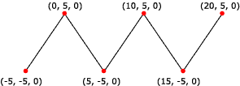

# Line Strips

A line strip is a primitive that is composed of connected line segments. Your application can use line strips for creating polygons that are not closed. A closed polygon is a polygon whose last vertex is connected to its first vertex by a line segment. If your application makes polygons based on line strips, the vertices are not guaranteed to be coplanar.

The following illustration shows a rendered line strip.



The following code shows how to create vertices for this line strip.


```
struct CUSTOMVERTEX
{
    float x,y,z;
};

CUSTOMVERTEX Vertices[] = 
{
    {-5.0, -5.0, 0.0},
    { 0.0,  5.0, 0.0},
    { 5.0, -5.0, 0.0},
    {10.0,  5.0, 0.0},
    {15.0, -5.0, 0.0},
    {20.0,  5.0, 0.0}
};
```


The code example below shows how to render a line strip in Direct3D 9 using [**IDirect3DDevice9::DrawPrimitive**](/windows/desktop/api/d3d9helper/nf-d3d9-idirect3ddevice9-drawprimitive) .


```
//
// It is assumed that d3dDevice is a valid
// pointer to a IDirect3DDevice9 interface.
//
d3dDevice->DrawPrimitive( D3DPT_LINESTRIP, 0, 5 );
```


## Related topics

<dl> <dt>

[Primitives](primitives.md)
</dt> </dl>

 

 


