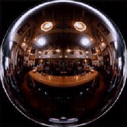

# Spherical Environment Mapping (Direct3D 9)

Spherical environment maps, or sphere maps, are special textures that contain an image of the scene surrounding an object, or the lighting effects around the object. Unlike cubic environment maps, sphere maps don't directly represent an object's surroundings. The teapot image in [Environment Mapping (Direct3D 9)](environment-mapping.md) topic shows the reflection effects you can achieve with sphere mapping. A sphere map is a 2D representation of the full 360-degree view of the scene surrounding of an object, as if taken through a fish-eye lens, as shown in the following illustration.

## Texture Coordinates for Spherical Environment Maps

The texture coordinates that you specify for each vertex receiving an environment mapping should address the texture as a function of the reflective distortion created by the curvature of the surface. Applications must compute these texture coordinates for each vertex to achieve the desired effect. One simple and effective way to generate texture coordinates uses the vertex normal as input. Although several methods exist, the following equation is common among applications that perform environment mapping with sphere maps.

In these formulas, u and v are the texture coordinates being computed, and NX and NY are the x and y components of the camera-space vertex normal. The formula is simple but effective. If the normal has a positive x component, the normal points to the right, and the u coordinate is adjusted to address the texture appropriately. Likewise for the v coordinate: positive y indicates that the normal points up. The opposite is true for negative values in each component.

If the normal points directly at the camera, the resulting coordinates should receive no distortion. The +0.5 bias to both coordinates places the point of zero-distortion at the center of the sphere map, and a vertex normal of (0, 0, z) addresses this point. This formula doesn't account for the z component of the normal, but applications that use the formula can optimize computations by skipping vertices with a normal that has a positive z element. This works for flat-shaded objects because, in camera space, if the normal points away from the camera (positive z), the vertex is culled when the object is rendered. For Gouraud-shaded objects, a normal can point away from the camera (positive x), and the triangle containing the vertex can still be visible. If you don't compute u and v for this vertex, the face might still be used, resulting in unexpected behavior.

## Applying Spherical Environment Maps

You apply an environment map to objects in the same manner as for any other texture, by setting the texture to the appropriate texture stage with the [**IDirect3DDevice9::SetTexture**](/windows/desktop/api) method. Set the first parameter to the index for the desired texture stage, and set the second parameter to the address of the [**IDirect3DDevice9**](/windows/desktop/api) interface returned when you created the texture for the environment map. You can set the color and alpha blending operations and arguments as needed to achieve the desired texture blending effects.

## Related topics

<dl> <dt>

[Environment Mapping](environment-mapping.md)
</dt> </dl>

 

 

