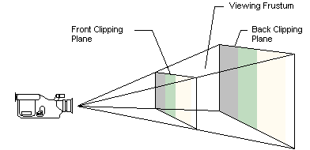
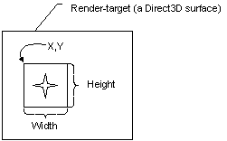

# Viewports and Clipping (Direct3D 9)

Conceptually, a viewport is a two-dimensional (2D) rectangle into which a 3D scene is projected. In Direct3D, the rectangle exists as coordinates within a Direct3D surface that the system uses as a rendering target. The projection transformation converts vertices into the coordinate system used for the viewport. A viewport is also used to specify the range of depth values on a render-target surface into which a scene will be rendered (usually 0.0 to 1.0).

## The Viewing Frustum

A viewing frustum is 3D volume in a scene positioned relative to the viewport's camera. The shape of the volume affects how models are projected from camera space onto the screen. The most common type of projection, a perspective projection, is responsible for making objects near the camera appear bigger than objects in the distance. For perspective viewing, the viewing frustum can be visualized as a pyramid, with the camera positioned at the tip as shown in the following illustration. This pyramid is intersected by a front and back clipping plane. The volume within the pyramid between the front and back clipping planes is the viewing frustum. Objects are visible only when they are in this volume.



If you imagine that you are standing in a dark room and looking through a square window, you are visualizing a viewing frustum. In this analogy, the near clipping plane is the window, and the back clipping plane is whatever finally interrupts your view - the skyscraper across the street, the mountains in the distance, or nothing at all. You can see everything inside the truncated pyramid that starts at the window and ends with whatever interrupts your view, and you can see nothing else.

The viewing frustum is defined by fov (field of view) and by the distances of the front and back clipping planes, specified in z-coordinates, as shown in the following diagram.


In this diagram, the variable D is the distance from the camera to the origin of the space that was defined in the last part of the geometry pipeline - the viewing transformation. This is the space around which you arrange the limits of your viewing frustum. For information about how this D variable is used to build the projection matrix, see the [Projection Transform (Direct3D 9)](projection-transform.md)

## Viewport Rectangle

You define the viewport rectangle in C++ by using the [**D3DVIEWPORT9**](d3dviewport9.md) structure. The D3DVIEWPORT9 structure is used with the following viewport manipulation methods exposed by the IDirect3DDevice9 interface.

-   [**IDirect3DDevice9::GetViewport**](idirect3ddevice9--getviewport.md)
-   [**IDirect3DDevice9::SetViewport**](idirect3ddevice9--setviewport.md)

The D3DVIEWPORT9 structure contains four members - X, Y, Width, Height - that define the area of the render-target surface into which a scene will be rendered. These values correspond to the destination rectangle, or viewport rectangle, as shown in the following diagram.



The values you specify for the X, Y, Width, Height members are screen coordinates relative to the upper-left corner of the render-target surface. The structure defines two additional members (MinZ and MaxZ) that indicate the depth-ranges into which the scene will be rendered.

Direct3D assumes that the viewport clipping volume ranges from -1.0 to 1.0 in X, and from 1.0 to -1.0 in Y. These were the settings used most often by applications in the past. You can adjust the viewport aspect ratio before clipping using the [projection transform](projection-transform.md).

> [!Note]  
> MinZ and MaxZ indicate the depth-ranges into which the scene will be rendered and are not used for clipping. Most applications will set these members to 0.0 and 1.0 to enable the system to render to the entire range of depth values in the depth buffer. In some cases, you can achieve special effects by using other depth ranges. For instance, to render a heads-up display in a game, you can set both values to 0.0 to force the system to render objects in a scene in the foreground, or you might set them both to 1.0 to render an object that should always be in the background.

 

The dimensions used in the X, Y, Width, Height members of the [**D3DVIEWPORT9**](d3dviewport9.md) structure for a viewport define the location and dimensions of the viewport on the render-target surface. These values are in screen coordinates, relative to the upper-left corner of the surface.

Direct3D uses the viewport location and dimensions to scale the vertices to fit a rendered scene into the appropriate location on the target surface. Internally, Direct3D inserts these values into the following matrix that is applied to each vertex.


This matrix scales vertices according to the viewport dimensions and desired depth range and translates them to the appropriate location on the render-target surface. The matrix also flips the y-coordinate to reflect a screen origin at the top-left corner with y increasing downward. After this matrix is applied, vertices are still homogeneous - that is, they still exist as \[x,y,z,w\] vertices - and they must be converted to non-homogeneous coordinates before being sent to the rasterizer.

> [!Note]  
> The viewport scaling matrix incorporates the MinZ and MaxZ members of the [**D3DVIEWPORT9**](d3dviewport9.md) structure to scale vertices to fit the depth range \[MinZ, MaxZ\]. This represents different semantics from previous releases of DirectX, in which these members were used for clipping.

 

> [!Note]  
> Applications typically set MinZ and MaxZ to 0.0 and 1.0 respectively to cause the system to render to the entire depth range. However, you can use other values to achieve certain affects. For example, you might set both values to 0.0 to force all objects into the foreground, or set both to 1.0 to render all objects into the background.

 

## Clearing a Viewport

Clearing the viewport resets the contents of the viewport rectangle on the render-target surface. It can also clear the rectangle in the depth and stencil buffer surfaces.

Use [**IDirect3DDevice9::Clear**](idirect3ddevice9--clear.md) to clear the viewport. The method accepts one or more rectangles that define the areas on the surface being cleared. Setting the Count parameter to 1, and the pRects parameter to the address of a single rectangle that covers the entire viewport area will clear the entire viewport. Another way to clear the entire viewport is to set the pRects parameter to **NULL** and the Count parameter to 0.

The [**IDirect3DDevice9::Clear**](idirect3ddevice9--clear.md) can be used for clearing stencil bits within a depth buffer. Simply set the Flags parameter to determine how **IDirect3DDevice9::Clear** works with the render target and any associated depth or stencil buffers. The D3DCLEAR\_TARGET flag will clear the viewport using an arbitrary RGBA color that you provide in the Color argument (this is not the material color). The D3DCLEAR\_ZBUFFER flag will clear the depth buffer to an arbitrary depth you specify in Z: 0.0 is the closest distance, and 1.0 is the farthest. The D3DCLEAR\_STENCIL flag will reset the stencil bits to the value you provide in the Stencil argument. You can use integers that range from 0 to 2n-1, where n is the stencil buffer bit depth.

In some situations, you might be rendering only to small portions of the render target and depth buffer surfaces. The clear methods also enable you to clear multiple areas of your surfaces in a single call. Do this by setting the Count parameter to the number of rectangles you want cleared, and specify the address of the first rectangle in an array of rectangles in the pRects parameter.

## Set Up the Viewport for Clipping

The results of the projection matrix determine the clipping volume in projection space as:

-w<sub>c</sub>&lt;= x<sub>c</sub>&lt;= w<sub>c</sub>

-w<sub>c</sub>&lt;= y<sub>c</sub>&lt;= w<sub>c</sub>

0 &lt;= z<sub>c</sub>&lt;= w<sub>c</sub>

Where: x, y, z, and w represent the vertex coordinates after the projection transformation is applied. Any vertices that have an x-, y-, or z-component outside these ranges are clipped, if clipping is enabled (the default behavior).

With the exception of vertex buffers, applications enable or disable clipping by way of the [**D3DRS\_CLIPPING**](direct3d9.d3drenderstatetype) render state. Clipping information for vertex buffers is generated during processing. For more information, see [Fixed Function Vertex Processing (Direct3D 9)](fixed-function-vertex-processing.md) and [Programmable Vertex Processing (Direct3D 9)](programmable-vertex-processing.md).

Direct3D does not clip transformed vertices of a primitive from a vertex buffer unless it comes from [**IDirect3DDevice9::ProcessVertices**](idirect3ddevice9--processvertices.md). If you are doing your own transforms and need Direct3D to do the clipping, you should not use vertex buffers. In this case, the application traverses the data to transform it. Direct3D traverses the data a second time to clip it, and then the driver renders the data, which is inefficient. So, if the application transforms the data, is should also clip the data.

When the device receives pre-transformed and lit vertices (T&L vertices) that need to be clipped, in order to perform the clipping operation the vertices are back-transformed to the clipping space using the vertex's reciprocal homogeneous w (RHW) and the viewport information. Clipping is then performed. Not all devices are capable of performing this back-transform in order to clip T&L vertices.

The D3DPMISCCAPS\_CLIPTLVERTS device capability indicates whether the device is capable of clipping T&L vertices. If this capability is not set, the application is responsible for clipping the T&L vertices that it intends to send down to the device to be rendered. The device is always capable of clipping T&L vertices in the software vertex processing mode (regardless of whether the device is created in the software vertex processing mode, or switched to the software vertex processing mode).

The only requirement for configuring the viewport parameters for a rendering device is to set the viewport's clipping volume. To do this, you initialize and set clipping values for the clipping volume and for the render-target surface. Viewports are commonly set up to render to the full area of the render-target surface, but this isn't a requirement.

You can use the following settings for the members of the [**D3DVIEWPORT9**](d3dviewport9.md) structure to achieve this in C++.


```
D3DVIEWPORT9 viewData = { 0, 0, width, height, 0.0f, 1.0f };
```


After setting values in the [**D3DVIEWPORT9**](d3dviewport9.md) structure, apply the viewport parameters to the device by calling its [**IDirect3DDevice9::SetViewport**](idirect3ddevice9--setviewport.md) method. The following code example shows what this call might look like.


```
HRESULT hr;

hr = pd3dDevice->SetViewport(&amp;viewData);
if(FAILED(hr))
    return hr;
```


If the call succeeds, the viewport parameters are set and will take effect the next time a rendering method is called. To make changes to the viewport parameters, just update the values in the [**D3DVIEWPORT9**](d3dviewport9.md) structure and call [**IDirect3DDevice9::SetViewport**](idirect3ddevice9--setviewport.md) again.

> [!Note]  
> The [**D3DVIEWPORT9**](d3dviewport9.md) structure members MinZ and MaxZ indicate the depth-ranges into which the scene will be rendered and are not used for clipping. Most applications set these members to 0.0 and 1.0 to enable the system to render to the entire range of depth values in the depth buffer. In some cases, you can achieve special effects by using other depth ranges. For instance, to render a heads-up display in a game, you can set both values to 0.0 to force the system to render objects in a scene in the foreground, or you might set them both to 1.0 to render an object that should always be in the background.

 

## Related topics

<dl> <dt>

[Getting Started](getting-started.md)
</dt> </dl>

 

 


