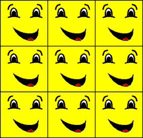

# Wrap Texture Address Mode (Direct3D 9)

The wrap texture address mode, identified by the D3DTADDRESS\_WRAP member of the [**D3DTEXTUREADDRESS**](https://msdn.microsoft.com/VS|directx_sdk|~\d3dtextureaddress.htm) enumerated type, makes Direct3D repeat the texture on every integer junction. Suppose, for example, your application creates a square primitive and specifies texture coordinates of (0.0,0.0), (0.0,3.0), (3.0,3.0), and (3.0,0.0). Setting the texture addressing mode to D3DTADDRESS\_WRAP results in the texture being applied three times in both the u-and v-directions, as shown in the following illustration.

The effects of this texture address mode are similar to, but distinct from, those of the mirror mode. For more information, see [Mirror Texture Address Mode (Direct3D 9)](mirror-texture-address-mode.md).

## Related topics

<dl> <dt>

[Texture Addressing Modes](texture-addressing-modes.md)
</dt> </dl>

 

 

