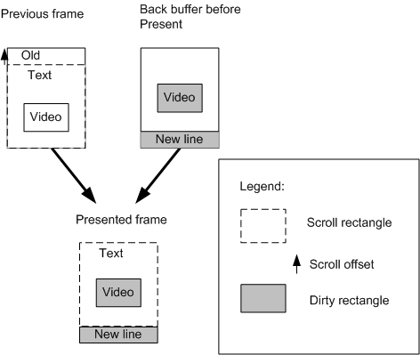
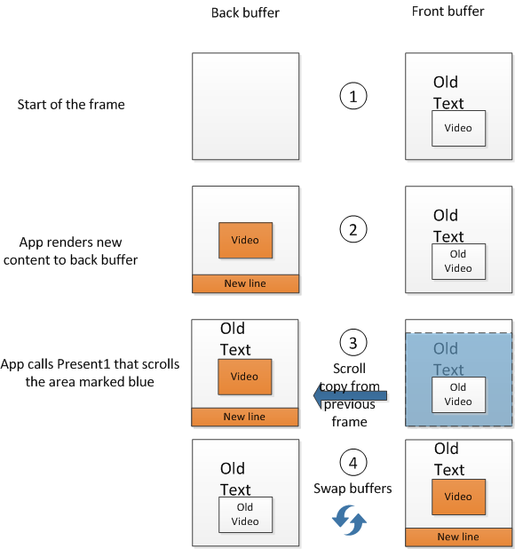
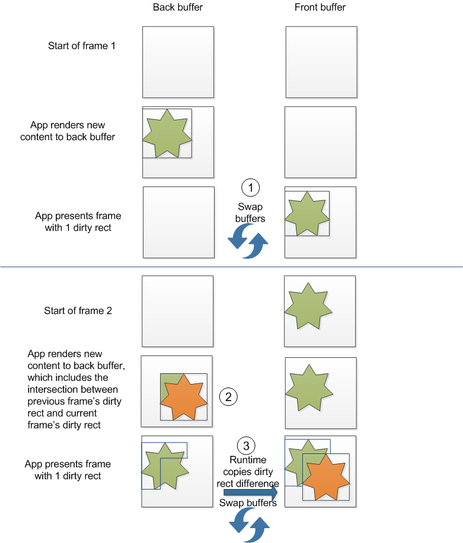

# Enhancing presentation with the flip model, dirty rectangles, and scrolled areas

DXGI 1.2 supports a new flip-model swap chain, dirty rectangles, and scrolled areas. We explain the benefits of using the new flip-model swap chain and of optimizing presentation by specifying dirty rectangles and scrolled areas.

-   [DXGI flip-model presentation](#dxgi-flip-model-presentation)
-   [Using dirty rectangles and the scroll rectangle in swap chain presentation](#using-dirty-rectangles-and-the-scroll-rectangle-in-swap-chain-presentation)
    -   [Sample 2-buffer flip-model swap chain with dirty rectangles and scroll rectangle](#sample-2-buffer-flip-model-swap-chain-with-dirty-rectangles-and-scroll-rectangle)
    -   [Tracking dirty rectangles and scroll rectangles across multiple frames](#tracking-dirty-rectangles-and-scroll-rectangles-across-multiple-frames)
    -   [Bitblt model swap chain with dirty rectangles](#bitblt-model-swap-chain-with-dirty-rectangles)
-   [Related topics](#related-topics)

## DXGI flip-model presentation

DXGI 1.2 adds support for the flip presentation model for Direct3D 10 and later APIs. In Windows 7, Direct3D 9EX first adopted [flip-model presentation](direct3darticles.direct3d_9ex_improvements#flip-model) to avoid unnecessarily copying the swap-chain buffer. By using flip model, back buffers are flipped between the runtime and Desktop Window Manager (DWM), so DWM always composes directly from the back buffer instead of copying the back buffer content.

DXGI 1.2 APIs include a revised DXGI swap-chain interface, [**IDXGISwapChain1**](/windows/desktop/api/DXGI1_2/nn-dxgi1_2-idxgiswapchain1). You can use multiple [**IDXGIFactory2**](/windows/desktop/api/DXGI1_2/nn-dxgi1_2-idxgifactory2) interface methods to create the appropriate **IDXGISwapChain1** object to use with an [**HWND**](https://msdn.microsoft.com/4553cafc-450e-4493-a4d4-cb6e2f274d46) handle, an **IWindow** object, [DirectComposition](https://msdn.microsoft.com/40e2d02b-77e8-425f-ac5e-3dcddef08173), or the [**Windows.UI.Xaml**](https://msdn.microsoft.com/Windows.UI.Xaml) framework.

You select the flip presentation model by specifying the [**DXGI\_SWAP\_EFFECT\_FLIP\_SEQUENTIAL**](dxgi-swap-effect.md#dxgi-swap-effect-flip-sequential) enumeration value in the **SwapEffect** member of the [**DXGI\_SWAP\_CHAIN\_DESC1**](/windows/desktop/api/DXGI1_2/ns-dxgi1_2-dxgi_swap_chain_desc1) structure and by setting the **BufferCount** member of **DXGI\_SWAP\_CHAIN\_DESC1** to a minimum of 2. For more info about how to use DXGI flip model, see [DXGI flip model](dxgi-flip-model.md). Because of the flip presentation model's smoother presentation and other new functionality, we recommend that you use flip presentation model for all new apps that you write with Direct3D 10 and later APIs.

## Using dirty rectangles and the scroll rectangle in swap chain presentation

By using dirty rectangles and the scroll rectangle in swap chain presentation, you save on the usage of memory bandwidth and the related usage of system power because the amount of pixel data that the operating system needs to draw the next presented frame is reduced if the operating system doesn't need to draw the entire frame. For apps that are often displayed via Remote Desktop Connection and other remote-accessing technologies, the savings are particularly noticeable in the display quality because these technologies use dirty rectangles and scroll metadata.

You can use scroll only with DXGI swap chains that run in flip presentation model. You can use dirty rectangles with DXGI swap chains that run in both flip model and bitblt model (set with [**DXGI\_SWAP\_EFFECT\_SEQUENTIAL**](dxgi-swap-effect.md#dxgi-swap-effect-sequential)).

In this scenario and illustration we show the functionality of using dirty rectangles and scroll. Here, a scrollable app contains text and animating video. The app uses dirty rectangles to just update the animating video and new line for the window, instead of updating the entire window. The scroll rectangle allows the operating system to copy and translate the previously rendered content on the new frame and to render only the new line on the new frame.

The app performs presentation by calling the [**IDXGISwapChain1::Present1**](/windows/desktop/api/DXGI1_2/nf-dxgi1_2-idxgiswapchain1-present1) method. In this call, the app passes a pointer to a [**DXGI\_PRESENT\_PARAMETERS**](/windows/desktop/api/DXGI1_2/ns-dxgi1_2-dxgi_present_parameters) structure that includes dirty rectangles and the number of dirty rectangles, or the scroll rectangle and the associated scroll offset, or both dirty rectangles and the scroll rectangle. Our app passes 2 dirty rectangles and the scroll rectangle. The scroll rectangle is the area of the previous frame that the operating system needs to copy to the current frame before it renders the current frame. The app specifies the animating video and new line as dirty rectangles, and the operating system renders them on the current frame.



``` syntax
DirtyRectsCount = 2
pDirtyRects[ 0 ] = { 10, 30, 40, 50 } // Video
pDirtyRects[ 1 ] = { 0, 70, 50, 80 } // New line
*pScrollRect = { 0, 0, 50, 70 }
*pScrollOffset = { 0, -10 }
```

The dashed rectangle shows the scroll rectangle in the current frame. The scroll rectangle is specified by the **pScrollRect** member of [**DXGI\_PRESENT\_PARAMETERS**](/windows/desktop/api/DXGI1_2/ns-dxgi1_2-dxgi_present_parameters). The arrow shows the scroll offset. The scroll offset is specified by the **pScrollOffset** member of **DXGI\_PRESENT\_PARAMETERS**. Filled rectangles show dirty rectangles that the app updated with new content. The filled rectangles are specified by the **DirtyRectsCount** and **pDirtyRects** members of **DXGI\_PRESENT\_PARAMETERS**.

### Sample 2-buffer flip-model swap chain with dirty rectangles and scroll rectangle

The next illustration and sequence shows an example of a DXGI flip-model presentation operation that uses dirty rectangles and a scroll rectangle. In this example we use the minimum number of buffers for flip-model presentation, which is a buffer count of two, one front buffer that contains the app display content and one back buffer that contains the current frame that the app wants to render.

1.  As shown in the front buffer at the beginning of the frame, the scrollable app initially shows a frame with some text and animating video.
2.  To render the next frame, the app renders onto the back buffer the dirty rectangles that update the animating video and the new line for the window.
3.  When the app calls [**IDXGISwapChain1::Present1**](/windows/desktop/api/DXGI1_2/nf-dxgi1_2-idxgiswapchain1-present1), it specifies the dirty rectangles and the scroll rectangle and offset. The runtime next copies the scroll rectangle from the previous frame minus the updated dirty rectangles onto the current back buffer.
4.  The runtime finally swaps the front and back buffers.



### Tracking dirty rectangles and scroll rectangles across multiple frames

When you use dirty rectangles in your app, you must track the dirty rectangles to support incremental rendering. When your app calls [**IDXGISwapChain1::Present1**](/windows/desktop/api/DXGI1_2/nf-dxgi1_2-idxgiswapchain1-present1) with dirty rectangles, you must ensure that every pixel within the dirty rectangles is up to date. If you aren't completely re-rendering the whole area of the dirty rectangle or if you can’t know for certain the areas that are dirtied, you must copy some data from the previous fully coherent back buffer to the current, stale back buffer before you start rendering.

The runtime copies only the differences between updated areas of the previous frame and updated areas of the current frame onto the current back buffer. If these areas intersect, the runtime copies only the difference between them. As you can see in the following diagram and sequence, you must copy the intersection between the dirty rectangle from frame 1 and the dirty rectangle from frame 2 into frame 2’s dirty rectangle.

1.  Present dirty rectangle in frame 1.
2.  Copy intersection between the dirty rectangle from frame 1 and the dirty rectangle from frame 2 into frame 2’s dirty rectangle.
3.  Present dirty rectangle in frame 2.



To generalize, for a swap chain with N buffers, the area that the runtime copies from the last frame to the current frame on the current frame’s present is:


where buffer indicates the buffer index in a swap chain, starting with current buffer index at zero.

You can keep track of any intersections between the previous frame and the current frame’s dirty rectangles by keeping a copy of the previous frame’s dirty rectangles or by re-rendering the new frame’s dirty rectangles with the appropriate content from the previous frame.

Similarly, in the cases where the swap chain has more than 2 back buffers, you must ensure that overlapping areas between the current buffer’s dirty rectangles and the dirty rectangles of all previous frame’s are copied or re-rendered.

### Tracking a single intersection between 2 dirty rectangles

In the simplest case, when you update a single dirty rectangle per frame, the dirty rectangles across two frames might intersect. To find out whether the dirty rectangle of the previous frame and the dirty rectangle of the current frame overlap, you need to verify whether the dirty rectangle of the previous frame intersects with the dirty rectangle of the current frame. You can call the GDI [**IntersectRect**](https://msdn.microsoft.com/da686f78-e557-4ff2-9f24-b229f0c01563) function to determine whether two [**RECT**](https://msdn.microsoft.com/9439cb6c-f2f7-4c27-b1d7-8ddf16d81fe8) structures that represent the two dirty rectangles intersect.

In this code snippet, a call to [**IntersectRect**](https://msdn.microsoft.com/da686f78-e557-4ff2-9f24-b229f0c01563) returns the intersection of two dirty rectangles in another [**RECT**](https://msdn.microsoft.com/9439cb6c-f2f7-4c27-b1d7-8ddf16d81fe8) called dirtyRectCopy. After the code snippet determines that the two dirty rectangles intersect, it calls the [**ID3D11DeviceContext1::CopySubresourceRegion1**](https://msdn.microsoft.com/1963011F-C3E2-428D-B667-195A4976510B) method to copy the region of intersection into the current frame.


```
RECT dirtyRectPrev, dirtyRectCurrent, dirtyRectCopy;
 
if (IntersectRect( &amp;dirtyRectCopy, &amp;dirtyRectPrev, &amp;dirtyRectCurrent ))
{
       D3D11_BOX intersectBox;
       intersectBox.left    = dirtyRectCopy.left;
       intersectBox.top     = dirtyRectCopy.top;
       intersectBox.front   = 0;
       intersectBox.right   = dirtyRectCopy.right;
       intersectBox.bottom  = dirtyRectCopy.bottom;
       intersectBox.back    = 1;
 
       d3dContext->CopySubresourceRegion1(pBackbuffer,
                                    0,
                                    0,
                                    0,
                                    0,
                                    pPrevBackbuffer,
                                    0,
                                    &amp;intersectBox,
                                    0
                                    );
}

// Render additional content to the current pBackbuffer and call Present1.
```


If you use this code snippet in an app, the app will then be ready to call [**IDXGISwapChain1::Present1**](/windows/desktop/api/DXGI1_2/nf-dxgi1_2-idxgiswapchain1-present1) to update the current frame with the current dirty rectangle.

### Tracking intersections between N dirty rectangles

If you specify multiple dirty rectangles, which can include a dirty rectangle for the newly revealed scroll line, per frame, you need to verify and track any overlaps that might occur between all the dirty rectangles of the previous frame and all the dirty rectangles of the current frame. To calculate the intersections between the dirty rectangles of the previous frame and the dirty rectangles of the current frame, you can group the dirty rectangles into regions.

In this code snippet, we call the GDI [**SetRectRgn**](https://msdn.microsoft.com/9a024d61-f397-43d8-a48e-edb8102a6f55) function to convert each dirty rectangle into a rectangular region and then we call the GDI [**CombineRgn**](https://msdn.microsoft.com/ef9fc4f3-737e-4c10-a80b-8ae2097c17d1) function to combine all the dirty rectangular regions into a group.


```
HRGN hDirtyRgnPrev, hDirtyRgnCurrent, hRectRgn; // Handles to regions 
// Save all the dirty rectangles from the previous frame.
 
RECT dirtyRect[N]; // N is the number of dirty rectangles in current frame, which includes newly scrolled area.
 
int iReturn;
SetRectRgn(hDirtyRgnCurrent, 
       dirtyRect[0].left, 
       dirtyRect[0].top, 
       dirtyRect[0].right, 
       dirtyRect[0].bottom 
       );

for (int i = 1; i<N; i++)
{
   SetRectRgn(hRectRgn, 
          dirtyRect[0].left, 
          dirtyRect[0].top, 
          dirtyRect[0].right, 
          dirtyRect[0].bottom 
          );

   iReturn = CombineRgn(hDirtyRgnCurrent,
                        hDirtyRgnCurrent,
                        hRectRgn,
                        RGN_OR
                        );
   // Handle the error that CombineRgn returns for iReturn.
}

```


You can now use the GDI [**CombineRgn**](https://msdn.microsoft.com/ef9fc4f3-737e-4c10-a80b-8ae2097c17d1) function to determine the intersection between the dirty region of the previous frame and the dirty region of the current frame. After you obtain the intersecting region, call the GDI [**GetRegionData**](https://msdn.microsoft.com/e0d4862d-a405-4c00-b7b0-af4dd60407c0) function to obtain each individual rectangle from the intersecting region and then call the [**ID3D11DeviceContext1::CopySubresourceRegion1**](https://msdn.microsoft.com/1963011F-C3E2-428D-B667-195A4976510B) method to copy each intersecting rectangle into the current back buffer. The next code snippet shows how to use these GDI and Direct3D functions.


```
HRGN hIntersectRgn;
bool bRegionsIntersect;
iReturn = CombineRgn(hIntersectRgn, hDirtyRgnCurrent, hDirtyRgnPrev, RGN_AND);
if (iReturn == ERROR)
{
       // Handle error.
}
else if(iReturn == NULLREGION)
{
       bRegionsIntersect = false;
}
else
{
       bRegionsIntersect = true;
}
 
if (bRegionsIntersect)
{
       int rgnDataSize = GetRegionData(hIntersectRgn, 0, NULL);
       if (rgnDataSize)
       {
              char pMem[] = new char[size];
              RGNDATA* pRgnData = reinterpret_cast<RGNDATA*>(pMem);
              iReturn = GetRegionData(hIntersectRgn, rgnDataSize, pRgnData);
              // Handle iReturn failure.
 
              for (int rectcount = 0; rectcount < pRgnData->rdh.nCount; ++r)
              {
                     const RECT* pIntersectRect = reinterpret_cast<RECT*>(pRgnData->Buffer) +                                            
                                                  rectcount;                
                     D3D11_BOX intersectBox;
                     intersectBox.left    = pIntersectRect->left;
                     intersectBox.top     = pIntersectRect->top;
                     intersectBox.front   = 0;
                     intersectBox.right   = pIntersectRect->right;
                     intersectBox.bottom  = pIntersectRect->bottom;
                     intersectBox.back    = 1;
 
                     d3dContext->CopySubresourceRegion1(pBackbuffer,
                                                      0,
                                                      0,
                                                      0,
                                                      0,
                                                      pPrevBackbuffer,
                                                      0,
                                                      &amp;intersectBox,
                                                      0
                                                      );
              }

              delete [] pMem;
       }
}

```


### Bitblt model swap chain with dirty rectangles

You can use dirty rectangles with DXGI swap chains that run in bitblt model (set with [**DXGI\_SWAP\_EFFECT\_SEQUENTIAL**](dxgi-swap-effect.md#dxgi-swap-effect-sequential)). Bitblt model swap chains that use more than one buffer must also track overlapping dirty rectangles across frames in the same way as described in [Tracking dirty rectangles and scroll rectangles across multiple frames](#tracking-dirty-rectangles-and-scroll-rectangles-across-multiple-frames) for flip model swap chains. Bitblt model swap chains with just one buffer need not track overlapping dirty rectangles because the entire buffer is redrawn every frame.

## Related topics

<dl> <dt>

[DXGI 1.2 Improvements](dxgi-1-2-improvements.md)
</dt> </dl>

 

 


