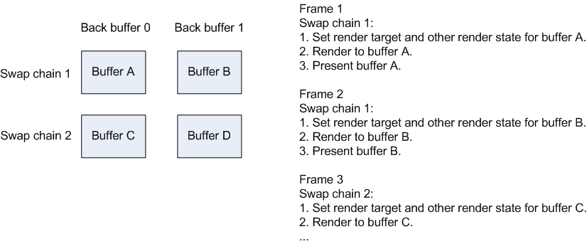
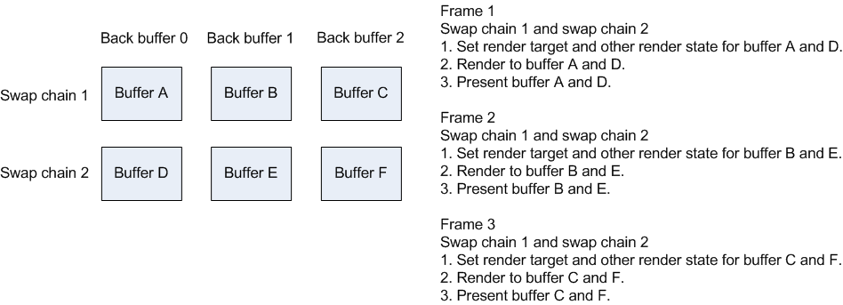

# Improving performance with multiple swap chains per rendering device

To improve performance, you might want to create more than one swap chain per Direct3D rendering device. Use this approach to save memory that is required by creating additional devices, or to reduce the amount of rendering time to render to individual per-device swap chains separately, or to both save memory and reduce rendering time.

-   [App scenarios with multiple swap chains per device](#app-scenarios-with-multiple-swap-chains-per-device)
-   [Managing multiple swap chains per device](#managing-multiple-swap-chains-per-device)
    -   [Setting maximum frame latency](#setting-maximum-frame-latency)
    -   [Using flip model with multiple swap chains per device](#using-flip-model-with-multiple-swap-chains-per-device)
-   [Related topics](#related-topics)

## App scenarios with multiple swap chains per device

Consider using multiple chains when the app scene consists of separate display objects that are rendered and updated independently. For example, the app has constantly changing animation, such as video on one side and scrollable text on another side. To save memory that you would normally need to create an extra device and to ease the sharing of contents between the two swap chains, you can create both swap chains tied to the same Direct3D rendering device. Use one swap chain for animation and one swap chain for text. A common example of this scenario is a Direct3D app that also uses the [DirectComposition](https://msdn.microsoft.com/40e2d02b-77e8-425f-ac5e-3dcddef08173) API.

Another scenario is when you want to save rendering time by setting multiple render targets on multiple swap chains simultaneously. For example, suppose you want to render a complex scene with lots of textures and geometry, such as racing cars on a track, and you want the app window to show views from both the rear and side mirrors in two display windows that are rendered by two swap chains. If you set the multiple swap chains as render targets, your app doesn't need to repeat the rendering times on each swap chain separately.

## Managing multiple swap chains per device

Use the guidelines in this section to manage multiple swap chains that you create for a single Direct3D rendering device.

### Setting maximum frame latency

Use the [**IDXGIDevice1::SetMaximumFrameLatency**](/windows/desktop/api/DXGI/nf-dxgi-idxgidevice1-setmaximumframelatency) method to set the maximum number of present operations that the operating system can queue for rendering to the display. This maximum number is per Direct3D rendering device rather than per swap chain. Therefore, to ensure that the operating system displays the present operations at the intended vsync interval, we recommend that you not set the maximum frame latency to 1 when you create multiple flip or bitblt model swap chains per device and when more than one of those swap chains will render for every frame. As a general rule, if you reliably submit only 2 present operations per frame between all swap chains of the same device, you can set the maximum frame latency to 2. If you can't reliably submit and count the present operations per frame, you can use [present statistics](dxgi-flip-model.md#frame-synchronization-of-dxgi-flip-model-apps) to track when the operating system displays present operations.

### Using flip model with multiple swap chains per device

Use these guidelines when you use the [DXGI flip model](dxgi-flip-model.md) with multiple swap chains that you create for a single Direct3D rendering device.

### Targeting specific vsync intervals with each swap chain’s present operations

When you create two or more flip model swap chains per device, pay attention to the display differences when you manage the sequence of device state and the sequence of calls to the [**IDXGISwapChain1::Present1**](/windows/desktop/api/DXGI1_2/nf-dxgi1_2-idxgiswapchain1-present1) method of all the swap chains. To ensure that the operating system displays each swap chain’s present operation at the intended vsync interval, we recommend that you ensure that the number of queued present operations is always at least one less than the number of back buffers for the swap chain with the least number of back buffers.

### Flip model swap chains with two buffers

Your app can target specific vsync intervals when its number of queued present operations is less than or equal to the number of back buffers – 1. Also, you must use or render to each swap chain separately, and then terminate the use of each swap chain with a present operation. So when you submit every present operation for a 2-buffer flip-model swap chain, you reach the threshold for the number of back buffers where you must pay special attention if you want your app to target specific vsync intervals.

In the case of 2-buffer swap chains, to target specific vsync intervals, you must ensure that the operating system finishes the display of each swap chain’s present operation before you render to the next buffer. We recommend that you finish setting the render-target view and other rendering state, next render, and then call [**IDXGISwapChain1::Present1**](/windows/desktop/api/DXGI1_2/nf-dxgi1_2-idxgiswapchain1-present1) for each of the two buffers of one swap chain before you do the same for another swap chain. When you work with two or more swap chains, you need to reset the render target and the rendering state on the device for each swap chain. The benefit of this approach is to avoid the case where one or more of the swap chain’s present operations miss their intended vsync interval. For the first example, app with changing animation and text, as described in [App scenarios with multiple swap chains per device](#app-scenarios-with-multiple-swap-chains-per-device), by targeting specific present intervals, you are guaranteed that when the animation is updated in one display window, the corresponding text that is rendered by a separate swap chain is also displayed at the same time in another display window. If your app needs to target specific vsync intervals, you must follow this guidance.

This diagram shows an example of the code flow of swap-chain rendering and presentation in an app with two flip-model swap chains each with two buffers. In this case, you need to target a specific present interval for each present operation.

### Reducing rendering time by simultaneously setting multiple swap chains as render targets

For the second example, racing cars on a track, as described in [App scenarios with multiple swap chains per device](#app-scenarios-with-multiple-swap-chains-per-device), you might want to trade off targeting specific present vsync intervals with the rendering time savings that you gain by setting multiple render targets on all swap chains simultaneously. In this case, set multiple render targets simultaneously, render the scene on each swap chain, and then call [**IDXGISwapChain1::Present1**](/windows/desktop/api/DXGI1_2/nf-dxgi1_2-idxgiswapchain1-present1) on each swap chain that is used in the scene. The benefit of this approach is you reduce the rendering time. The limitation of this approach is your simultaneous swap chain present operations can't target the same vsync when you use 2-buffer swap chains. For example, the operating system won't display the contents of the race car side-view mirrors until 1 vsync after the same contents are seen from the race car rear-view mirror.

This diagram shows an example of the code flow of swap-chain rendering and presentation in an app with two flip-model swap chains each with two buffers in length. In this type of example, you save rendering times to swap chains 1 and 2 for buffers A and C. But you can't synchronize the vsync intervals at which present operations for buffers A and C are displayed. This patterns repeats for frame 2.

To avoid missing the intended vsync interval because of to many queued present operations, you can increase the number of back buffers in each swap chain. But this technique uses more video memory. To avoid missing target vsync intervals, we recommend that you always keep the number of queued present operations less than the number of back buffers in the swap chain with the least number of back buffers. When you set two swap chains as multiple render targets, because you queue two present operations simultaneously on both swap chains, we recommend that you create swap chains with at least three buffers in length.

The next diagram shows an example of the code flow of swap-chain rendering and presentation in an app with two flip-model swap chains each with three buffers in length. Here, because the number of queued presents for any particular frame is 2, which is less than the number of back buffers per swap chain, your app can set multiple render targets and still target the same vsync intervals for buffers A and D in frame 2 and for the buffers in subsequent frames.

## Related topics

<dl> <dt>

[Enhancing presentation with the flip model, dirty rectangles, and scrolled areas](dxgi-1-2-presentation-improvements.md)
</dt> </dl>

 

 

