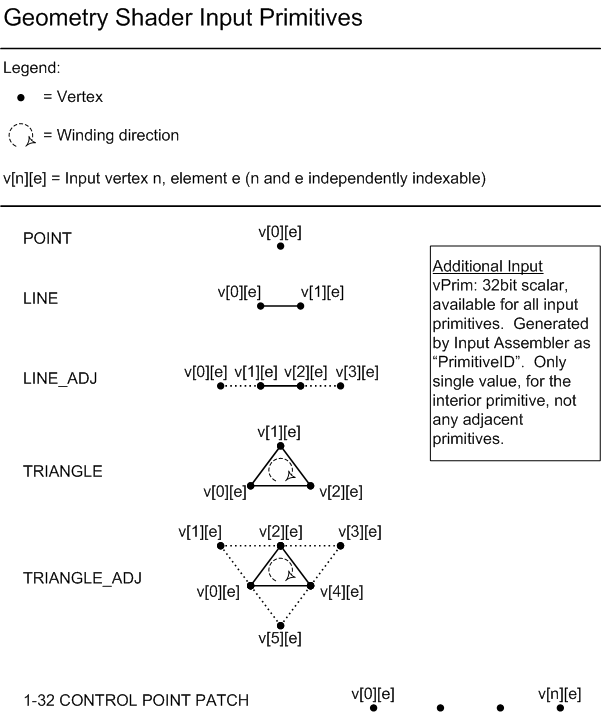
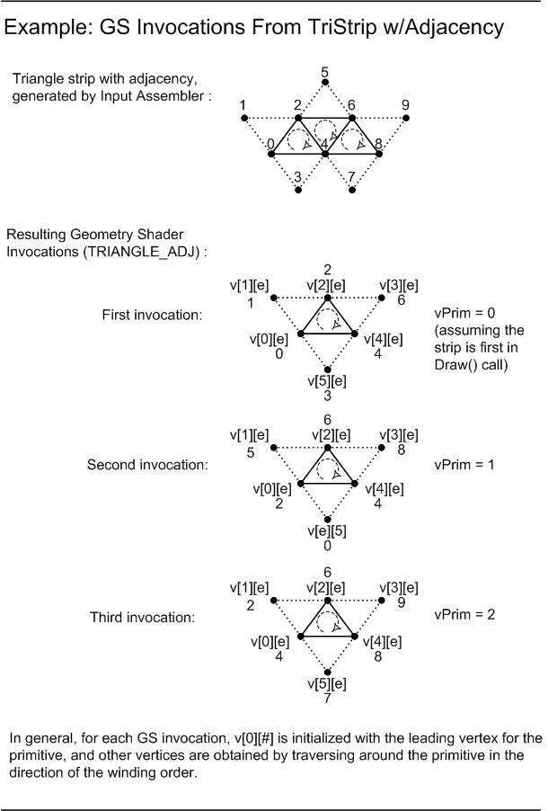

# Geometry-Shader Object

A geometry-shader object processes entire primitives. Use the following syntax to declare a geometry-shader object.


|                                                                                                                                        |
|----------------------------------------------------------------------------------------------------------------------------------------|
| \[maxvertexcount(*NumVerts*)\] void *ShaderName* (   *PrimitiveType DataType Name \[ NumElements \]*,   inout *StreamOutputObject*  ); |


 

## Parameters

<dl> <dt>

<span id="_maxvertexcount_NumVerts__"></span><span id="_maxvertexcount_numverts__"></span><span id="_MAXVERTEXCOUNT_NUMVERTS__"></span>\[maxvertexcount(*NumVerts*)\]
</dt> <dd>

\[in\] Declaration for the maximum number of vertices to create.

-   \[maxvertexcount()\] - required keyword; brackets and parenthesis are required characters for correct syntax.
-   *NumVerts* - An integer number representing the number of vertices.

</dd> <dt>

<span id="ShaderName"></span><span id="shadername"></span><span id="SHADERNAME"></span>*ShaderName*
</dt> <dd>

\[in\] An ASCII string that contains a unique name for the geometry-shader function.

</dd> <dt>

<span id="PrimitiveType_DataType_Name___NumElements__"></span><span id="primitivetype_datatype_name___numelements__"></span><span id="PRIMITIVETYPE_DATATYPE_NAME___NUMELEMENTS__"></span>*PrimitiveType DataType Name \[ NumElements \]*
</dt> <dd>

*PrimitiveType* - Primitive type, which determines the order of the primitive data.


| Primitive Type | Description                                                   |
|----------------|---------------------------------------------------------------|
| *point*        | Point list                                                    |
| *line*         | Line list or line strip                                       |
| *triangle*     | Triangle list or triangle strip                               |
| *lineadj*      | Line list with adjacency or line strip with adjacency         |
| *triangleadj*  | Triangle list with adjacency or triangle strip with adjacency |


 

*DataType* - \[in\] An input data type; can be any [HLSL data type](dx-graphics-hlsl-data-types.md).

*Name* - Argument name; this is an ASCII string.

*NumElements* - Array size of the input, which depends on the *PrimitiveType* as shown in the following table.

| Primitive Type | NumElements                                                                                                  |
|----------------|--------------------------------------------------------------------------------------------------------------|
| *point*        | \[1\]<br/> You operate on only one point at a time.<br/>                                         |
| *line*         | \[2\]<br/> A line requires two vertices.<br/>                                                    |
| *triangle*     | \[3\]<br/> A triangle requires three vertices.<br/>                                              |
| *lineadj*      | \[4\]<br/> A lineadj has two ends; therefore, it requires four vertices.<br/>                    |
| *triangleadj*  | \[6\]<br/> A triangleadj borders three more triangles; therefore, it requires six vertices.<br/> |


 

</dd> <dt>

<span id="StreamOutputObject"></span><span id="streamoutputobject"></span><span id="STREAMOUTPUTOBJECT"></span>*StreamOutputObject*
</dt> <dd>

The declaration of the [stream-output object](dx-graphics-hlsl-so-type.md).

</dd> </dl>

## Return Value

None

## Remarks

The following diagram shows the various primitive types for a geometry shader object.



The following diagram shows geometry shader invocations.



## Examples

This example is from exercise 1 from the [Direct3D 10 Shader Model 4.0 Workshop](https://msdn.microsoft.com/en-us/library/Ee416554(v=VS.85).aspx).


```
[maxvertexcount(3)]
void GSScene( triangleadj GSSceneIn input[6], inout TriangleStream<PSSceneIn> OutputStream )
{   
    PSSceneIn output = (PSSceneIn)0;

    for( uint i=0; i<6; i+=2 )
    {
        output.Pos = input[i].Pos;
        output.Norm = input[i].Norm;
        output.Tex = input[i].Tex;
        
        OutputStream.Append( output );
    }
    
    OutputStream.RestartStrip();
}
```


## Minimum Shader Model

This object is supported in the following shader models.


| Shader Model                                                        | Supported |
|---------------------------------------------------------------------|-----------|
| [Shader Model 4](dx-graphics-hlsl-sm4.md) and higher shader models | yes       |


 

## Related topics

<dl> <dt>

[Shader Model 4](dx-graphics-hlsl-sm4.md)
</dt> </dl>

 

 


