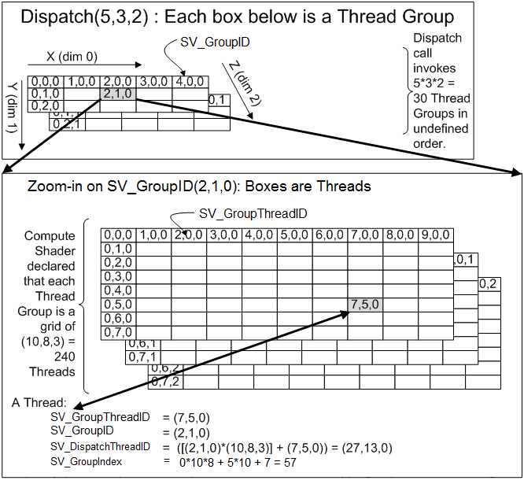

# SV\_DispatchThreadID

Indices for which combined thread and thread group a compute shader is executing in. SV\_DispatchThreadID is the sum of SV\_GroupID \* numthreads and GroupThreadID. It varies across the range specified in [**Dispatch**](https://msdn.microsoft.com/library/windows/desktop/ff476405) and [numthreads](sm5-attributes-numthreads.md). For example if Dispatch(2,2,2) is called on a compute shader with numthreads(3,3,3) SV\_DispatchThreadID will have a range of 0..5 for each dimension.

## Type

|       |
|-------|
| Type  |
| uint3 |

 

## Remarks

This system value is optional.

The following illustration shows the relationship between the parameters passed to [**Dispatch**](https://msdn.microsoft.com/library/windows/desktop/ff476405), Dispatch(5,3,2), the values specified in the [numthreads](sm5-attributes-numthreads.md) attribute, numthreads(10,8,3), and values that will passed to the compute shader for the thread-related system values ([SV\_GroupIndex](sv-groupindex.md),SV\_DispatchThreadID,[SV\_GroupThreadID](sv-groupthreadid.md),[SV\_GroupID](sv-groupid.md)).

This function is supported in the following types of shaders:

|        |      |        |          |       |         |
|--------|------|--------|----------|-------|---------|
| Vertex | Hull | Domain | Geometry | Pixel | Compute |
|        |      |        |          |       | x       |

 

## See also

<dl> <dt>

[Semantics](dx-graphics-hlsl-semantics.md)
</dt> <dt>

[Shader Model 5](d3d11-graphics-reference-sm5.md)
</dt> </dl>

 

 

