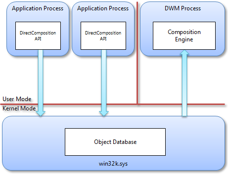
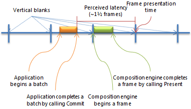

# Architecture and components

This topic describes the components that make up Microsoft DirectComposition. It consists of the following sections.

-   [Software components](#software-components)
-   [Application library](#application-library)
-   [Composition engine](#composition-engine)
-   [Related topics](#related-topics)

## Software components

DirectComposition consists of the following main software components.

-   A user-mode application library (dcomp.dll) that implements the Component Object Model (COM)-based public API.
-   A user-mode composition engine (dwmcore.dll) that is hosted in the Desktop Window Manager (DWM) process (dwm.exe), and performs the actual desktop composition.
-   A kernel-mode object database (part of win32k.sys) that marshals commands from the application to the composition engine.

A single instance of the composition engine handles the DirectComposition composition trees for all applications and the DWM composition tree, which represents the entire desktop. Both the kernel-mode object database and the user-mode composition engine are instantiated once per session, so a Terminal Server machine with multiple users has multiple instances of both of those components.

The following diagram shows the main DirectComposition components and how they relate to one another.

## Application library

The DirectComposition application library is a public COM-based API with a single flat entry-point that is exported from dcomp.dll and returns an interface pointer to a device object. The device object, in turn, has methods for creating all other objects, each of which is represented by an interface pointer. All DirectComposition interfaces inherit from and fully implement the [**IUnknown**](https://msdn.microsoft.com/library/windows/desktop/ms680509) interface. All methods that accept DirectComposition interfaces check whether the interface is implemented inside of dcomp.dll or whether it is implemented by another component. Because DirectComposition is not extensible, methods that take interfaces as parameters return E\_INVALIDARG if the interfaces are not implemented in dcomp.dll. The API requires no special privileges; it can be called by processes running at the lowest level of access. However, because the API does not operate in session 0, it is not suitable for services. In these respects, the DirectComposition API is similar to other Microsoft DirectX APIs, most notably Direct2D, Microsoft Direct3D, and Microsoft DirectWrite.

Because the composition engine is designed exclusively for asynchronous execution, object properties in the DirectComposition API are write-only. All properties have setter methods, but not getter methods. Reading properties is not only resource intensive, but can also be inaccurate because any value that the composition engine returns can immediately become invalid. This can happen if, for example, an independent animation is bound to the property that is being read.

The API is thread-safe. An application can call any method from any thread at any time. However, because many API methods must be called in a particular sequence, without any synchronization an application can experience unpredictable behavior depending on how the threads interleave. For example, if two threads change the same property of the same object to different values at the same time, the application cannot predict which of the two values will be the final value of the property. Similarly, if two threads call [**Commit**](/windows/win32/Dcomp/?branch=master) on the same device, neither thread gets truly transactional behavior because a call to **Commit** on one thread will submit the batch of all commands issued by both threads, not just the one that called **Commit**.

The system maintains all internal state per device object. If an application creates two or more DirectComposition device objects, the application can maintain independent batches and other state between the two.

All DirectComposition objects have device object affinity; objects created by a particular device object can be used only with that device object, and can be associated only with other objects created by the same device object. In other words, each device object is a separate disjoint island of functionality. The one exception is the visual class, which permits the building of visual trees where a visual can belong to a different device object than its parent. This enables scenarios where an application and a control can manage a single composition tree without also needing to share a single DirectComposition device object.

## Composition engine

The DirectComposition composition engine runs on a dedicated process, separate from any application process. A single composition process, dwm.exe, supports every application in a session. Each application can create two visual trees for each window that it owns. All of the trees are actually implemented as subtrees of a larger visual tree that also encompasses the composition structures of DWM. The DWM constructs one large visual tree for each desktop in a session. Here are the key advantages to this architecture:

-   The composition engine has access to all application bitmaps and visual trees, which enables cross-process window interoperability and composition.
-   The composition engine runs in a trusted system process that is separate from any application process, enabling applications that have low access rights to securely compose protected content.
-   The composition engine can detect when a particular window is fully occluded and avoid wasting CPU and graphics processing unit (GPU) resources composing for the window.
-   The composition engine can compose directly to the screen back buffer, avoiding the need for an extra copy that is required for per-process composition engines.
-   All applications share a single Direct3D device for composition, which offers considerable memory savings

The visual tree is a retained structure. The DirectComposition API exposes methods to edit the structure in batches of changes that are processed atomically. The root object in the DirectComposition API is the device object, which serves as the factory for all other DirectComposition objects and contains a method called [**Commit**](/windows/win32/Dcomp/?branch=master). The composition engine does not reflect any changes that the application makes to the visual tree until the application calls **Commit**, at which point all changes since the last **Commit** are processed as a single transaction.

The requirement to call [**Commit**](/windows/win32/Dcomp/?branch=master) is similar to the concept of a "frame" except that, because the composition engine runs asynchronously, it can present several different frames between calls to **Commit**. In DirectComposition, a *frame* is a single iteration of the composition engine, and the interval spent by an application between two calls to **Commit** is called a *batch*.

DirectComposition batches all application calls to the DirectComposition API. The kernel object database, which is implemented in the win32k.sys session driver, stores all state information that is associated with the API calls.

The composition engine produces one frame for each vertical blank in the display. The frame is started at a vertical blank and targets the subsequent vertical blank. When the frame starts, the composition engine picks up all pending batches and includes their commands in that frame. Batches are placed in a pending queue when the application calls [**Commit**](/windows/win32/Dcomp/?branch=master), and the pending queue is flushed atomically at the beginning of the frame. Therefore, there is a single point in time that marks the beginning of a frame. Any batches submitted before this point are included in the frame, while any batches submitted after must wait until the next frame to be processed. The full composition loop is as follows:

1.  Estimate the time of the next vertical blank.
2.  Retrieve all pending batches.
3.  Process the retrieved batches.
4.  Update all animations using the time estimated in step 1.
5.  Determine the regions of the screen that need to be re-composed.
6.  Re-compose the dirty regions.
7.  Present the frame by flipping the back and front buffers for each screen.
8.  If nothing was composed and presented in steps 6 and 7, wait for a batch to be committed.
9.  Wait for the next vertical blank.

If there are multiple monitors attached to a single video adapter, the composition engine uses the vertical blank of the primary monitor to drive the composition loop and set the animation sampling times. Each monitor is represented by a separate full-screen flip chain; the composition engine repeats steps 6 and 7 for each monitor, in a round-robin fashion, using a single Direct3D device. If there are also multiple video adapters, the composition engine uses a separate Direct3D device for each video adapter in steps 6 and 7.

Composition frames are scheduled to always start at a vertical blank, as the following illustration shows.

If the composition engine has no work to do because the composition tree has not changed, the composition thread sleeps while waiting for a new batch. When a new batch is submitted, the composition thread wakes up but immediately goes back to sleep until the next vertical blank. This behavior ensures predictable frame start and end times for applications and for the composition engine.

The composition engine publishes the frame presentation times and the current frame rate. Publishing this information enables applications to estimate the presentation time for their own batches, which in turns enables animations to be synchronized. In particular, an application can use a combination of frame statistics from the composition engine, and a historical model of how long its UI thread takes to produce a batch, to determine the sampling time for its own animations.

For example, at the beginning of the application batch shown in the previous illustration, the application can query the composition engine to determine the exact presentation time of the next frame. The application can then use the current time, along with information about previous batches that it has produced, to determine whether the application can complete the current batch before the next vertical blank. Therefore, the application uses the frame presentation time as the sampling time for its own animations. If the application determines that it is unlikely to complete its work in the current vertical blank, the application can use the subsequent frame time as the sampling time instead, using the frame rate information returned by the composition engine to compute that time.

## Related topics

<dl> <dt>

[DirectComposition Concepts](directcomposition-concepts.md)
</dt> </dl>

 

 

