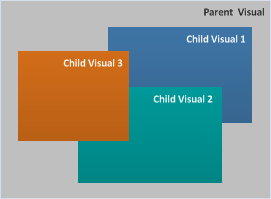
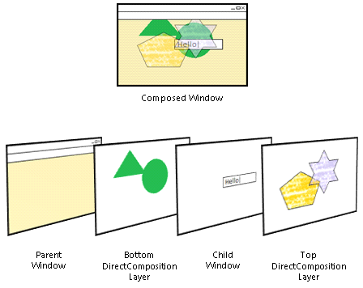
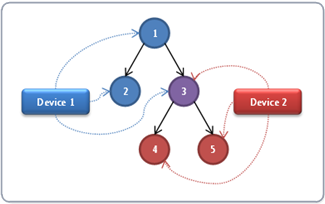
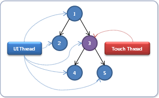

# Basic concepts

> [!NOTE]
> For apps on Windows 10, we recommend using Windows.UI.Composition APIs instead of DirectComposition. For more info, see [Modernize your desktop app using the Visual layer](/windows/uwp/composition/visual-layer-in-desktop-apps).

This topic provides an overview of the basic concepts of Microsoft DirectComposition. It contains the following sections:

-   [Composition](#composition-target-window)
-   [Visuals](#visuals)
    -   [Visual tree](#visual-tree)
    -   [Properties of a visual object](#properties-of-a-visual-object)
-   [Device object](#device-object)
-   [Composition target window](#composition-target-window)
-   [Transactional composition](#transactional-composition)
    -   [Batching](#batching)
    -   [Synchronization](#synchronization)
    -   [Cross-device visual trees](#cross-device-visual-trees)
-   [Related topics](#related-topics)

## Composition

DirectComposition defines a *composition* as a collection of bitmaps that are combined and manipulated by applying various transforms, effects, and animations to produce a visual result in an application UI. DirectComposition works with bitmap content only; it does not support vectors or text. DirectComposition does not provide bitmap content. Instead it provides interfaces in which users can draw with D2D, DXGI, or upload their own texture content.

A DirectComposition application creates two sets of objects to compose a scene: bitmaps that are composed together, and visuals that define the spatial relationships among the bitmaps. For more information about the bitmap objects supported by DirectComposition, see [Bitmap objects](bitmap-surfaces.md).

## Visuals

*Visuals* (or *visual objects*) are the fundamental elements of DirectComposition. They are the basic building blocks that you use to create compositions and animations in your application UI.

In programming terms, a visual is an object that has a set of properties, and exposes an interface that you use to set the value of the properties. A visual's Content property associates a particular bitmap with the visual, while other properties control how DirectComposition positions and manipulates the visual as it is rendered to the screen.

For more information, see [Properties of a Visual](#properties-of-a-visual-object).

### Visual tree

DirectComposition creates a composition from a hierarchical collection of visual objects called a *visual tree*. The visual at the root of a tree is called the *root visual* and it can have one or more *child visuals* associated with it. A child visual can have one or more child visuals of its own. Any visual that has associated child visuals is called a *parent visual*, and all child visuals that share the same parent are called *sibling visuals*. A particular visual along with all its child and descendent visuals is called a *visual subtree*.

A visual's location in the tree helps determine its screen position and z-order relative to the other visuals in the composition. The root visual is positioned relative to the upper-left corner of the client area of the target window where the composition is rendered. All child visuals are positioned relative to the upper-left corner of their parent visual (or the visual specified by the TransformParent property), and always appear in front of their parent in the z-order.

The following illustration shows a composition of visuals and the structure of the visual tree used to produce the composition. Visual 1 is the root visual and is also the parent of child Visuals 2 and 3, which are sibling visuals. Visual 3 has two child visuals of its own, Visuals 4 and 5. Together, Visuals 3 through 5 make up a visual subtree.

A parent visual maintains an ordered list of its child visuals. When sibling visuals are positioned such that they overlap one another, DirectComposition sets the z-order of the siblings based on the order in which they appear in the parent visual's children list. A sibling that appears later in the list is placed in front of all siblings that appear earlier in the list. The following illustration shows the z-order of overlapping child visuals.

### Properties of a visual object

A visual object exposes a set of properties that enable you to set the bitmap content for the visual, and to control how DirectComposition positions and manipulates the visual content. The following sections describe each property in detail.

-   [Content property](#content-property)
-   [Clip property](#clip-property)
-   [BorderMode property](#bordermode-property)
-   [BitmapInterpolationMode property](#bitmapinterpolationmode-property)
-   [CompositeMode property](#compositemode-property)
-   [OffsetX and OffsetY properties](#offsetx-and-offsety-properties)
-   [Effect property](#effect-property)
-   [Transform property](#transform-property)
-   [TransformParent property](#transformparent-property)

### Content property

A visual's Content property specifies the bitmap content that is associated with the visual. This is the bitmap that DirectComposition uses when you include the visual in a composition.

You set the Content property of a visual by calling the [**IDCompositionVisual::SetContent**](https://msdn.microsoft.com/en-us/library/Hh449157(v=VS.85).aspx) method.

For more information about the types of bitmap content supported by DirectComposition, see [Bitmap objects](bitmap-surfaces.md).

### Clip property

The Clip property of a visual specifies a rectangular area called the *clipping region* (or *clip rectangle*). When a visual is rendered, only the portion of the visual that falls inside the clipping region is displayed, while any content that extends outside the clipping region is clipped (that is, not displayed). DirectComposition supports clipping regions that have rounded or squared corners.

You set the Clip property of a visual by calling the [**IDCompositionVisual::SetClip**](/windows/desktop/api/Dcomp/nf-dcomp-setclip) method.

For more information, see [Clipping](clipping.md).

### BorderMode property

The BorderMode property specifies how to compose the edges of bitmaps and clips associated with this visual, or with visuals in the subtree rooted at this visual.

The border mode affects how the edges of a bitmap are composed when the bitmap is transformed such that the edges are not axis-aligned with integer coordinates. It also affects how content is clipped at the corners of a clip that has rounded corners, and at the edge of a clip that is transformed such that the edges are not axis-aligned with integer coordinates.

For more information, see [**IDCompositionVisual::SetBorderMode**](https://msdn.microsoft.com/en-us/library/Hh449149(v=VS.85).aspx).

### BitmapInterpolationMode property

The BitmapInterpolationMode property tells DirectComposition how to compose a bitmap when it is transformed such that there is no one-to-one correspondence between pixels in the bitmap and pixels on the screen.

You set the BitmapInterpolationMode property of a visual by calling the [**IDCompositionVisual::SetBitmapInterpolationMode**](https://msdn.microsoft.com/en-us/library/Hh449147(v=VS.85).aspx) method.

### CompositeMode property

The CompositeMode property tells DirectComposition how to blend the bitmap content of a visual with the render target. For a description of the supported composite modes, see [**DCOMPOSITION\_COMPOSITE\_MODE**](/windows/desktop/api/DcompTypes/ne-dcomptypes-dcomposition_composite_mode).

You set the CompositeMode property of a visual by calling the [**IDCompositionVisual::SetCompositeMode**](https://msdn.microsoft.com/en-us/library/Hh802902(v=VS.85).aspx) method.

### OffsetX and OffsetY properties

The OffsetX and OffsetY properties tell DirectComposition where to position a visual horizontally and vertically. They define the two-dimensional fixed position from which all transforms and effects for the visual are calculated.

For a root visual, the OffsetX and OffsetY properties define the x-coordinate and y-coordinate of a point relative to the upper-left corner of the window that hosts the visual. For a child visual, the coordinates are relative to the upper-left corner of the parent or, if the [TransformParent property](#transformparent-property) is specified, the upper-left corner of the specified visual. When a visual is rendered, it is positioned such that the visual's upper-left corner coincides with the specified coordinates.

You set the OffsetX and OffsetY properties of a visual by calling the [**IDCompositionVisual::SetOffsetX**](https://msdn.microsoft.com/en-us/library/Hh449126(v=VS.85).aspx) and [**SetOffsetY**](https://msdn.microsoft.com/en-us/library/Hh449131(v=VS.85).aspx) methods.

### Effect property

The Effect property lets you specify an effect, or group of effects, that will modify how a visual and its subtree is composed. For example, you can specify effects that control the opacity of a visual, blend the visual with another bitmap in various ways, and apply perspective transforms to the visual.

You set the Effect property of a visual by calling the [**IDCompositionVisual::SetEffect**](https://msdn.microsoft.com/en-us/library/Hh449159(v=VS.85).aspx) method.

For more information, see [Effects](effects.md).

### Transform property

The Transform property specifies a two-dimensional (2D) transformation, or group of 2D transformations, for DirectComposition to perform on the visual. A transformation (or transform) is an operation that modifies the coordinate system of a visual relative to its parent, or relative to the visual specified by the [TransformParent property](#transformparent-property). You can use transforms to alter the position, size, or nature of a visual by moving it to another location (translation), making it larger or smaller (scaling), turning it (rotation), distorting its shape (skewing), and so on.

You set the Transform property of a visual by calling the [**IDCompositionVisual::SetTransform**](https://msdn.microsoft.com/en-us/library/Hh449178(v=VS.85).aspx) method.

For more information, see [Transforms](transforms.md).

### TransformParent property

The coordinate system of a visual is modified by the OffsetX, OffsetY, and Transform properties. Normally, these properties define the coordinate system of a visual relative to its immediate parent. To use some visual other than the parent as the basis for the coordinate system of a child visual, use the TransformParent property to specify a different visual as the "parent" for transform purposes.

You set the TransformParent property of a visual by calling the [**IDCompositionVisual::SetTransformParent**](https://msdn.microsoft.com/en-us/library/Hh449172(v=VS.85).aspx) method.

## Device object

To use DirectComposition, you must create and manipulate a variety of Component Object Model (COM) objects. The first object that you need to create is the DirectComposition *device object* because it serves as the factory for creating all other objects used in a composition.

You create a device object by calling the [**DCompositionCreateDevice**](/windows/desktop/api/Dcomp/nf-dcomp-dcompositioncreatedevice) function, which returns an [**IDCompositionDevice**](https://msdn.microsoft.com/en-us/library/Hh437392(v=VS.85).aspx) interface pointer. This interface exposes a set of methods that you use to create visual objects, clip objects, animation objects, transform objects, effect objects, and so on.

The device object serves one other purpose besides being a factory for creating other objects. It exposes a method called [**Commit**](https://msdn.microsoft.com/en-us/library/Hh437393(v=VS.85).aspx) that passes a visual tree to DirectComposition for processing. For more information, see [Transactional Composition](#transactional-composition).

Remember that, while you can create multiple instances of the device object in your application, all of the objects that you use in a particular composition must be created by the same device object—with one exception: You can combine visual objects from different device objects in the same visual tree. When you do so, DirectComposition treats the visual tree as it normally would, except that changes to a particular visual object in the tree take effect only when the [**Commit**](https://msdn.microsoft.com/en-us/library/Hh437393(v=VS.85).aspx) method is called on the device object that created the visual object.

The ability to use visuals from different devices in the same visual tree enables multiple threads to create and manipulate a single visual tree while maintaining two independent devices that can be used to commit changes asynchronously. For more information, see [Cross-Device Visual Trees](#cross-device-visual-trees).

## Composition target window

A visual tree must be bound to a window before any of the tree's visuals can be displayed on the screen. The window, called the *composition target window*, can be a top-level window or a child window. Also, the composition target window can be a layered window; that is, it can have the [**WS\_EX\_LAYERED**](https://msdn.microsoft.com/library/windows/desktop/ff700543#ws-ex-layered) window style.

DirectComposition allows an application to bind a maximum of two visual trees to each window. The visual trees include one that is composed on top of the window itself, but behind all of the window’s child windows, and another that is composed on top of the window and on top of the child windows. In other words, each window has four conceptual layers, and all layers are clipped to the target window's visible region. The following illustration shows the four conceptual layers of a window.

## Transactional composition

DirectComposition uses a transactional model where you create a batched set of changes to a visual and then "commit" the set to DirectComposition for processing all at once. You can modify the same DirectComposition visual object and commit the changes any number of times. When the Desktop Window Manager (DWM) picks up batches, it picks up all pending batches and applies them to the next frame in the order they were committed.

All changes within a single commit are guaranteed to be applied to a single frame. Because DWM collects batches once per frame, you can modify any particular object only once per frame. Subsequent commits that modify different objects might also be applied to the current frame, but DirectComposition does not guarantee that the changes will occur in the same frame.

The [**IDCompositionSurface::BeginDraw**](https://msdn.microsoft.com/en-us/library/Hh449100(v=VS.85).aspx) and [**IDCompositionSurface::EndDraw**](https://msdn.microsoft.com/en-us/library/Hh449102(v=VS.85).aspx) methods let you synchronize rendering updates with visual updates. For example, you can call **IDCompositionSurface::BeginDraw**, update the OffsetX and Clip properties of a visual, call [**IDCompositionDevice::Commit**](https://msdn.microsoft.com/en-us/library/Hh437393(v=VS.85).aspx), draw content with Microsoft DirectX, and then call **IDCompositionSurface::EndDraw**. In this case, Microsoft DirectComposition ensures that bitmap content and the visual properties are updated at the same time.

### Batching

You can commit multiple changes to the same visual, or multiple changes to different visuals, within the same frame. When making multiple changes to the same visual within the same frame, keep the following points in mind:

-   If you make multiple changes to the same property of a visual, only the last change is applied. For example, if you set the opacity to 0, then to 0.5, and finally to 1.0, only an opacity of 1.0 is applied to the visual.
-   If you change multiple properties of the same visual, DirectComposition applies the changes first to the visual and then to any child visuals. The properties are applied in the following order regardless of the order in which you specify them:

    1.  Offset
    2.  Transform
    3.  Clip
    4.  Effect

    The following illustration shows the result of applying all four properties to a visual.

    

    Remember that all changes are applied to the visual at once within the context of the same frame. This means that, from the user's perspective, the changes to the visual occur instantaneously.

-   For the Transform property, you can use [**IDCompositionDevice::CreateTransformGroup**](https://msdn.microsoft.com/en-us/library/Hh437410(v=VS.85).aspx) to create a group of transforms to apply to a visual all at once. DirectComposition applies the transforms in the order that you specify.
-   For the Effect property, you can use [**IDCompositionEffectGroup**](https://msdn.microsoft.com/en-us/library/Hh437418(v=VS.85).aspx) to apply a group of effects. DirectComposition applies the effects in the order that you specify. In addition, 3D perspective transformations result in flattening of the visual tree after all 3D transformations in the current visual have been applied. This helps ensure that the resulting visual looks as close to 3D as possible.

### Synchronization

Your application can call DirectComposition from multiple threads at the same time. The order of execution is guaranteed for sequential calls, but not for concurrent calls. For example, if thread A modifies a visual and thread B commits the batch at the same time, it is not defined whether that visual change is included in the committed batch or whether it starts a new batch. On the other hand, if your application uses other synchronization mechanisms to ensure that one method is called before the other, DirectComposition honors the call order and processes them as if both calls were issued in that order from a single thread.

### Cross-device visual trees

DirectComposition objects are not thread bound; you can use multiple threads to modify the same set of objects. However, be aware of the following issues when sharing the same device object.

-   Both threads need to be able to call [**IDCompositionDevice::Commit**](https://msdn.microsoft.com/en-us/library/Hh437393(v=VS.85).aspx). If only one of the threads calls **IDCompositionDevice::Commit**, the other thread cannot commit any of its changes to DirectComposition.
-   Transactional behavior might be lost if one thread calls [**IDCompositionDevice::Commit**](https://msdn.microsoft.com/en-us/library/Hh437393(v=VS.85).aspx) while the other thread is still making changes that are intended to be part of the same transaction.

If you need to commit multiple simultaneous transactions to DirectComposition, you must use multiple device objects, possibly from multiple threads. In this scenario, the same visual tree is shared by both device objects, and each device object commits its own transactions.

The following illustration shows a visual tree that is shared by two device objects. Visuals 1, 2, 4 and 5 are owned by one device or the other, but visual 3 is shared by both devices, and can therefore be used to connect two sub-trees into a single, larger visual tree. Sharing the visual tree allows the two devices to be manipulated from two different threads asynchronously.

To illustrate the usefulness of sharing a visual tree between two devices, consider an architecture that enables low-latency touch input. The architecture could use two threads, one that handles most UI tasks, and a second thread dedicated to processing touch input events. The touch thread updates the transform of a particular visual based on the user input gesture. By updating the transform, the touch thread can make the entire subtree under that visual follow the user’s finger, scale up or down as the user executes a multi-touch gesture, and so on. The UI thread retains ownership of most of the composition tree, with the touch thread owning only the few visuals that are tagged for asynchronous touch response. The following illustration shows a simplified version of such a composition tree:

Typically, the UI thread modifies only the visuals that it owns exclusively, and the touch thread modifies only the shared visual. The only exception occurs when creating or destroying a touch-enabled subtree.

## Related topics

<dl> <dt>

[**IDCompositionSurface::BeginDraw**](https://msdn.microsoft.com/en-us/library/Hh449100(v=VS.85).aspx)
</dt> <dt>

[**IDCompositionSurface::EndDraw**](https://msdn.microsoft.com/en-us/library/Hh449102(v=VS.85).aspx)
</dt> <dt>

[**IDCompositonDevice::Commit**](https://msdn.microsoft.com/en-us/library/Hh437393(v=VS.85).aspx)
</dt> <dt>

[DirectComposition Concepts](directcomposition-concepts.md)
</dt> </dl>

 

 

