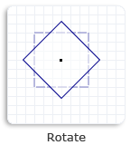
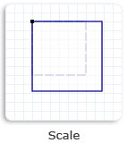
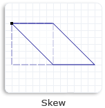
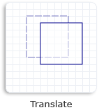

# Transforms

This topic discusses Microsoft DirectComposition support for two-dimensional (2D) affine (linear) transforms, and describes the types of transforms that DirectComposition supports.

DirectComposition also supports 3D perspective transforms, but because they require the creation of an intermediate bitmap, DirectComposition considers them to be effects rather than transforms. For information about 3D perspective transform effects, see [Effects](effects.md).

This topic includes the following sections:

-   [What is a DirectComposition 2D transform?](#what-is-a-directcomposition-2d-transform)
-   [The DirectComposition 2D coordinate space](#the-directcomposition-2d-coordinate-space)
-   [Support for affine 2D transforms](#support-for-affine-2d-transforms)
-   [Matrix 2D transforms](#matrix-2d-transforms)
-   [Transform Groups](#transform-groups)
-   [Transform animation](#transform-animation)
-   [Related topics](#related-topics)

## What is a DirectComposition 2D transform?

A 2D transform enables you to alter the position, size, or nature of a visual in two dimensions by moving the visual to another location (translation), making it larger or smaller (scaling), turning it (rotation), or distorting its shape (skewing).

A 2D transform is achieved by mapping the points of a visual from one position to another within the same coordinate space, or from one coordinate space to another. This mapping is described by a table of values called a transformation matrix, defined as a collection of three rows with three columns of floating-point values as shown in the following table.

|                 |                 |     |
|-----------------|-----------------|-----|
| M11Default: 1.0 | M12Default: 0.0 | 0.0 |
| M21Default: 0.0 | M22Default: 1.0 | 0.0 |
| M31OffsetX: 0.0 | M32OffsetY: 0.0 | 1.0 |

 

The transformation matrix for affine 2D transforms is a 3-by-2 matrix that omits the third column from the previous transformation matrix. The following table shows the layout of this matrix.

|                 |                 |
|-----------------|-----------------|
| M11Default: 1.0 | M12Default: 0.0 |
| M21Default: 0.0 | M22Default: 1.0 |
| M31OffsetX: 0.0 | M32OffsetY: 0.0 |

 

> [!Note]  
> DirectComposition does no special processing when applying 2D transforms to stereo content. This means the 3D content might appear distorted when a 2D transform is applied to it.

 

## The DirectComposition 2D coordinate space

DirectComposition uses a left-handed 2D coordinate space; that is, positive x-axis values increase to the right and positive y-axis values increase downward. Visuals are positioned relative to the origin, which is the point where the x-axis and y-axis intersect (0, 0), as shown in the following illustration.

By manipulating values in a 3-by-2 transformation matrix, you can rotate, scale, skew, and translate an object in two dimensions. For example, if you set OffsetX to 100 and OffsetY to 200, you move the object to the right 100 pixels and down 200 pixels.

## Support for affine 2D transforms

The following table describes the types of affine 2D transforms supported by DirectComposition, and lists the interfaces that you can use to perform the various types of transformations.

| Transform/interface                                                                               | Description                                                                                              | Illustration                                                                                                                      |
|---------------------------------------------------------------------------------------------------|----------------------------------------------------------------------------------------------------------|-----------------------------------------------------------------------------------------------------------------------------------|
| Rotate 2D[**idcompositionrotatetransform**](idcompositionrotatetransform.md)\[newline\]          | rotate a visual by the specified angle about the specified center point.                                 |                |
| Scale 2D[**idcompositionscaletransform**](idcompositionscaletransform.md)\[newline\]             | scale a visual by the specified factor about the specified center point.                                 |                                                                   |
| Skew 2D[**idcompositionskewtransform**](idcompositionskewtransform.md)\[newline\]                | skew a visual by the specified angle along the x-axis and y-axis, and around the specified center point. |                                    |
| Translate 2D[**idcompositiontranslatetransform**](idcompositiontranslatetransform.md)\[newline\] | change the position of a visual in the direction of the x-axis and y-axis.                               |  |

 

## Matrix 2D transforms

The [**IDCompositionMatrixTransform**](idcompositionmatrixtransform.md) interface enables you to define your own 3-by-2 affine 2D transform matrix and apply it to a visual. This interface is useful if you need to apply a type of affine 2D transform that is not available through the other DirectComposition transform interfaces. You define the matrix by filling a [**D2D\_MATRIX\_3X2\_F**](https://msdn.microsoft.com/library/windows/desktop/dd368178) structure and passing it to the [**IDCompositionMatrixTransform::SetMatrix**](idcompositionmatrixtransform-setmatrix.md) method.

## Transform Groups

You can use transform groups to combine multiple transforms into one. A transform group defines a collection of transform objects whose matrices are multiplied together in the order in which they are specified in the collection. The resulting transform matrix is then applied to the visual. A transform group produces the same result as applying each transform separately.

Keep in mind that the order of the transform objects in a transform group is important. For example, if a visual is first rotated, then scaled, and then translated, the result is different than if the visual is first translated, then rotated, and then scaled. DirectComposition always applies the transforms to a visual in the order in which they are specified in the collection.

To create a transform group, first create the transform objects that you want to include in the group, and then pass an array of transform object pointers to the [**IDCompositionDevice::CreateTransformGroup**](idcompositiondevice-createtransformgroup.md) method. After you create a transform group, you cannot add or remove any transform objects. However, you can modify the properties of the individual transform objects in the collection, and the changes will be reflected in the resulting transform matrix.

## Transform animation

The properties of a transform can be animated. When a property is animated, DirectComposition changes the value of the property over time, rather than all at once. This is particularly useful when creating transitions. For more information, see [Animation](animation.md).

## Related topics

<dl> <dt>

[DirectComposition Concepts](directcomposition-concepts.md)
</dt> </dl>

 

 

