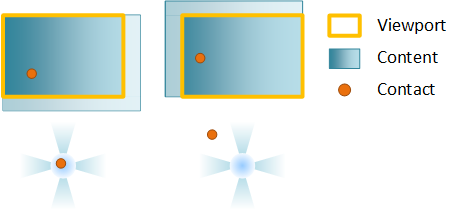
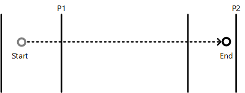
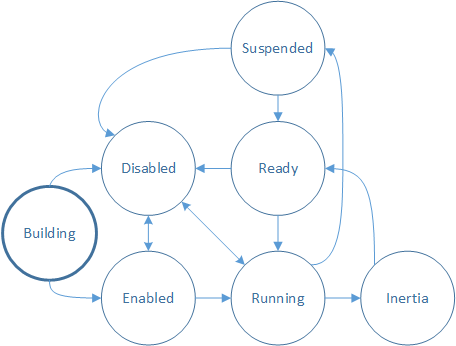

# Viewports and content

[Direct Manipulation](direct-manipulation-portal.md) uses *viewports*, *contents* and *contacts* to describe the interactive elements of the UI.

-   [Configuring a viewport](#configuring-a-viewport)
-   [Snap points and boundaries](#snap-points-and-boundaries)
-   [Snap point offset and RTL scenarios](#snap-point-offset-and-rtl-scenarios)
-   [Behaviors](#behaviors)
-   [Coordinate system](#coordinate-system)
-   [Transforms](#transforms)
-   [Viewport state](#viewport-state)
-   [Related topics](#related-topics)

A *viewport* is a region within a window that can receive and process input from user interactions. The viewport represents the region of the content that can be seen by the end-user at a given time (also called the content clip). The viewport has several functions:

-   It manages the interaction state (for example, when the content is ready to be manipulated, when content is undergoing manipulation, when content is in inertia animation) and maps input to output transforms.
-   It contains content that moves in response to the user interaction. This might be an HTML div element (scrolling), a pan-able list (the Windows 8 Start screen), or the pop-up menu for a select control.

A viewport is created by calling [**CreateViewport**](/windows/previous-versions/DirectManipulation/nf-directmanipulation-idirectmanipulationmanager-createviewport?branch=master). Multiple viewports can be created in a single window to produce a rich UI experience.

*Content* represents the element that gets transformed in response to an interaction. In other words, the content is what moves or scales as the user pans or pinches. There are two types of content:

-   *Primary content* is the single, intrinsic element within a viewport that responds to input manipulations and inertia. Primary content is created at the same time as the viewport and cannot be added or removed from a viewport. You can customize behavior of primary content using snap points (discussed later).
-   *Secondary content* moves relative to the motion of primary content. Secondary content is created separately from the viewport and can be added or removed from a viewport. All secondary content transforms are calculated based on the primary content’s transform. Specific rules can be applied to change how the transform is calculated based on the intended purpose of the element, identified by its CLSID during creation.

In this diagram showing before and after a pan, a single contact has been used to pan primary content. Even though the user isn't directly interacting with the panning indicator (secondary content), the secondary content moves as the primary content is panned. This provides visual cues for how far the user has panned.

## Configuring a viewport

After you've created the viewport. configure its behavior using an *interaction configuration*. The interaction configuration specifies which manipulations, like panning, are supported.

*Panning* changes the position of the content along either the horizontal or vertical axis or both as a user pans. When you configure translation on both axes, the content moves freely in any direction.

To constrain the motion of content, configure *rails*, typically on both the horizontal and vertical axis. If a user’s interaction is primarily along a single axis (represented by the blue regions in the next diagram), the pan becomes *railed* and the content only moves along the railed axis. If the user has panned and is currently railed and performs a second pan while the content is in inertia, the new pan continues to be railed.

Example: A viewport is configured for horizontal and vertical panning. In the first frame, the contact comes down. In the second, a vertical pan is initiated and the contact is locked to the vertical rail. Finally, once the pan is railed, only the vertical component of a diagonal pan is used to move the content.

If the user pans diagonally in a way that they are not in the rails detection regions (the white regions), the pan is *unrailed* and the content will move freely in both axes.

*Zooming* changes the scale factor of the content as a user pinches or stretches. The point around which the content is scaled (called the zoom center) is at the center of the contacts. If you've set horizontal or vertical alignment, the zoom center changes to preserve alignment.

You can override this behavior by specifying unlock center, which sets the zoom center at the center of the contacts.

*Inertia* is the gradual deceleration of a manipulation, both panning and zooming, after all contacts have been lifted (in the case of touch) or after keyboard/mouse input (such as clicking a scroll bar, or pressing the arrow keys). When a user manipulates the content, the manipulation does not immediately stop after the contact is lifted. Instead, the content continues in the current direction and velocity, slowing gradually to a stop.

## Snap points and boundaries

An inertia animation takes place after the manipulation ends as result of a finger being lifted off the screen (in the case of touch) or as a result of a keyboard/mouse action (such as arrow keys, page up/down, mouse wheel scrolling, etc).

There are two pieces of information that define the inertia animation:

-   The rest point of the animation – the final ending position of the particular transform component.
-   The animation duration, curve, velocity – these are determined by the type of the rest point.

The inertia animation is affected by snap-points and boundaries. Boundaries specify the maximum and minimum rest points for content. If content reaches a boundary during inertia, a boundary animation will be applied. Snap points are defined on the primary content to modify the rest point and modify the inertia animation curve itself.

You define snap points with [**SetSnapInterval**](/windows/previous-versions/DirectManipulation/nf-directmanipulation-idirectmanipulationprimarycontent-setsnapinterval?branch=master) when the content is regularly spaced or with [**SetSnapPoints**](/windows/previous-versions/DirectManipulation/nf-directmanipulation-idirectmanipulationprimarycontent-setsnappoints?branch=master) when the content is unevenly spaced. Here is an example of snap points:

In the diagram, there is a piece of content with a series of sub-content blocks – news items in a news-reader type app or items in a Grid View. The intent is to snap an item’s left edge onto the viewport’s left edge after inertia has ended.

There are two groups of snap point types:

-   *Optional vs. Mandatory*: An optional snap point snaps the inertia animation only if the inertia rest point is near the snap point. A mandatory snap point always snaps the inertia animation to a specified snap point.
-   *Single vs. Multiple*: A multiple snap point type allows the content to move past many snap points before coming to a rest at a snap point close to its natural rest point. A single snap point type chooses the next nearest snap point as the rest point for the inertia animation.

The next diagram demonstrates how snap point types modify the rest position of the inertia animation.

In this diagram, the inertia start point is labeled as ‘Start’ and the natural inertia end position in the absence of snap points as ‘End’. The vertical lines mark the various snap points. This table describes how each type of snap point will affect the end position of the animation.

| Point type         | Description                                                                                |
|--------------------|--------------------------------------------------------------------------------------------|
| Mandatory single   | Snap point P1 is chosen because it is the first snap point in the direction of inertia     |
| Mandatory multiple | Snap point P2 is chosen because it is closest to the end point in the direction of inertia |
| Optional single    | Snap point P1 is chosen because it is the first snap point encountered during inertia      |
| Optional multiple  | Snap point P2 is chosen because it is near the natural end point                           |

 

## Snap point offset and RTL scenarios

You apply the snap point offset and coordinate system using the [**SetSnapCoordinate**](/windows/previous-versions/DirectManipulation/nf-directmanipulation-idirectmanipulationprimarycontent-setsnapcoordinate?branch=master) API – which offsets all the snap points or snap-intervals using the specified offset/coordinate system.

The coordinate system is very useful in RTL scenarios, where you want to describe snap points from the left-edge of the content in the reverse direction. In the previous diagram, [**SetSnapCoordinate**](/windows/previous-versions/DirectManipulation/nf-directmanipulation-idirectmanipulationprimarycontent-setsnapcoordinate?branch=master) is used with the **DIRECTMANIPULATION\_MOTION\_TRANSLATEX** and **DIRECTMANIPULATION\_COORDINATE\_MIRRORED** flag, which automatically offsets the snap points from the left-edge of the content and supplies them in right-to-left order: S1 is at 0px, S2 is at 50px (and so on). Any offset set using **SetSnapCoordinate** will further offset from this left-edge of the content automatically, including the correct scale-factor.

You will almost always use [**SetSnapCoordinate**](/windows/previous-versions/DirectManipulation/nf-directmanipulation-idirectmanipulationprimarycontent-setsnapcoordinate?branch=master) with the *origin* parameter set to avoid setting snap points outside of the content area.

For example, if the viewport is 200x200 and the content is 1000x200, and the interface is RTL, the viewport will have it's left edge at x=800 when the viewport is first presented. Call [**SetSnapCoordinate**](/windows/previous-versions/DirectManipulation/nf-directmanipulation-idirectmanipulationprimarycontent-setsnapcoordinate?branch=master) with `SetSnapCoordinate(DIRECTMANIPULATION_MOTION_TRANSLATEX, DIRECTMANIPULATION_COORDINATE_MIRRORED, 1000.0)` to specify that the snap points should be calculated from right to left order starting from the RIGHT edge of the content.

## Behaviors

A *behavior* is an object that can be attached to a viewport in order to modify how [Direct Manipulation](direct-manipulation-portal.md) handles the output transform of a viewport's primary or secondary content. A behavior object may affect one or more aspects of a manipulation, such as how input is processed or how the inertia animation is applied. For example, an autoscroll behavior affects the inertia animation by performing a scrolling animation toward one end of the primary content. A cross-slide configuration behavior affects Direct Manipulation input processing which detects when a cross-slide action is being performed.

A behavior object is created by calling [**CreateBehavior**](/windows/previous-versions/DirectManipulation/nf-directmanipulation-idirectmanipulationmanager2-createbehavior?branch=master), added to a viewport and then its behavior is configured asynchronously. Removing the behavior from the viewport removes its effects.

## Coordinate system

There are three main coordinate systems employed by [Direct Manipulation](direct-manipulation-portal.md):

-   Client coordinate system - describes the rectangle of the client window. Units are in pixels.
-   Viewport coordinate system - describes the rectangle of a region within the client that can process input. Units are application-defined (using [**SetViewportRect**](/windows/previous-versions/DirectManipulation/nf-directmanipulation-idirectmanipulationviewport-setviewportrect?branch=master)).
-   Content coordinate system - describes the rectangle or size of primary content. Units are application-defined (using [**SetContentRect**](/windows/previous-versions/DirectManipulation/nf-directmanipulation-idirectmanipulationcontent-setcontentrect?branch=master)).

For all three systems, coordinates are defined relative to their respective top-left origin, and are positive increasing to the right and down. These coordinate systems are illustrated in the next diagram. Only the section of the content within the viewport rectangle can be seen or manipulated by the end-user.

## Transforms

[Direct Manipulation](direct-manipulation-portal.md) maintains several different transforms that contribute to the overall displayed output.

-   *Content transform* – the initial transform computed by [Direct Manipulation](direct-manipulation-portal.md) based on a manipulation or inertia. It captures the effects of snap points, railing, default overpan (manipulation), default overbounce (inertia), and ZoomToRect animations.
-   *Output transform* - the final visual or output transform. It is the combination of both the content as well as the sync transforms.
-   *Sync transform* – computed when you call [**SyncContentTransform**](/windows/previous-versions/DirectManipulation/nf-directmanipulation-idirectmanipulationcontent-synccontenttransform?branch=master). It helps [Direct Manipulation](direct-manipulation-portal.md) apply a new content transform supplied by the application while also maintaining the existing output transform.
-   *Display transform* – applied by the application as part of post-processing. See [**SyncDisplayTransform**](/windows/previous-versions/DirectManipulation/nf-directmanipulation-idirectmanipulationviewport-syncdisplaytransform?branch=master) for more details.

Because the output transform is intended to offset a surface visually on the screen, [Direct Manipulation](direct-manipulation-portal.md) performs the necessary rounding on the output transform components so that text and other content are always rendered/composited at an integral pixel boundary. The rounding mechanism depends upon multiple factors, including the velocity of the motion and the presence of Remote Desktop. The rounding mechanism for secondary content matches that of the primary content, while taking into account the difference in the motion between the two. Clients of [**GetOutputTransform**](/windows/previous-versions/DirectManipulation/nf-directmanipulation-idirectmanipulationcontent-getoutputtransform?branch=master) should not depend on the exact rounding mechanism of the output transform, as various factors affect it.

> [!Note]
>
> This means that the components of a content transform may not be integral and may contain sub-pixel offsets. Clients using [Direct Manipulation](direct-manipulation-portal.md) are encouraged to use the [**GetOutputTransform**](/windows/previous-versions/DirectManipulation/nf-directmanipulation-idirectmanipulationcontent-getoutputtransform?branch=master) to compute the correct visual transform to apply on the content when using manual update mode. When using automatic update mode using the built in compositor, Direct Manipulation automatically applies this transform on the client’s behalf. This transform is generated by Direct Manipulation to ensure visually pleasing results when composing the visual output.

 

## Viewport state

As input is processed the viewport manages the interaction state and mapping of input to output transforms. Check the interaction state of the viewport by calling [**GetStatus**](/windows/previous-versions/DirectManipulation/nf-directmanipulation-idirectmanipulationviewport-getstatus?branch=master).

-   Building – the viewport is being created and is not yet able to process input. In order to process input, call [**IDirectManipulationViewport::Enable**](/windows/previous-versions/DirectManipulation/nf-directmanipulation-idirectmanipulationviewport-enable?branch=master). If **Enable** is not called, the viewport goes to the Disabled state.

    > [!Note]  
    > This is the initial state of the interaction.

     

-   Enabled – the viewport is ready to process input. When a contact comes down ([**SetContact**](/windows/previous-versions/DirectManipulation/nf-directmanipulation-idirectmanipulationviewport-setcontact?branch=master) is called) and a manipulation is detected, the viewport transitions to Running.

-   Running – the viewport is currently processing input and updating content. When the contact is lifted, the viewport transitions to Inertia, if configured.

-   Inertia – the content is moving in an inertia animation. Once inertia is complete, the viewport will transition to Ready. If auto-disable has been set on the viewport, it will transition from Inertia to Ready, and then to Disabled.

-   Ready – the viewport is ready to process input. When a contact comes down ([**SetContact**](/windows/previous-versions/DirectManipulation/nf-directmanipulation-idirectmanipulationviewport-setcontact?branch=master) is called) and a manipulation is detected, the viewport transitions to Running.

-   Suspended – the viewport may become Suspended when its input has been promoted to a parent in the [**SetContact**](/windows/previous-versions/DirectManipulation/nf-directmanipulation-idirectmanipulationviewport-setcontact?branch=master) chain. This is discussed in greater detail in [Multiple viewports: hit testing and viewport hierarchy](directmanipulation-multiple-vieports.md).

-   Disabled – the viewport will not process input or make callbacks. A viewport may be disabled from various states by calling [**IDirectManipulationViewport::Disable**](/windows/previous-versions/DirectManipulation/nf-directmanipulation-idirectmanipulationviewport-disable?branch=master). If auto-disable has been set on the viewport, it will transition automatically to Disabled after a manipulation is processed. To re-enable a disabled viewport, call [**IDirectManipulationViewport::Enable**](/windows/previous-versions/DirectManipulation/nf-directmanipulation-idirectmanipulationviewport-enable?branch=master).

## Related topics

<dl> <dt>

</dt> <dt>

[Multiple viewports: hit testing and viewport hierarchy](directmanipulation-multiple-vieports.md)
</dt> <dt>

[**ActivateConfiguration**](/windows/previous-versions/DirectManipulation/nf-directmanipulation-idirectmanipulationviewport-activateconfiguration?branch=master)
</dt> <dt>

[**GetOutputTransform**](/windows/previous-versions/DirectManipulation/nf-directmanipulation-idirectmanipulationcontent-getoutputtransform?branch=master)
</dt> <dt>

[**SyncDisplayTransform**](/windows/previous-versions/DirectManipulation/nf-directmanipulation-idirectmanipulationviewport-syncdisplaytransform?branch=master)
</dt> </dl>

 

 

