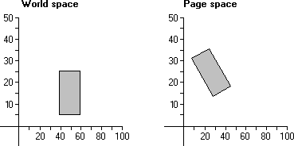
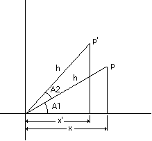

# Rotation

Many CAD applications provide features that rotate objects drawn in the client area. Applications that include rotation capabilities use the [**SetWorldTransform**](/windows/desktop/api/Wingdi/nf-wingdi-setworldtransform) function to set the appropriate world-space to page-space transformation. This function receives a pointer to an [**XFORM**](/windows/desktop/api/Wingdi/ns-wingdi-tagxform) structure containing the appropriate values. The eM11, eM12, eM21, and eM22 members of XFORM specify respectively, the cosine, sine, negative sine, and cosine of the angle of rotation.

When *rotation* occurs, the points that constitute an object are rotated with respect to the coordinate-space origin. The following illustration shows a 20-by-20-unit rectangle rotated 30 degrees when copied from world-coordinate space to page-coordinate space.



In the preceding illustration, each point in the rectangle was rotated 30 degrees with respect to the coordinate-space origin.

The following algorithm computes the new x-coordinate (x ') for a point (x,y ) that is rotated by angle A with respect to the coordinate-space origin.

``` syntax
x' = (x * cos A) - (y * sin A) 
```

The following algorithm computes the y-coordinate (y ') for a point (x,y ) that is rotated by the angle A with respect to the origin.

``` syntax
y' = (x * sin A) + (y * cos A) 
```

The two rotation transformations can be combined in a 2-by-2 matrix as follows.

``` syntax
|x' y'| == |x y| * | cos A   sin A| 
                   |-sin A   cos A| 
```

The 2-by-2 matrix that produced the rotation contains the following values.

``` syntax
| .8660    .5000| 
|-.5000    .8660| 
```

## Rotation Algorithm Derivation

Rotation algorithms are based on trigonometry's addition theorem stating that the trigonometric function of a sum of two angles (A1 and A2 ) can be expressed in terms of the trigonometric functions of the two angles.

``` syntax
sin(A1 + A2) = (sin A1 * cos A2) + (cos A1 * sin A2) 
cos(A1 + A2) = (cos A1 * cos A2) - (sin A1 * sin A2) 
```

The following illustration shows a point p rotated counterclockwise to a new position p'. In addition, it shows two triangles formed by a line drawn from the coordinate-space origin to each point and a line drawn from each point through the x-axis.



Using trigonometry, the x-coordinate of point p can be obtained by multiplying the length of the hypotenuse h by the cosine of A1.

``` syntax
x = h * cos A1 
```

The y-coordinate of point p can be obtained by multiplying the length of the hypotenuse h by the sine of A1.

``` syntax
y = h * sin A1 
```

Likewise, the x-coordinate of point p' can be obtained by multiplying the length of the hypotenuse h by the cosine of (A1 +A2 ).

``` syntax
x' = h * cos (A1 + A2) 
```

Finally, the y-coordinate of point p' can be obtained by multiplying the length of the hypotenuse h by the sine of (A1 +A2 ).

``` syntax
y' = h * sin (A1 + A2) 
```

Using the addition theorem, the preceding algorithms become the following:

``` syntax
x' = (h * cos A1 * cos A2) - (h * sin A1 * sin A2) 
y' = (h * cos A1 * sin A2) + (h * sin A1 * cos A2) 
```

The rotation algorithms for a given point rotated by angle A2 can be obtained by substituting x for each occurrence of (h \* cos A1 ) and by substituting y for each occurrence of (h \* sin A1 ).

``` syntax
x' = (x * cos A2) - (y * sin A2) 
y' = (x * sin A2) + (y * cos A2) 
```

 

 


