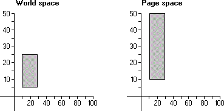

# Scaling

Most CAD and drawing applications provide features that scale output created by the user. Applications that include scaling (or zoom) capabilities call the [**SetWorldTransform**](/windows/desktop/api/Wingdi/nf-wingdi-setworldtransform) function to set the appropriate world-space to page-space transformation. This function receives a pointer to an [**XFORM**](/windows/desktop/api/Wingdi/ns-wingdi-tagxform) structure containing the appropriate values. The eM11 and eM22 members of XFORM specify the horizontal and vertical scaling components, respectively.

When *scaling* occurs, the vertical and horizontal lines (or vectors), that constitute an object, are stretched or compressed with respect to the x- or y-axis. The following illustration shows a 20-by-20-unit rectangle scaled vertically to twice its original height when copied from world-coordinate space to page-coordinate space.



In the preceding illustration, the vertical lines that define the original rectangle's side measure 20 units, while the vertical lines that define the scaled rectangle's sides measure 40 units.

Vertical scaling can be represented by the following algorithm.

``` syntax
y' = y * Dy 
```

Where y' is the new length, y is the original length, and Dy is the vertical scaling factor.

Horizontal scaling can be represented by the following algorithm.

``` syntax
x' = x * Dx 
```

Where x' is the new length, x is the original length, and Dx is the horizontal scaling factor.

The vertical and horizontal scaling transformations can be combined into a single operation by using a 2-by-2 matrix.

``` syntax
|x' y'|  =  |Dx   0|  *  |x y| 
            |0   Dy| 
```

The 2-by-2 matrix that produced the scaling transformation contains the following values.

``` syntax
|1    0| 
|0    2| 
```

 

 


