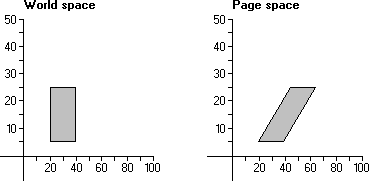

# Shear

Some applications provide features that shear objects drawn in the client area. Applications that use shear capabilities use the [**SetWorldTransform**](/windows/win32/Wingdi/nf-wingdi-setworldtransform?branch=master) function to set appropriate values in the world-space to page-space transformation. This function receives a pointer to an [**XFORM**](/windows/win32/Wingdi/ns-wingdi-tagxform?branch=master) structure containing the appropriate values. The eM12 and eM21 members of XFORM specify the horizontal and vertical proportionality constants, respectively.

There are two components of the *shear transformation*. The first alters the vertical lines in an object; the second alters the horizontal lines. The following illustration shows a 20-by-20-unit rectangle sheared horizontally when copied from world space to page space.



A horizontal shear can be represented by the following algorithm:

``` syntax
x' = x + (Sx * y) 
```

where x is the original x-coordinate, Sx is the proportionality constant, and x' is the result of the shear transformation.

A vertical shear can be represented by the following algorithm:

``` syntax
y' = y + (Sy * x) 
```

where y is the original y-coordinate, Sy is the proportionality constant, and y' is the result of the shear transformation.

The horizontal-shear and vertical-shear transformations can be combined into a single operation using a 2-by-2 matrix.

``` syntax
|x' y'| == |x y| * |  1   Sx| 
                   | Sy    1| 
```

The 2-by-2 matrix that produced the shear contains the following values:

``` syntax
|1    1| 
|0    1| 
```

 

 


