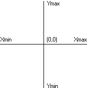

# Transformation of Coordinate Spaces

A *coordinate space* is a planar space based on the Cartesian coordinate system. This system provides a means of specifying the location of each point on a plane. It requires two axes that are perpendicular and equal in length. The following illustration shows a coordinate space.

The system supports four coordinate spaces, as described in the following table.

| Coordinate space | Description                                                                                                                                                                                                                                                                                                                                                                                                                                                                |
|------------------|----------------------------------------------------------------------------------------------------------------------------------------------------------------------------------------------------------------------------------------------------------------------------------------------------------------------------------------------------------------------------------------------------------------------------------------------------------------------------|
| world            | Used optionally as the starting coordinate space for graphics transformations. It allows scaling, translation, rotation, shearing, and reflection. World space measures 2^32 units high by 2^32 units wide.                                                                                                                                                                                                                                                                |
| page             | Used either as the next space after world space or as the starting space for graphics transformations. It sets the mapping mode. Page space also measures 2^32 units high by 2^32 units wide.                                                                                                                                                                                                                                                                              |
| device           | Used as the next space after page space. It only allows translation, which ensures the origin of the device space maps to the proper location in physical device space. Device space measures 2^27 units high by 2^27 units wide.                                                                                                                                                                                                                                          |
| physical device  | The final (output) space for graphics transformations. It usually refers to the client area of the application window; however, it can also include the entire desktop, a complete window (including the frame, title bar, and menu bar), or a page of printer or plotter paper, depending on the function that obtained the handle to the device context. Physical device dimensions vary according to the dimensions set by the display, printer, or plotter technology. |

 

Page space works with device space to provide applications with device-independent units, such as millimeters and inches. This overview refers to both world space and page space as logical space.

To depict output on a physical device, the system copies (or maps) a rectangular region from one coordinate space into the next using a transformation until the output appears in its entirety on the physical device. Mapping begins in the application's world space if the application has called the [**SetWorldTransform**](setworldtransform.md) function; otherwise, mapping occurs in page space. As the system copies each point within the rectangular region from one space into another, it applies an algorithm called a transformation. A *transformation* alters (or transforms) the size, orientation, and shape of objects that are copied from one coordinate space into another. Although a transformation affects an object as a whole, it is applied to each point, or to each line, in the object.

The following illustration shows a typical transformation performed by using the [**SetWorldTransform**](setworldtransform.md) function.

 

 

