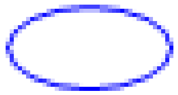

# Antialiasing with Lines and Curves

When you use Windows GDI+ to draw a line, you provide the starting point and ending point of the line, but you don't have to provide any information about the individual pixels on the line. GDI+ works in conjunction with the display driver software to determine which pixels will be turned on to show the line on a particular display device.

Consider a straight red line that goes from the point (4, 2) to the point (16, 10). Assume the coordinate system has its origin in the upper-left corner and that the unit of measure is the pixel. Also assume that the x-axis points to the right and the y-axis points down. The following illustration shows an enlarged view of the red line drawn on a multicolored background.


Note that the red pixels used to render the line are opaque. There are no partially transparent pixels involved in displaying the line. This type of line rendering gives the line a jagged appearance, and the line looks a bit like a staircase. This technique of representing a line with a staircase is called aliasing; the staircase is an alias for the theoretical line.

A more sophisticated technique for rendering a line involves using partially transparent pixels along with pure red pixels. Pixels are set to pure red or to some blend of red and the background color depending on how close they are to the line. This type of rendering is called antialiasing and results in a line that the human eye perceives as more smooth. The following illustration shows how certain pixels are blended with the background to produce an antialiased line.


Antialiasing (smoothing) can also be applied to curves. The following illustration shows an enlarged view of a smoothed ellipse.



The following illustration shows the same ellipse in its actual size, once without antialiasing and once with antialiasing.


To draw lines and curves that use antialiasing, create a [**Graphics**](-gdiplus-class-graphics-class.md) object and pass *SmoothingModeAntiAlias* to its [**Graphics::SetSmoothingMode**](-gdiplus-class-graphics-setsmoothingmode-smoothingmode-.md) method. Then call one of the drawing methods of that same **Graphics** object.


```
myGraphics.SetSmoothingMode(SmoothingModeAntiAlias);
myGraphics.DrawLine(&amp;myPen, 0, 0, 12, 8);
```


**SmoothingModeAntiAlias** is an element of the [**SmoothingMode**](-gdiplus-enum-smoothingmode.md) enumeration.

 

 


