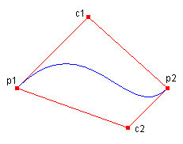

# Drawing Bezier Splines

A Bézier spline is defined by four points: a start point, two control points, and an end point. The following example draws a Bézier spline with start point (10, 100) and end point (200, 100). The control points are (100, 10) and (150, 150):


```
Point p1(10, 100);   // start point
Point c1(100, 10);   // first control point
Point c2(150, 150);  // second control point
Point p2(200, 100);  // end point
Pen pen(Color(255, 0, 0, 255));
graphics.DrawBezier(&amp;pen, p1, c1, c2, p2);
```


The following illustration shows the resulting Bézier spline along with its start point, control points, and end point. The illustration also shows the spline's convex hull, which is a polygon formed by connecting the four points with straight lines.



You can use the [DrawBeziers](/windows/win32/gdiplusgraphics/nf-gdiplusgraphics-graphics-drawbeziers(in const pen,in const point,in int)?branch=master) method of the [**Graphics**](/windows/win32/gdiplusgraphics/nl-gdiplusgraphics-graphics?branch=master) class to draw a sequence of connected Bézier splines. The following example draws a curve that consists of two connected Bézier splines. The end point of the first Bézier spline is the start point of the second Bézier spline.


```
Point p[] = {
   Point(10, 100),   // start point of first spline
   Point(75, 10),    // first control point of first spline
   Point(80, 50),    // second control point of first spline
   Point(100, 150),  // end point of first spline and 
                     // start point of second spline
   Point(125, 80),   // first control point of second spline
   Point(175, 200),  // second control point of second spline
   Point(200, 80)};  // end point of second spline
Pen pen(Color(255, 0, 0, 255));
graphics.DrawBeziers(&amp;pen, p, 7);
```


The following illustration shows the connected splines along with the seven points.


 

 


