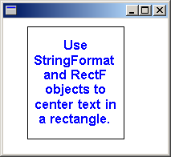

# Formatting Text

To apply special formatting to text, initialize a [**StringFormat**](/windows/desktop/api/gdiplusstringformat/nl-gdiplusstringformat-stringformat) object and pass the address of that object to the [DrawString](https://msdn.microsoft.com/en-us/library/ms535759(v=VS.85).aspx) method of the [**Graphics**](/windows/desktop/api/gdiplusgraphics/nl-gdiplusgraphics-graphics) class.

To draw formatted text in a rectangle, you need [**Graphics**](/windows/desktop/api/gdiplusgraphics/nl-gdiplusgraphics-graphics), [**FontFamily**](/windows/desktop/api/gdiplusheaders/nl-gdiplusheaders-fontfamily), [**Font**](/windows/desktop/api/gdiplusheaders/nl-gdiplusheaders-font), [**RectF**](/windows/desktop/api/gdiplustypes/nl-gdiplustypes-rectf), [**StringFormat**](/windows/desktop/api/gdiplusstringformat/nl-gdiplusstringformat-stringformat), and [**Brush**](/windows/desktop/api/gdiplusbrush/nl-gdiplusbrush-brush) objects.

-   [Aligning Text](#aligning-text)
-   [Setting Tab Stops](#setting-tab-stops)
-   [Drawing Vertical Text](#drawing-vertical-text)

## Aligning Text

The following example draws text in a rectangle. Each line of text is centered (side to side), and the entire block of text is centered (top to bottom) in the rectangle.


```
WCHAR string[] = 
   L"Use StringFormat and RectF objects to center text in a rectangle.";
                       
FontFamily   fontFamily(L"Arial");
Font         font(&fontFamily, 12, FontStyleBold, UnitPoint);
RectF        rectF(30.0f, 10.0f, 120.0f, 140.0f);
StringFormat stringFormat;
SolidBrush   solidBrush(Color(255, 0, 0, 255));

// Center-justify each line of text.
stringFormat.SetAlignment(StringAlignmentCenter);

// Center the block of text (top to bottom) in the rectangle.
stringFormat.SetLineAlignment(StringAlignmentCenter);

graphics.DrawString(string, -1, &font, rectF, &stringFormat, &solidBrush);

Pen pen(Color(255, 0, 0, 0));
graphics.DrawRectangle(&pen, rectF);
            
```


The following illustration shows the rectangle and the centered text.



The preceding code calls two methods of the [**StringFormat**](/windows/desktop/api/gdiplusstringformat/nl-gdiplusstringformat-stringformat) object: [**StringFormat::SetAlignment**](/windows/desktop/api/Gdiplusstringformat/nf-gdiplusstringformat-stringformat-setalignment) and [**StringFormat::SetLineAlignment**](/windows/desktop/api/Gdiplusstringformat/nf-gdiplusstringformat-stringformat-setlinealignment). The call to **StringFormat::SetAlignment** specifies that each line of text is centered in the rectangle given by the third argument passed to the [DrawString](https://msdn.microsoft.com/en-us/library/ms535759(v=VS.85).aspx) method. The call to **StringFormat::SetLineAlignment** specifies that the block of text is centered (top to bottom) in the rectangle.

The value [****StringAlignmentCenter****](/windows/desktop/api/Gdiplusenums/ne-gdiplusenums-stringalignment) is an element of the **StringAlignment** enumeration, which is declared in Gdiplusenums.h.

## Setting Tab Stops

You can set tab stops for text by calling the [**StringFormat::SetTabStops**](/windows/desktop/api/Gdiplusstringformat/nf-gdiplusstringformat-stringformat-settabstops) method of a [**StringFormat**](/windows/desktop/api/gdiplusstringformat/nl-gdiplusstringformat-stringformat) object and then passing the address of that **StringFormat** object to the [DrawString](https://msdn.microsoft.com/en-us/library/ms535759(v=VS.85).aspx) method of the [**Graphics**](/windows/desktop/api/gdiplusgraphics/nl-gdiplusgraphics-graphics) class.

The following example sets tab stops at 150, 250, and 350. Then the code displays a tabbed list of names and test scores.


```
WCHAR string[150] = 
   L"Name\tTest 1\tTest 2\tTest 3\n";

StringCchCatW(string, 150, L"Joe\t95\t88\t91\n");
StringCchCatW(string, 150, L"Mary\t98\t84\t90\n");
StringCchCatW(string, 150, L"Sam\t42\t76\t98\n");
StringCchCatW(string, 150, L"Jane\t65\t73\t92\n");
                       
FontFamily   fontFamily(L"Courier New");
Font         font(&fontFamily, 12, FontStyleRegular, UnitPoint);
RectF        rectF(10.0f, 10.0f, 450.0f, 100.0f);
StringFormat stringFormat;
SolidBrush   solidBrush(Color(255, 0, 0, 255));
REAL         tabs[] = {150.0f, 100.0f, 100.0f};

stringFormat.SetTabStops(0.0f, 3, tabs);

graphics.DrawString(string, -1, &font, rectF, &stringFormat, &solidBrush);

Pen pen(Color(255, 0, 0, 0));
graphics.DrawRectangle(&pen, rectF);
            
```


The following illustration shows the tabbed text.


The preceding code passes three arguments to the [**StringFormat::SetTabStops**](/windows/desktop/api/Gdiplusstringformat/nf-gdiplusstringformat-stringformat-settabstops) method. The third argument is the address of an array containing the tab offsets. The second argument indicates that there are three offsets in that array. The first argument passed to **StringFormat::SetTabStops** is 0, which indicates that the first offset in the array is measured from position 0, the left edge of the bounding rectangle.

## Drawing Vertical Text

You can use a [**StringFormat**](/windows/desktop/api/gdiplusstringformat/nl-gdiplusstringformat-stringformat) object to specify that text be drawn vertically rather than horizontally.

The following example passes the value [****StringFormatFlagsDirectionVertical****](/windows/desktop/api/Gdiplusenums/ne-gdiplusenums-stringformatflags) to the [**StringFormat::SetFormatFlags**](/windows/desktop/api/Gdiplusstringformat/nf-gdiplusstringformat-stringformat-setformatflags) method of a [**StringFormat**](/windows/desktop/api/gdiplusstringformat/nl-gdiplusstringformat-stringformat) object. The address of that **StringFormat** object is passed to the [DrawString](https://msdn.microsoft.com/en-us/library/ms535759(v=VS.85).aspx) method of the [**Graphics**](/windows/desktop/api/gdiplusgraphics/nl-gdiplusgraphics-graphics) class. The value [****StringFormatFlagsDirectionVertical****](/windows/desktop/api/Gdiplusenums/ne-gdiplusenums-stringformatflags) is an element of the **StringFormatFlags** enumeration, which is declared in Gdiplusenums.h.


```
WCHAR string[] = L"Vertical text";
                     
FontFamily   fontFamily(L"Lucida Console");
Font         font(&fontFamily, 14, FontStyleRegular, UnitPoint);
PointF       pointF(40.0f, 10.0f);
StringFormat stringFormat;
SolidBrush   solidBrush(Color(255, 0, 0, 255));

stringFormat.SetFormatFlags(StringFormatFlagsDirectionVertical);

graphics.DrawString(string, -1, &font, pointF, &stringFormat, &solidBrush);
            
```


The following illustration shows the vertical text.


 

 


