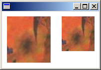

# Improving Performance by Avoiding Automatic Scaling

If you pass only the upper-left corner of an image to the **DrawImage** method, Windows GDI+ might scale the image, which would decrease performance.

The following call to the **DrawImage** method specifies an upper-left corner of (50, 30) but does not specify a destination rectangle:


```
graphics.DrawImage(&amp;image, 50, 30);  // upper-left corner at (50, 30)
```


Although this is the easiest version of the **DrawImage** method in terms of the number of required arguments, it is not necessarily the most efficient. If the number of dots per inch on the current display device is different than the number of dots per inch on the device where the image was created, GDI+ scales the image so that its physical size on the current display device is as close as possible to its physical size on the device where it was created.

If you want to prevent such scaling, pass the width and height of a destination rectangle to the **DrawImage** method. The following example draws the same image twice. In the first case, the width and height of the destination rectangle are not specified, and the image is automatically scaled. In the second case, the width and height (measured in pixels) of the destination rectangle are specified to be the same as the width and height of the original image.


```
Image image(L"Texture.jpg");
graphics.DrawImage(&amp;image, 10, 10);
graphics.DrawImage(&amp;image, 120, 10, image.GetWidth(), image.GetHeight());
```


The following illustration shows the image rendered twice.



 

 


