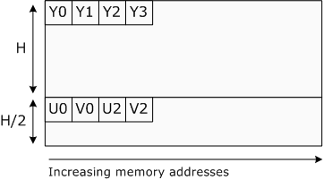
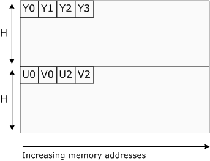

# 10-bit and 16-bit YUV Video Formats

This topic describes the 10- and 16-bit YUV formats that are recommended for capturing, processing, and displaying video in the Microsoft Windows operating system.

This topic contains the following sections:

-   [Overview](#overview)
-   [FOURCC Codes For 10-Bit and 16-Bit YUV](#fourcc-codes-for-10-bit-and-16-bit-yuv)
-   [Surface Definitions](#surface-definitions)
    -   [4:2:0 Formats](#420-formats)
    -   [4:2:2 Formats](#422-formats)
    -   [4:4:4 Formats](#444-formats)
-   [Preferred YUV Formats](#preferred-yuv-formats)
-   [Related topics](#related-topics)

## Overview

These formats use a fixed-point representation for both the luma channel and the chroma (C'b and C'r) channels. Sample values are scaled 8-bit values, using a scaling factor of 2^(n − 8), where n is either 10 or 16, as per sections 7.7-7.8 and 7.11-7.12 of SMPTE 274M. Precision conversions can be performed using simple bit shifts. For example, if the white point of an 8-bit format is 235, the corresponding 10-bit format has a white point at 940 (235 × 4).

The 16-bit representations described here use little-endian **WORD** values for each channel. The 10-bit formats also use 16 bits for each channel, with the lowest 6 bits set to zero, as shown in the following diagram.

Because the 10-bit and 16-bit representations of the same YUV format have the same memory layout, it is possible to cast a 10-bit representation to a 16-representation with no loss of precision. It is also possible to cast a 16-bit representation down to a 10-bit representation. (The Y416 and Y410 formats are an exception to this general rule, however, because they do not share the same memory layout.)

When the graphics hardware reads a surface that contains a 10-bit representation, it should ignore the low-order 6 bits of each channel. If a surface contains valid 16-bit data, however, it should be identified as a 16-bit surface.

In the formats that contain alpha, a completely transparent pixel has an alpha value of zero, and a completely opaque pixel has an alpha value of (2^n) – 1, where n is the number of alpha bits. Alpha is assumed to be a linear value that is applied to each component after the component has been converted into its normalized linear form.

For images in video memory, the graphics driver selects the memory alignment of the surface. The surface must be **DWORD** aligned. That is, individual lines within a surface are guaranteed to start at a 32-bit boundary, although the alignment can be larger than 32 bits. The origin (0,0) is always the upper-left corner of the surface.

For the purposes of this documentation, the term *U* is equivalent to *Cb*, and the term *V* is equivalent to *Cr*.

## FOURCC Codes For 10-Bit and 16-Bit YUV

The FOURCC codes for the formats described here use the following convention:

-   If the format is planar, the first character in the FOURCC code is 'P'. If the format is packed, the first character is 'Y'.
-   The second character in the FOURCC code is determined by the chroma sampling, as shown in the following table.

    

    | Chroma sampling | FOURCC code letter |
    |-----------------|--------------------|
    | 4:4:4           | '4'                |
    | 4:2:2           | '2'                |
    | 4:2:1           | '1'                |
    | 4:2:0           | '0'                |

    

     

-   The final two characters in the FOURCC indicate the number of bits per channel, either '16' for 16 bits or '10' for 10 bits.

Using this scheme, the following FOURCC codes have been defined. No 4:2:1 formats for 10-bit or 16-bit YUV have been defined at this time.

| FOURCC | Description            |
|--------|------------------------|
| P016   | Planar, 4:2:0, 16-bit. |
| P010   | Planar, 4:2:0, 10-bit. |
| P216   | Planar, 4:2:2, 16-bit. |
| P210   | Planar, 4:2:2, 10-bit. |
| Y216   | Packed, 4:2:2, 16-bit. |
| Y210   | Packed, 4:2:2, 10-bit. |
| Y416   | Packed, 4:4:4, 16-bit  |
| Y410   | Packed, 4:4:4, 10-bit. |

 

Subtype GUIDs have also been defined from these FOURCCs; see [Video Subtype GUIDs](video-subtype-guids.md).

## Surface Definitions

This section describes the memory layout of each format. In the descriptions that follow, the term **WORD** refers to a little-endian 16-bit value, and the term **DWORD** refers to a little-endian 32-bit value.

### 4:2:0 Formats

Two 4:2:0 formats are defined, with the FOURCC codes P016 and P010. They share the same memory layout, but P016 uses 16 bits per channel and P010 uses 10 bits per channel.

### P016 and P010

In these two formats, all Y samples appear first in memory as an array of **WORD**s with an even number of lines. The surface stride can be larger than the width of the Y plane. This array is followed immediately by an array of **WORD**s that contains interleaved U and V samples, as shown in the following diagram.

If the combined U-V array is addressed as an array of **DWORD**s, the least significant word (LSW) contains the U value and the most significant word (MSW) contains the V value. The stride of the combined U-V plane is equal to the stride of the Y plane. The U-V plane has half as many lines as the Y plane.

These two formats are the preferred 4:2:0 planar pixel formats for higher precision YUV representations. They are expected to be an intermediate-term requirement for DirectX Video Acceleration (DXVA) accelerators that support 10-bit or 16-bit 4:2:0 video.

### 4:2:2 Formats

Four 4:2:2 formats are defined, two planar and two packed. They have the following FOURCC codes:

-   P216
-   P210
-   Y216
-   Y210

### P216 and P210

In these two planar formats, all Y samples appear first in memory as an array of **WORD**s with an even number of lines. The surface stride can be larger than the width of the Y plane. This array is followed immediately by an array of **WORD**s that contains interleaved U and V samples, as shown in the following diagram.

If the combined U-V array is addressed as an array of **DWORD**s, the LSW contains the U value and the MSW contains the V value. The stride of the combined U-V plane is equal to the stride of the Y plane. The U-V plane has the same number of lines as the Y plane.

These two formats are the preferred 4:2:2 planar pixel formats for higher precision YUV representations. They are expected to be an intermediate-term requirement for DirectX Video Acceleration (DXVA) accelerators that support 10-bit or 16-bit 4:2:2 video.

### Y216 and Y210

In these two packed formats, each pair of pixels is stored as an array of four **WORD**s, as shown in the following illustration.

The first **WORD** in the array contains the first Y sample in the pair, the second **WORD** contains the U sample, the third **WORD** contains the second Y sample, and the fourth **WORD** contains the V sample.

Y210 is identical to Y216 except that each sample contains only 10 bits of significant data. The least significant 6 bits are set to zero, as described previously.

### 4:4:4 Formats

Two 4:4:4 formats are defined, with the FOURCC codes Y410 and Y416. Both are packed formats.

### Y410

This format is a packed 10-bit representation that includes 2 bits of alpha. Each pixel is encoded as a single **DWORD** with the memory layout shown in the following diagram.

Bits 0-9 contain the U sample, bits 10-19 contain the Y sample, bits 20-29 contain the V sample, and bits 30-31 contain the alpha value. To indicate that a pixel is fully opaque, an application must set the two alpha bits equal to 0x03.

### Y416

This format is a packed 16-bit representation that includes 16 bits of alpha. Each pixel is encoded as a pair of **DWORD**s, as shown in the following illustration.

Bits 0-15 contain the U sample, bits 16-31 contain the Y sample, bits 32-47 contain the V sample, and bits 48-63 contain the alpha value.

To indicate that a pixel is fully opaque, an application must set the two alpha bits equal to 0xFFFF. This format is intended primarily as an intermediate format during image processing to avoid the accumulation of errors.

## Preferred YUV Formats

The following table lists the preferred YUV formats, including 8-bit formats.

| Format | Chroma sampling | Packed or planar | Bits per channel |
|--------|-----------------|------------------|------------------|
| AYUV   | 4:4:4           | Packed           | 8                |
| Y410   | 4:4:4           | Packed           | 10               |
| Y416   | 4:4:4           | Packed           | 16               |
| AI44   | 4:4:4           | Packed           | Palettized       |
| YUY2   | 4:2:2           | Packed           | 8                |
| Y210   | 4:2:2           | Packed           | 10               |
| Y216   | 4:2:2           | Packed           | 16               |
| P210   | 4:2:2           | Planar           | 10               |
| P216   | 4:2:2           | Planar           | 16               |
| NV12   | 4:2:0           | Planar           | 8                |
| P010   | 4:2:0           | Planar           | 10               |
| P016   | 4:2:0           | Planar           | 16               |
| NV11   | 4:1:1           | Planar           | 8                |

 

It is recommended that if an object supports a given bit depth and chroma sampling scheme, it should support the corresponding YUV formats listed in this table. (Objects might support additional formats not listed here.)

## Related topics

<dl> <dt>

[Recommended 8-Bit YUV Formats for Video Rendering](recommended-8-bit-yuv-formats-for-video-rendering.md)
</dt> <dt>

[Video Subtype GUIDs](video-subtype-guids.md)
</dt> <dt>

[Video Media Types](video-media-types.md)
</dt> </dl>

 

 

