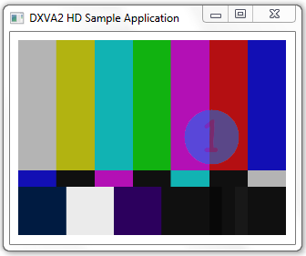

# DXVA-HD Sample

Shows how to use Microsoft DirectX Video Acceleration High Definition (DXVA-HD).

This sample is essentially a port of the [DXVA2\_VideoProc Sample](dxva2-videoproc-sample.md). It has the same basic functions, and most of the keyboard commands are the same.

The sample programmatically generates video with a primary stream and a substream. The primary stream displays SMPTE color bars. The substream is alpha-blended onto the primary stream using luma keying. The user can change the video processing parameters, including the planar alpha value, source and destination rectangles, color adjustments, and color space. The following image shows that video that is generated.

## APIs Demonstrated

This sample demonstrates the following DXVA-HD interfaces:

-   [**IDXVAHD\_Device**](idxvahd-device.md)
-   [**IDXVAHD\_VideoProcessor**](idxvahd-videoprocessor.md)

## Requirements

| Product                                                        | Version   |
|----------------------------------------------------------------|-----------|
| [Windows SDK](http://go.microsoft.com/fwlink/p/?linkid=129787) | Windows 7 |

 

## Downloading the Sample

This sample is available in the [Windows classic samples github repository](https://github.com/Microsoft/Windows-classic-samples/tree/master/Samples/Win7Samples/multimedia/mediafoundation/DXVA_HD).

## Related topics

<dl> <dt>

[DXVA-HD](dxva-hd.md)
</dt> <dt>

[Media Foundation SDK Samples](media-foundation-sdk-samples.md)
</dt> </dl>

 

 

