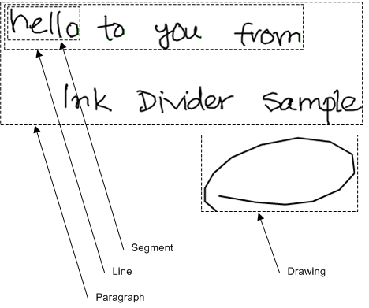

# Ink Analysis with the Divider Object

The [Divider](T:Microsoft.Ink.Divider) object provides layout analysis features that classify and group strokes into different structural elements.

## Divider Object

The [Divider](T:Microsoft.Ink.Divider) object analyzes strokes as you add or remove them. You can retrieve the current classification and grouping of the analyzed strokes in a [DivisionResult](T:Microsoft.Ink.DivisionResult) object by calling the [Divide](M:Microsoft.Ink.Divider.Divide) method of the Divider object.

The strokes that the [Divider](T:Microsoft.Ink.Divider) object analyzes are kept in the [Strokes](P:Microsoft.Ink.Divider.Strokes) property of the Divider object. Because a [Strokes](T:Microsoft.Ink.Strokes) collection is a reference to ink data and is not the actual data itself, changes in the parent [Ink](frlrfMicrosoftInkInkClassTopic) object of the Strokes collection can invalidate the Strokes collection. For more information about ink data, see [Ink Data](ink-data.md).

The [Divider](T:Microsoft.Ink.Divider) object uses a recognizer context to improve its analysis of recognition segments and to generate recognition text for handwriting elements. If a recognizer context is not assigned to the [RecognizerContext](P:Microsoft.Ink.Divider.RecognizerContext) property of the Divider object or recognizers are not installed, then the layout analysis feature performs the recognition segment division, and no text is associated with the [DivisionResult](T:Microsoft.Ink.DivisionResult) object. For more information about ink recognition, see [Ink Recognition](ink-recognition.md).

## DivisionResult Object

Each [DivisionResult](T:Microsoft.Ink.DivisionResult) object records the layout analysis of the strokes contained by the [Divider](T:Microsoft.Ink.Divider) object at the time the [Divide](M:Microsoft.Ink.Divider.Divide) method is called. The DivisionResult object also stores a copy of the strokes that were used in the analysis.

The [DivisionResult](T:Microsoft.Ink.DivisionResult) object groups the analysis results by structural element type. The [**ResultByType**](iinkdivisionresult-resultbytype.md) method of the DivisionResult object returns in a [DivisionUnits](T:Microsoft.Ink.DivisionUnits) collection the collection of all structural elements of a given type. The [InkDivisionType](T:Microsoft.Ink.InkDivisionType) enumeration defines the element types that the layout analysis recognizes.

The following table describes the element types in the [InkDivisionType](T:Microsoft.Ink.InkDivisionType) enumeration.

| Name                 | Description                                                                      |
|----------------------|----------------------------------------------------------------------------------|
| Segment    | A recognition segment.                                                 |
| Line       | A line of handwriting that contains one or more recognition segments.  |
| Paragraph  | A block of strokes that contains one or more lines of handwriting.     |
| Drawing    | Ink that is not text.                                                  |

 

The following image shows an example of the different element types the [DivisionResult](T:Microsoft.Ink.DivisionResult) object recognizes.

## DivisionUnits Collection and DivisionUnit Objects

Each [DivisionUnits](T:Microsoft.Ink.DivisionUnits) collection is a copy of the layout analysis result for a single type of structural element. The [DivisionUnit](T:Microsoft.Ink.DivisionUnit) object represents an individual element in the DivisionUnits collection. Each structural element has a reference to the strokes that make up the element. If recognizers are installed, handwriting elements have recognition text available. Line and recognition segment elements also include a rotation matrix that can rotate an element's strokes from vertical to horizontal.

The [Ink Divider Sample](ink-divider-sample.md) topic demonstrates how to use a [Divider](T:Microsoft.Ink.Divider) object with [Ink](T:Microsoft.Ink.Ink) objects to perform ink layout analysis.

For more information about using ink analysis, see [The Divider Object](the-divider-object.md).

 

 

