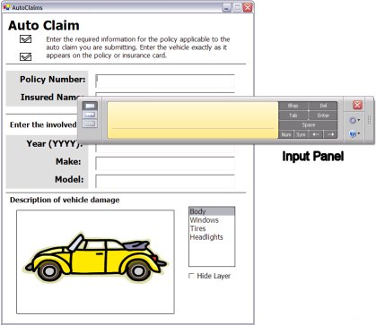

# Programming the Input Panel Using the PenInputPanel Class

\[[**PenInputPanel**](peninputpanel-class.md) has been replaced by [Microsoft.Ink.TextInput](https://msdn.microsoft.com/library/ms581554(v=VS.100).aspx). Please refer to [Programming the Text Input Panel](programming-the-text-input-panel.md).\]

Description of using the [**PenInputPanel**](peninputpanel-class.md) object to program the system-level Tablet PC Input Panel.

## Input Panel vs. the PenInputPanel Object

In Microsoft Windows XP Tablet PC Edition version 1.0, the system-level Tablet PC Input Panel provides a universal mechanism to accomplish text input across the Windows platform, but it does not provide programmatic access. In Windows XP Tablet PC Edition Software Development Kit (SDK) version 1.5 and later, the [**PenInputPanel**](peninputpanel-class.md) object enables you to integrate text input tools directly into your applications, and provide a level of control not previously available. Starting with the Windows XP Tablet PC Edition 2005, the system-level Input Panel has been upgraded to include the in-place input functionality provided by the **PenInputPanel** object and more.

The following graphic shows Input Panel displayed over the [Auto Claims Form Sample](auto-claims-form-sample.md) sample.



Input Panel supersedes the [**PenInputPanel**](peninputpanel-class.md) by supplying the same in-place input functionality to any application running on Windows XP Tablet PC Edition 2005 or later without the need for additional code. This article on using the **PenInputPanel** object is provided for backward compatibility. Applications that already utilize the **PenInputPanel** object will function the same except that Input Panel will be displayed instead of the **PenInputPanel** when the application is run on Windows XP Tablet PC Edition 2005 or later.

If you are developing a new application for the Tablet PC and want to have an in-place user input solution, Input Panel provides this automatically on Windows XP Tablet PC Edition 2005 or later. There is no need to instantiate the [**PenInputPanel**](peninputpanel-class.md) object.

## Disabling the Input Panel

There may be cases where you want to disable Input Panel. There are two ways to accomplish this. You can accomplish this programmatically or by setting a registry entry that disables Input Panel for your entire application.

### Disabling Input Panel Programmatically

To disable Input Panel programmatically, instantiate the [**PenInputPanel**](peninputpanel-class.md) and set its [**AutoShow**](https://msdn.microsoft.com/en-us/library/ms703289(v=VS.85).aspx) property to **False**.


```C++
using Microsoft.Ink;

// ...

private PenInputPanel theInputPanel;

// ...

private void Form1_Load(object sender, System.EventArgs e)
{
// Attach the Input Panel to a specific TextBox control.
theInputPanel = new PenInputPanel(textBox1);

// Disable the Input Panel for the TextBox.
theInputPanel.AutoShow = false;
}
```


To disable Input Panel for multiple controls in a single application, either instantiate a [**PenInputPanel**](peninputpanel-class.md) object for each control and set the [**AutoShow**](https://msdn.microsoft.com/en-us/library/ms703289(v=VS.85).aspx)property to **False** for each or instantiate a single **PenInputPanel** and move it from control to control as input focus changes. For more information about these two techniques, see the [PenInputPanel Sample](peninputpanel-sample.md) topic.

### Disabling Input Panel Through the Registry

You can set a registry entry to disable Input Panel for your entire application. However, this will also disable it for common dialog boxes such as the **File Open** dialog box, the **Print** dialog box, and the **File Save** dialog box. This may make the user experience in your application inconsistent with other Tablet PC applications.

Setting the `DisableInPlace` registry key to zero prevents Input Panel user interface (UI) from appearing in an application. You must place the `DisableInPlace` registry key at `HKEY_LOCAL_MACHINE\Software\Microsoft\TabletTip\`. Then, add a new registry value by using the full path of the application in which you want to disable Input Panel. The following example registry entry disables Input Panel in an application called MyApp:

`[HKEY_LOCAL_MACHINE \SOFTWARE\Microsoft\WindowsNT\TabletTIP\DisableInPlace]``"C:\Progam Files\My App\MyApp.exe"=dword:00000000`

If you still see a problem in your application after you disable the Input Panel UI, it may be necessary to disable the underlying framework, which queries your application for the caret location. For example, Input Panel may expose a bug in your application's caret tracking code. Turning off the caret tracking query also prevents the Input Panel UI from appearing. To disable the framework, set the `EnableCaretTracking` registry key to zero. Locate this key at `HKEY_LOCAL_MACHINE\SOFTWARE\Microsoft\WindowsNT\CurrentVersion\AppCompatFlags\CaretTracking\`.

> [!Note]  
> Accessibility tools and speech technology in Windows XP also use this framework, so disabling the query also disables these features in your application.

 

## The Input Panel and Web Pages

In order to use an API on a Web page, it must function in a partial trust environment. All [**PenInputPanel**](peninputpanel-class.md) class members require full trust except the following:

-   [PenInputPanel Constructors](https://msdn.microsoft.com/library/ms571341(v=VS.90).aspx) (managed code only)
-   [Dispose Method](https://msdn.microsoft.com/library/ms571343(v=VS.90).aspx) (managed code only)
-   [AttachedEditControl Property](https://msdn.microsoft.com/library/ms582239(v=VS.90).aspx) (managed code only)
-   [**AutoShow Property**](https://msdn.microsoft.com/en-us/library/ms703289(v=VS.85).aspx)

These APIs function in a partial trust environment, such as a Web page, enabling you to instantiate a [**PenInputPanel**](peninputpanel-class.md) object, attach it to a control, and disable Input Panel for that control. For more information, see Programming the Input Panel Using the PenInputPanel Class and [Ink on the Web](ink-on-the-web.md).

## The PenInputPanel Object

The rest of this topic describes how to use the [**PenInputPanel**](peninputpanel-class.md) object in your Tablet PC–enabled applications. More specifically, this topic refers to the **PenInputPanel** object when discussing the programming object, the pen input panel when referring to the UI element, and the PC Input Panel (or Input Panel) when referring to the global input panel typically found on the side of the Tablet PC screen.

The following sections describe the [**PenInputPanel**](peninputpanel-class.md) object and UI.

-   [About the Input Panel](about-the-input-panel.md)
-   [Instantiating the PenInputPanel Class](instantiating-the-peninputpanel-class.md)
-   [Factoid Support](factoid-support.md)
-   [Text Services Framework](text-services-framework.md)
-   [Best Practices](best-practices.md)

 

 


