# List Views

With a list view, users can view and interact with a collection of data objects, using either single selection or multiple selection.

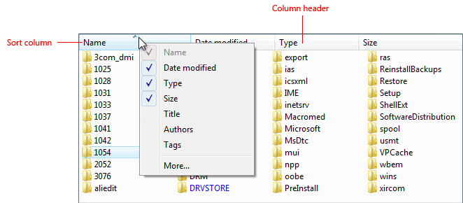

A typical list view.

List views have more flexibility and functionality than list boxes. Unlike list boxes, they support changing views, grouping, multiple columns with headings, sorting by columns, changing column widths and order, being a drag source or a drop target, and copying data to and from the clipboard.

> [!Note]  
> Guidelines related to [layout](vis-layout.md) and [list boxes](ctrl-list-boxes.md) are presented in separate articles.

 

## Is this the right control?

A list view is more than just a more flexible and functional list box: its extra functionality results in different usage. The following table shows the comparison.

|                             |                                           |                                                                                                                                               |
|-----------------------------|-------------------------------------------|-----------------------------------------------------------------------------------------------------------------------------------------------|
|                             | **List boxes**                  | **List views**                                                                                                                      |
| **Data type**     | Both data and program options.  | Data only.                                                                                                                          |
| **Contents**      | Labels only.                    | Labels and auxiliary data, possibly in multiple columns.                                                                            |
| **Interaction**   | Used for making selections.     | Can be used for making selections, but often used for displaying and interacting with data. Can be a drag source or a drop target.  |
| **Presentation**  | Fixed.                          | Users can change views, group, sort by columns, and change column widths and order.                                                 |

 

To decide if this is the right control, consider these questions:

-   **Does the list present data, rather than program options?** If not, consider using a list box instead.
-   **Do users need to change views, group, sort by columns, or change column widths and order?** If not, use a list box instead.
-   **Does the control need to be a drag source or a drop target?** If so, use a list view.
-   **Do the list items need to be copied to or pasted from the clipboard?** If so, use a list view.

### Check box list views

-   **Is the control used to choose zero or more items from a list of data?** To choose one item, use single selection instead.
-   **Is multiple selection essential to the task or commonly used?** If so, use a check box list view to make multiple selection obvious, especially if your target users aren't advanced. If not, use a standard multiple-selection list view if the check boxes would draw too much attention to multiple selection or result in too much screen clutter.
-   **Is the stability of the multiple selection important?** If so, use a [check box list](ctrl-list-boxes.md), list builder, or add/remove list because clicking changes only a single item at a time. With a standard multiple selection list, it's very easy to clear all the selections even by accident.

> [!Note]  
> Sometimes a control that looks like a list view is implemented using a list box, and vice versa. In such cases, apply the guidelines based on the usage, not on the implementation.

 

## Usage patterns

All views support single selection, where users can select only one item at a time, and multiple selection, where users can select any number of items, including none. List views support [extended selection mode](glossary.md), where the selection can be extended by dragging or with Shift+click or Ctrl+click to select groups of contiguous or non-adjacent values, respectively. Unlike list boxes, they don't support [multiple selection mode](glossary.md), where clicking any item toggles its selection state regardless of the Shift and Ctrl keys.

### Standard list view

The list view control supports five standard views:

|                                                                                                                                                                                                                                             |                                                                                                                                                                                                                                                                                                                                                           |
|---------------------------------------------------------------------------------------------------------------------------------------------------------------------------------------------------------------------------------------------|-----------------------------------------------------------------------------------------------------------------------------------------------------------------------------------------------------------------------------------------------------------------------------------------------------------------------------------------------------------|
| **Tile**  each item appears as a medium icon, with a label and optional details to the right.                                                                                                                           | 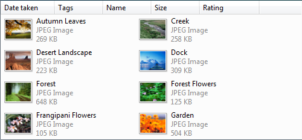  Tile view shows medium icons with labels and optional details on the right.                                                                                                                                                                 |
| **Large icon**  each item appears as an extra large, large, or medium icon with a label below it.                                                                                                                       | 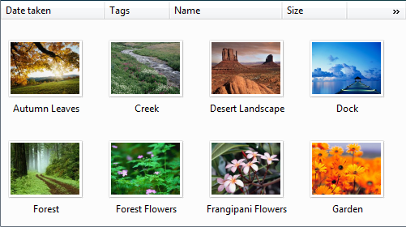  Large Icon view shows each item as a large icon with a label below it.                                                                                                                                                                               |
| **Small icon**  each item appears as a small icon with a label to the right.                                                                                                                                            | 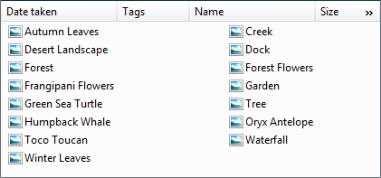  Small Icon view shows each item as a small icon with its label on the right.                                                                                                                                                                         |
| **List**  each item appears as a small icon with a label to the right.                                                                                                                                                  | in list mode, this view orders items in columns and uses a horizontal scrollbar. by contrast, the icon view modes order items in rows and use a vertical scrollbar.     List mode shows each item as a small icon with its label on the right.  |
| **Details**  each item appears as a row in a tabular format. the leftmost column contains both the item's optional icon and label, and the subsequent columns contain additional information, such as item properties.  | additionally, columns can be added or removed, and reordered and resized. rows can be grouped, sorted by column.   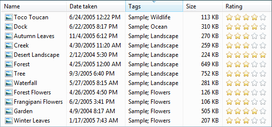  Details view shows each item as a line in a table format.                                                               |

 

### List view variations

<table>
<colgroup>
<col style="width: 50%" />
<col style="width: 50%" />
</colgroup>
<tbody>
<tr class="odd">
<td><strong>Column chooser</strong>  List views sometimes have so many columns that it isn't practical to show them all. In this case, the best approach is to display the most useful columns by default and allow users to add or remove columns as needed.  </td>
<td>  Right-clicking the column heading displays a context menu that allows users to add or remove columns.    Clicking More in the column header context menu displays the Choose Columns dialog box, which allows users to add or remove columns as well as reorder them. </td>
</tr>
<tr class="even">
<td><strong>Check box list view</strong>  Allow users to select multiple items. </td>
<td>Multiple-selection list views have exactly the same appearance as single-selection list views, so there is no visual clue that they support multiple selection. A check box list view can be used to clearly indicate that multiple selection is possible. Consequently, this pattern should be used for tasks where multiple selection is essential or commonly used.    In this example, a Small Icon view uses check boxes because multiple selection is essential to the task. </td>
</tr>
<tr class="odd">
<td><strong>List views with groups</strong>  Organize the data into groups. </td>
<td>While Details views often support sorting the data by any of the columns, list views further allow users to organize the items into groups. Some benefits of grouping are: 
<ul>
<li>Groups works in all views (except list), so, for example, users could group an extra large icons view of albums by artist.</li>
<li>Groups can be high-level collections, which are often more meaningful than grouping directly off the data. For example, Windows Explorer groups dates into Today, Yesterday, Last week, Earlier this year, and A long time ago.</li>
</ul>
  In this example, the Windows Welcome Center shows grouped items in a list view. </td>
</tr>
</tbody>
</table>

 

## Guidelines

### Presentation

-   **Sort list items in a logical order.** Sort names in alphabetical order, numbers in numeric order, and dates in chronological order.
-   **If appropriate, allow users to change the sort order.** User sorting is important if the list has many items or if there are scenarios where items are found more effectively using a sort order other than the default.
-   **Use the Always Show Selection attribute** so that users can readily determine the selected item, even when the control doesn't have focus.
-   **Avoid presenting empty list views.** If users create a list, initialize the list with instructions or example items that users might need.

    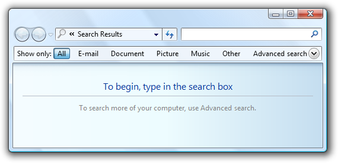

    In this example, the Search list view initially presents instructions.

-   **If users can change views, group, sort by columns, or change columns and their widths and order, make those settings persist so they take effect the next time the list view is displayed.** Make them persist on a per-list view, per-user basis.

### Interaction

-   **Use single-click to select the list item the user is pointing to.Exception:** For the command link list pattern, single-click selects the item and either closes the window or navigates to the next page.
-   **Consider providing double-click behavior.** Double clicking should have the same effect as selecting an item and performing its default command.
-   **Make double-click behavior redundant.** There should always be a command button or context menu command that has the same effect.
-   If a list item requires further explanation, **provide the explanation in an** [infotip](ctrl-tooltips-and-infotips.md). Use complete sentences and ending punctuation.

    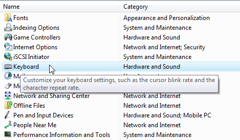

    In this example, an infotip is used to provide further information.

-   **Provide context menus of relevant commands.** Such commands include Cut, Copy, Paste, Remove or Delete, Rename, and Properties.
-   **If users can change the sort order and grouping, provide Sort By and Group By context menus.** The first click on a column name sorts or groups the list in the ascending order for that column, the second click sorts or groups in descending order. Use the previous order (from another column) as the secondary key.

    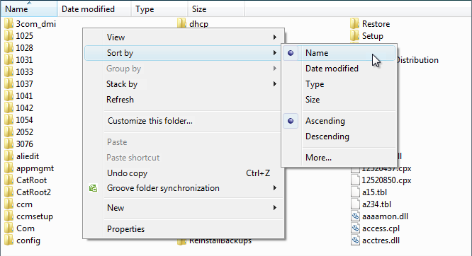

    In this example, the Sort By context menu changes the sort order. Clicking Name once sorts by name in ascending order. Clicking Name again sorts by name in descending order.

-   **Make the list view column header accessible using the keyboard.**
    -   **Developers:** You can do this by setting focus on the column header control. This capability is new to Windows Vista.
-   **When disabling a list view, also disable any associated labels and command buttons.**
-   **Avoid horizontal scrolling.** The List mode uses horizontal scrolling. This mode is usually the most compact, but horizontal scrolling is generally harder to use than vertical scrolling. Consider using the Small Icon view instead if compactness isn't important. However, List mode is a good choice when there are many alphabetically sorted items and sufficient screen space for a wide control.

    **Acceptable:**

    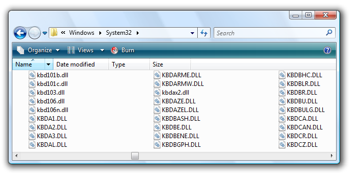

    In this example, List mode is used because there are many items and plenty of available screen space for a wide control.

### Multiple-selection lists

-   **Consider displaying the number of selected items below the list**, especially if users are likely to select several items. This information not only gives useful feedback, but it also clearly indicates that the list view supports multiple selection.

    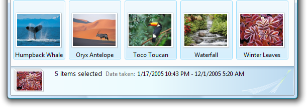

    In this example, the number of selected items is displayed below the list.

-   Alternatively instead of the number of selected items, you can give other selection metrics that might be more meaningful, such as the resources required for the selections.

    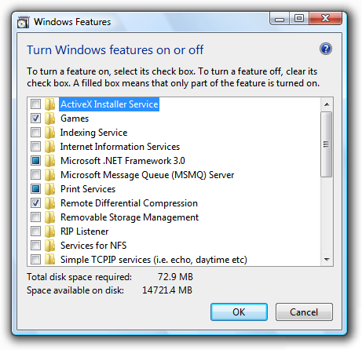

    In this example, the disk space required to install the components is more meaningful than the number of components selected.

-   For check box list views, if there are potentially many items and selecting or clearing all of them is likely, add Select all and Clear all command buttons.
-   **Use mixed-state check boxes to indicate partial selection of the items in a container.** The mixed state is not used as a third state for an individual item.

### Changing views

If users can change views:

-   **Choose the most convenient view by default.** Any changes users make should be made persistent on a per-list view, per-user basis.
-   **Change the view using a split button, menu button, or drop-down list.** Whenever practical, use a [split button](ctrl-command-buttons.md) on the toolbar and change the button label to reflect the current view.

    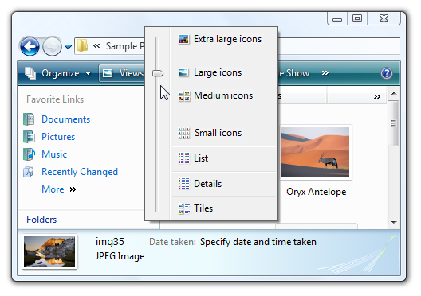

    In this example, a split button on the toolbar is used to change views.

-   **Provide a View context menu.**

    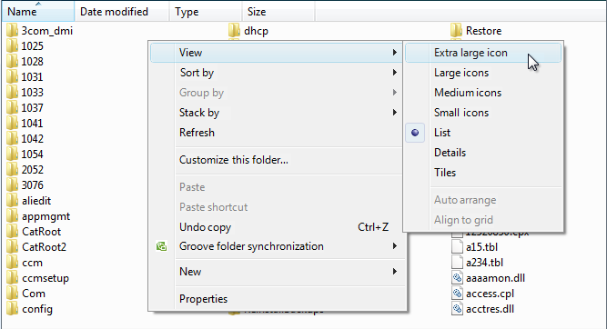

In this example, a View context menu is used to change views.

### Details views

-   **Consider using tiles view to improve readability.**

    **Acceptable:**

    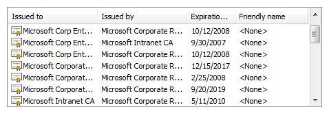

    In this example, there is too much data and the window, list, and columns are too small, making the list items hard to read.

    **Better:**

    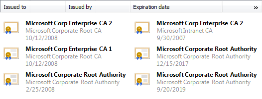

    In this example, Tile view displays the data without truncation.

-   **Choose default column widths appropriate for the longest data.** List views automatically truncate long data with ellipses, so the column widths are appropriate if few ellipses are displayed by default. While users can resize columns, prefer other solutions:

    -   Size each column width to fit its data.
    -   Size the control width to fit its columns plus any likely scrollbars.
    -   If necessary, use horizontal scrolling.
    -   Have truncated data only for odd-sized items or as a last resort.

    If normal-sized data must be truncated by default, make the window and list view resizable. Include an additional 30 percent (up to 200 percent for shorter text) for any text (but not numbers) that will be localized.

    **Incorrect:**

    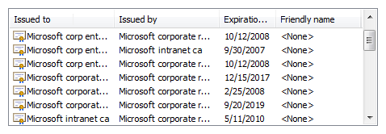

    In this example, most data is truncated. The many ellipses clearly indicate that the control and column widths are too small for the data.

    **Incorrect:**

    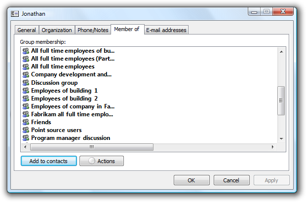

    In this example, data is truncated without reason.

-   **Choose an appropriate default column order.** Generally, order the columns as follows:

    -   First, the item name or identifying data.
    -   Next, other data useful in differentiating the list items.
    -   Next, the most useful (preferably short or fixed length) data.
    -   Next, less useful (preferable short or fixed length) data.
    -   Last, long, variable-length data.

    Long, variable length-data is placed in the last columns to reduce the need for horizontal scrolling. Within these categories, place related information together in a logical sequence.

-   **When appropriate, allow users to add and remove columns, as well as change the order.** Display the most useful columns by default. This is achieved with the Header Drag Drop attribute.
-   Choose an alignment appropriate for the data. Use the following rules:
    -   Right-align numbers, currencies, and times.
    -   Left-align text, IDs (even if numeric), and dates.
-   For sortable column headings, **the first click on a heading sorts the list in ascending order for the column, the second click sorts in descending order.** Use the previous sort order (from another column) as the secondary sort key.

    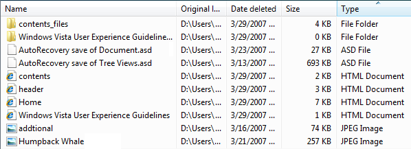

    In this example, the Name column was clicked first, then the Type column. As a result, Type in ascending order is the primary sort key, and Name in ascending order is the secondary.

-   **Use the Full Row Select attribute** so that users can readily determine the selected items in all columns.
-   **Don't use a sortable column header unless the data can be sorted.**
-   **Don't use a column header if there is only one column and there is no need to reverse sort.** Use a label instead to identify the data.

    **Incorrect:**

    

    **Correct:**

    

    In the correct example, a label is used instead of a column header.

## Recommended sizing and spacing

Recommended sizing and spacing for list views.

-   **Choose a list view height that displays an integral number of items.** Avoid truncating items vertically.
-   **Choose a list view size that eliminates unnecessary vertical and horizontal scrolling in all supported views.** List views should display between 3 and 20 items. Consider making a list view slightly larger if doing so eliminates a scroll bar. Lists with potentially many items should display at least five items to facilitate scrolling by showing more items at a time and making the scroll bar easier to position.
-   **If users benefit from making the list view larger, make the list view and its parent window resizable.** Doing so allows users to adjust the list view size as needed. However, resizable list views should display no fewer than three items.

## Labels

### Control labels

-   All list views need labels. Write the label as a word or phrase, not as a sentence, ending with a colon using static text.
-   Assign a unique [access key](glossary.md) for each label. For guidelines, see [Keyboard](inter-keyboard.md).
-   Use [sentence-style capitalization](glossary.md).
-   Position the label above the control and align the label with the left edge of the control.
-   For multiple-selection list views, write the label that clearly indicates multiple selection is possible. Check box list view labels can be less explicit.

    **Correct:**

    

    In this example, the label clearly indicates that multiple selection is possible.

    **Incorrect:**

    

    In this example, the label provides no information about multiple selection.

    **Acceptable:**

    

    In this example, the check boxes clearly indicate that multiple selection is possible, so the label doesn't have to be explicit.

-   You may specify units (seconds, connections, and so on) in parentheses after the label.

### Heading labels

-   Keep the heading labels brief (three words or fewer).
-   Use a single noun or noun phrase with no ending punctuation.
-   Use [sentence-style capitalization](glossary.md).
-   Align the heading the same way as the data.

### Group labels

-   Use the following group labels for high-level collections:
    -   Names: Use first letter of name or letter ranges.
    -   Sizes: Unspecified, 0 KB, 0-10 KB, 10-100 KB, 100 KB - 1 MB, 1-16 MB, 16-128 MB
    -   Dates: Today, Yesterday, Last week, Earlier this year, and A long time ago.
-   Otherwise, group labels use the exact text of the data being grouped, including capitalization and punctuation.

### Data text

-   Use [sentence-style capitalization](glossary.md).

### Instructional text

-   If you need to add instructional text about a list view, add it above the label. Use complete sentences with ending punctuation.
-   Use [sentence-style capitalization](glossary.md).
-   Additional information that is helpful but not necessary should be kept short. Place this information either in parentheses between the label and colon or without parentheses below the control.

## Documentation

When referring to list views:

-   Use the exact label text including its capitalization but don't include the access key underscore or colon, and include the word list. Don't refer to a list box as a list box, list view, or field.
-   For list data, use the exact data text including its capitalization.
-   Refer to list views as list views only in programming and other technical documentation. Everywhere else use list.
-   To describe user interaction, use select for the data, and click for the headings.
-   When possible, format the label and list options using bold text. Otherwise, put the label and options in quotation marks only if required to prevent confusion.

Example: In the **Programs and services** list, select **File and printer sharing**.

When referring to check boxes in a list view:

-   Use the exact label text including its capitalization, and include the word check box. Don't include the access key underscore.
-   To describe user interaction, use select and clear.
-   When possible, format the label using bold text. Otherwise, put the label in quotation marks only if required to prevent confusion.

Example: Select the **Underline** check box.

 

 

