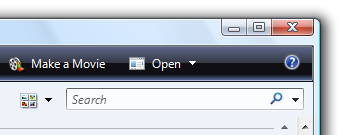
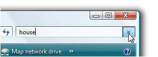
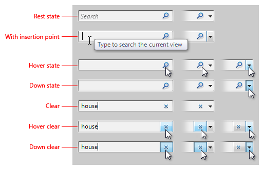
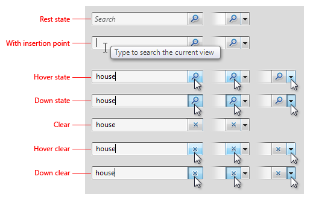
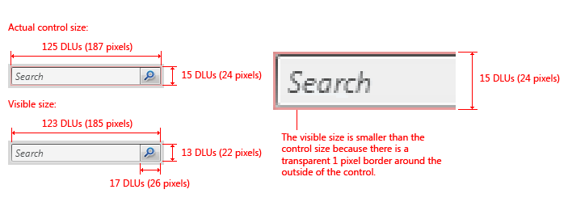

# Search Boxes

With a Search box, users can quickly locate specific objects or text within a large set of data by filtering or highlighting matches. There is no standard search control, but you should strive to make your program's search features consistent with those of Windows.

There are two types of searches:

-   **Instant search**, where the results are displayed immediately as the user types. No button needs to be clicked, so the magnifying glass search symbol is shown as a graphic, not a button.

    

    A typical Search box using Instant search. Search is automatically executed on every keystroke.

-   **Regular search**, where a search is performed when the user clicks the search button. The magnifying glass search symbol is shown on a button.

    

    A typical Search box using regular search. Users click a button to perform the search.

    You can provide either or both kinds of search options for your users.

## Is this the right control?

To decide, consider these questions:

-   **Are specific objects difficult to find?** This can happen when:
    -   There are many objects.
    -   The objects aren't located in a single location. Search is especially useful for finding objects in trees.
    -   The search data is difficult to find (for example, metadata).
-   **Do users need to find specific text within documents?**
-   **Does your feature return relevant search results within five seconds?** If not, you can provide a search feature, but use an alternative design that gives visible feedback to accommodate long-running searches, such as a search dialog box.

## Design concepts

Searching is a crucial first step in many scenarios: Users must find objects before they can use them. Users are saving more and more objects on increasingly larger hard disks, but browsing for objects doesn't scale well. Search must be a simple, consistent, reliable part of the user experience.

Search boxes in Windows:

-   Are part of all Explorer windows, so they are easy to find and recognize.
-   Have consistent appearance and behavior.
-   Are efficient and fast, giving instant results in Instant search mode.

A Search box is used in Windows in these places:

-   Explorers
-   Experiences (Microsoft Windows Media Player, Windows Photo Gallery, Windows Internet Explorer)
-   Start menu (to find programs and recent files)
-   Control Panel home page (to find control panel items and tasks)
-   Help (to find relevant Help topics)

### Look and feel

The feel of Search in Windows is significantly enhanced by supporting Instant search. Having instant results makes Windows feel more powerful and direct.

In Windows Explorer and application windows, Search is located in the upper-right corner if it is a supplemental entry point. In this case, users look for a search mechanism when they don't find what they are looking for in the window. However, if Search is the primary entry point, it is centered at the top of the window.

The Search button is visually connected to a Search box. To minimize space, an optional [prompt](https://www.bing.com/search?q=prompt) is used inside a Search box instead of a label. The prompt may be an instruction (for example, Type to search) or indicate the scope of the search (for example, Search for pictures).

Without labels and separate buttons, Instant search in Windows has a lightweight look.

Performing a successful search creates a virtual page of the search results and adds it to the Back stack and Address bar. Users have several ways to restore the original page and clear a Search box, including clicking Back, clicking the original page in the Address bar, pressing Esc, or clearing the Search box.

Users can also simply clear the Search box without restoring a previous page of results. In Instant search mode, a clear button appears after the user starts typing; an "x" replaces the magnifying glass search symbol. On hover, the "x" gets a button look and can be clicked.

The user can clear the Search box by clicking "x" at the right end of the control.

In regular search mode, the clear button is optional. Users may find it useful, for example, if a search is taking a long time to complete. Users can click the "x" to stop the search in progress. If a search has already completed, users can click the "x" to clear the Search box.

## Guidelines

### Location

-   For application windows, locate Search in the upper-right corner.
-   For popup windows, locate Search wherever is most sensible and convenient.
-   **Exception:** If Search is usually the first thing users do in a window (the primary entry point), center it at the top of the window.

### Look

-   Use the standard search button graphics. There are three versions:
    -   **Magnifying glass search symbol only (no button on hover).** Use for Instant search.
    -   **Magnifying glass search symbol with button.** Use when button needs to be clicked to start the search.
    -   **Magnifying glass search symbol with button and drop-down arrow.** Add a drop-down arrow when users can change the scope or when other settings are available.
        -   For Instant search, use a drop-down arrow only, and show a button on hover.
        -   For regular search, show the drop-down arrow on a button.

Visual specifications for Instant search.

Visual specifications for regular search.

-   Don't use a label; use an optional prompt instead. If users tend to assume that the search is a generic file search, use the prompt to give the scope. Otherwise, use Type to search or a similar, concise phrase.

    

    

    In these examples, brief textual prompts help users work with Search.

### Interaction

-   **On input focus, automatically select any previously entered text.** Doing so allows users to enter a new search by typing, or to modify the previous search by positioning the caret using the arrow keys.

    

    In this example, previously entered text is selected on input focus.

-   **Assign the keyboard shortcut for the Search box to be Ctrl+E.**

### Functionality

-   **Support Instant search whenever possible.** Provide both regular and Instant searches if there are scenarios where regular searching is worth the extra wait time.
-   Regular searches must return relevant results within five seconds and Instant search must return results within two seconds. After this point, Search may continue to fill in less relevant results over time as long as the program is responsive and users can perform other tasks. You may have to index your search data to ensure this responsiveness.
-   If you provide both regular and Instant search modes, the Instant search results must be a subset of the regular search results.
-   All searching is prefix-based (no substring or suffix searching). The use of trailing wildcard characters is optional and doesn't affect the results. If multiple words are entered, use OR searching.
-   A successful search adds a virtual page with the search results to the Back stack and Address bar. Multiple searches result in a single virtual page, so clicking Back always returns the original page.
-   If necessary for scale, rank the search results by relevance.
-   A blank search returns the original page.

## Recommended sizing and spacing

Recommended sizing and spacing for Instant search.

Recommended sizing and spacing for regular search.

## Text

-   For the wording of the prompt in the Search box, either make it an instruction (for example, Type to search) or indicate the scope of the search (for example, Search for pictures).
-   Prompt text should be brief. A single word or short phrase should suffice.
-   Use sentence-style capitalization.
-   Don't use ending punctuation or ellipsis.

## Documentation

-   Refer to this control as the Search box. Capitalize the initial letter of the first word; don't capitalize the initial letter of box.
-   Refer to the two types of search as Instant search and regular search. Capitalize the initial letter of Instant search; don't capitalize the initial letter of regular search.

## Related topics

<dl> <dt>

[Glossary](glossary.md)
</dt> </dl>

 

 

